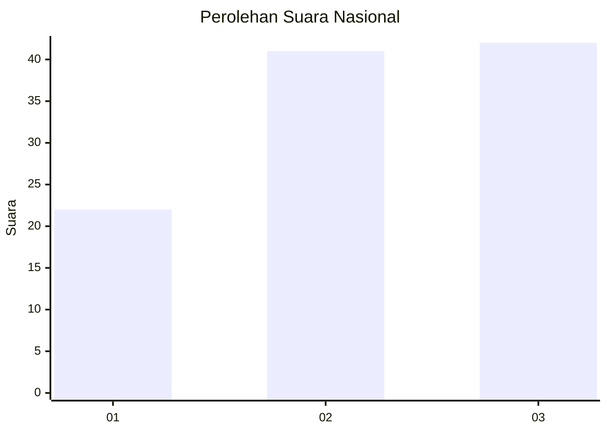
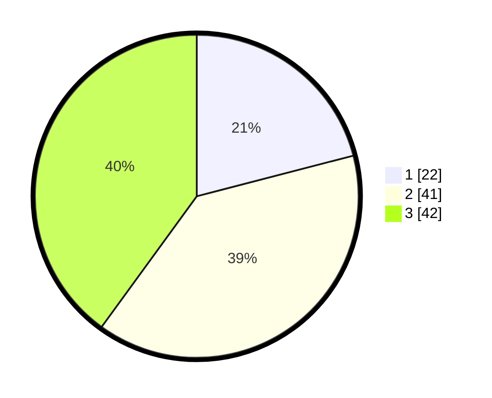

# Hasil

## Grafik

## Tabel

| No. | Nama Paslon    | Suara | Suara (raw) | Persentase |
|:--- |:-------------- | -----:| -----------:| ----------:|
| 1   | ANIES MUHAIMIN | 22    | [22][p-1]   | 20,95      |
| 2   | PRABOWO GIBRAN | 41    | [41][p-2]   | 39,05      |
| 3   | GANJAR MAHFUD  | 42    | [42][p-3]   | 40,00      |

[p-1]: https://github.com/gigit-pemilu/pemilu-2024/blob/main/pilpres/hitung-suara/sub/18-lampung/sub/07-lampung-timur/sub/05-sekampung/sub/2006-hargomulyo/sub/006-tps/sub/paslon-1.txt
[p-2]: https://github.com/gigit-pemilu/pemilu-2024/blob/main/pilpres/hitung-suara/sub/18-lampung/sub/07-lampung-timur/sub/05-sekampung/sub/2006-hargomulyo/sub/006-tps/sub/paslon-2.txt
[p-3]: https://github.com/gigit-pemilu/pemilu-2024/blob/main/pilpres/hitung-suara/sub/18-lampung/sub/07-lampung-timur/sub/05-sekampung/sub/2006-hargomulyo/sub/006-tps/sub/paslon-3.txt

## Foto C Plano

https://sirekap-obj-formc.kpu.go.id/d874/pemilu/ppwp/18/07/05/20/06/1807052006006-20240221-115014--221d7ef4-a03d-4458-97a3-f3d3a7963b4a.jpg

https://sirekap-obj-formc.kpu.go.id/d874/pemilu/ppwp/18/07/05/20/06/1807052006006-20240221-115113--7a7cbd80-a034-4d51-8a5b-90ddfbf1fd59.jpg

https://sirekap-obj-formc.kpu.go.id/d874/pemilu/ppwp/18/07/05/20/06/1807052006006-20240221-115325--1ed3c7e3-3480-479a-bb23-5b9615ab14c3.jpg

## Metadata

| Key        | Value               |
| ---------- | ------------------- |
| Time Stamp | 2024-02-21 12:00:00 |

