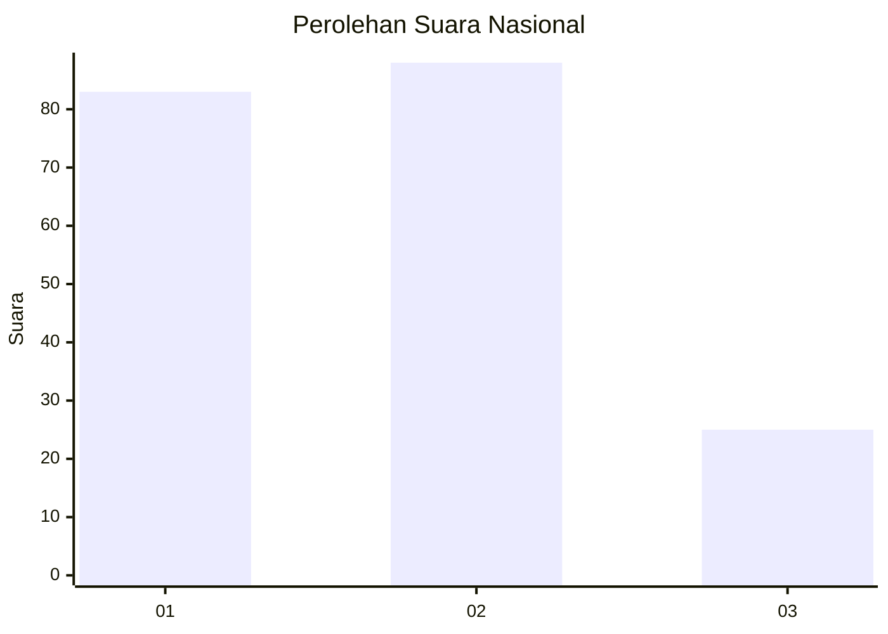
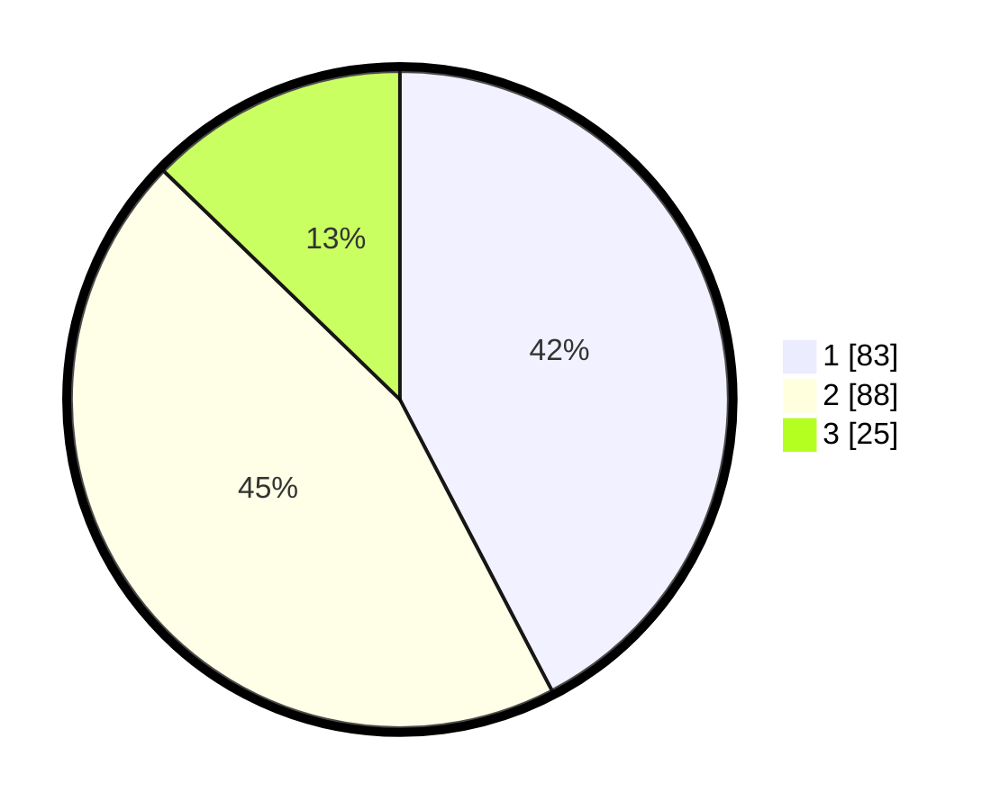

# Hasil

## Grafik

## Tabel

| No. | Nama Paslon    | Suara | Suara (raw) | Persentase |
|:--- |:-------------- | -----:| -----------:| ----------:|
| 1   | ANIES MUHAIMIN | 83    | [83][p-1]   | 42,35      |
| 2   | PRABOWO GIBRAN | 88    | [88][p-2]   | 44,90      |
| 3   | GANJAR MAHFUD  | 25    | [25][p-3]   | 12,76      |

[p-1]: https://github.com/gigit-pemilu/pemilu-2024/blob/main/pilpres/hitung-suara/sub/18-lampung/sub/07-lampung-timur/sub/05-sekampung/sub/2006-hargomulyo/sub/012-tps/sub/paslon-1.txt
[p-2]: https://github.com/gigit-pemilu/pemilu-2024/blob/main/pilpres/hitung-suara/sub/18-lampung/sub/07-lampung-timur/sub/05-sekampung/sub/2006-hargomulyo/sub/012-tps/sub/paslon-2.txt
[p-3]: https://github.com/gigit-pemilu/pemilu-2024/blob/main/pilpres/hitung-suara/sub/18-lampung/sub/07-lampung-timur/sub/05-sekampung/sub/2006-hargomulyo/sub/012-tps/sub/paslon-3.txt

## Foto C Plano

https://sirekap-obj-formc.kpu.go.id/39ce/pemilu/ppwp/18/07/05/20/06/1807052006012-20240221-113354--86a69c38-2bfe-45c2-8bdc-27dbd2b6f554.jpg

https://sirekap-obj-formc.kpu.go.id/39ce/pemilu/ppwp/18/07/05/20/06/1807052006012-20240221-113452--3563f9b4-3b42-4c5e-b566-98f4003cecf2.jpg

https://sirekap-obj-formc.kpu.go.id/39ce/pemilu/ppwp/18/07/05/20/06/1807052006012-20240221-113753--3d563138-7772-45be-8c48-f6d5ae97812f.jpg

## Metadata

| Key        | Value               |
| ---------- | ------------------- |
| Time Stamp | 2024-02-21 12:00:00 |

## DATA PEMILIH TETAP

Jumlah pemilih dalam DPT: **378**.
 * L: **822**.
 * P: **877**.

## DATA PENGGUNA HAK PILIH

Jumlah pengguna hak pilih dalam DPT: **858**.
 * L: **888**.
 * P: **888**.

Jumlah pengguna hak pilih dalam DPTb: **888**.
 * L: **888**.
 * P: **844**.

Jumlah pengguna hak pilih dalam DPK: **884**.
 * L: **588**.
 * P: **844**.

Jumlah pengguna hak pilih: **944**.
 * L: **584**.
 * P: **844**.

## JUMLAH SUARA SAH DAN TIDAK SAH

JUMLAH SELURUH SUARA SAH: **853**.

JUMLAH SUARA TIDAK SAH: **0**.

JUMLAH SELURUH SUARA SAH DAN SUARA TIDAK SAH: **153**.

