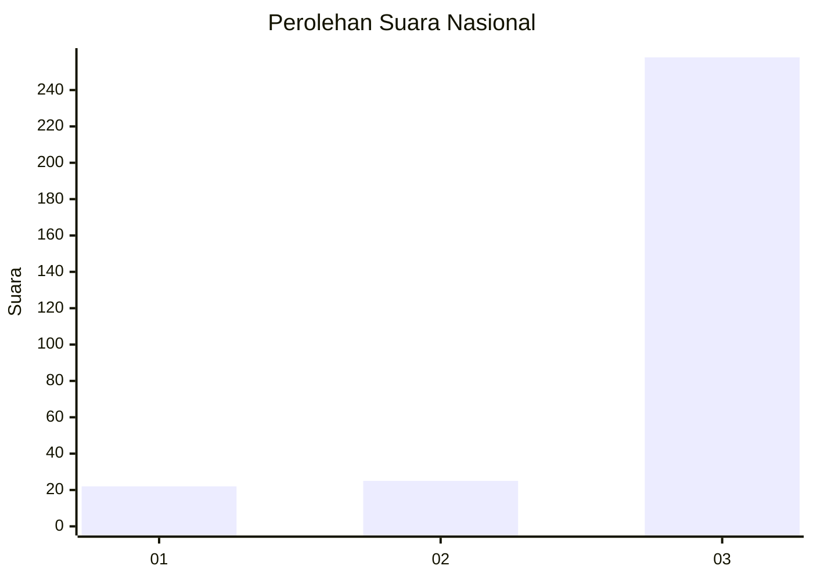
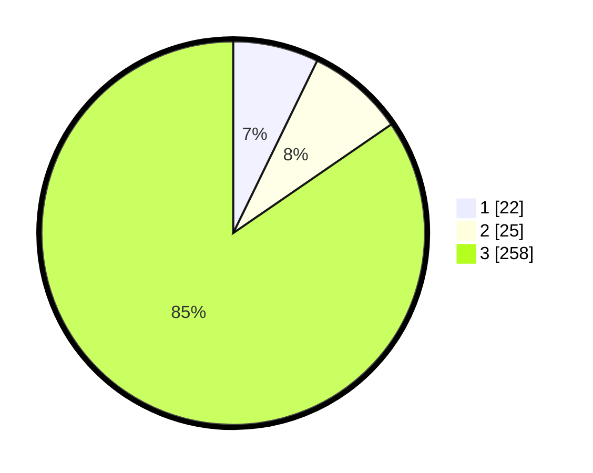

# Hasil

## Grafik

## Tabel

| No. | Nama Paslon    | Suara | Suara (raw) | Persentase |
|:--- |:-------------- | -----:| -----------:| ----------:|
| 1   | ANIES MUHAIMIN | 22    | [22][p-1]   | 7,21       |
| 2   | PRABOWO GIBRAN | 25    | [25][p-2]   | 8,20       |
| 3   | GANJAR MAHFUD  | 258   | [258][p-3]  | 84,59      |

[p-1]: https://github.com/gigit-pemilu/pemilu-2024/blob/main/pilpres/hitung-suara/sub/18-lampung/sub/07-lampung-timur/sub/05-sekampung/sub/2016-mekar-mukti/sub/001-tps/sub/paslon-1.txt
[p-2]: https://github.com/gigit-pemilu/pemilu-2024/blob/main/pilpres/hitung-suara/sub/18-lampung/sub/07-lampung-timur/sub/05-sekampung/sub/2016-mekar-mukti/sub/001-tps/sub/paslon-2.txt
[p-3]: https://github.com/gigit-pemilu/pemilu-2024/blob/main/pilpres/hitung-suara/sub/18-lampung/sub/07-lampung-timur/sub/05-sekampung/sub/2016-mekar-mukti/sub/001-tps/sub/paslon-3.txt

## Foto C Plano

https://sirekap-obj-formc.kpu.go.id/d3c3/pemilu/ppwp/18/07/05/20/16/1807052016001-20240221-110810--6378a510-2e86-45fb-9de4-f44bd998ac45.jpg

https://sirekap-obj-formc.kpu.go.id/d3c3/pemilu/ppwp/18/07/05/20/16/1807052016001-20240221-110912--b043952e-fd11-4262-842e-97ee15fec353.jpg

https://sirekap-obj-formc.kpu.go.id/d3c3/pemilu/ppwp/18/07/05/20/16/1807052016001-20240221-111017--140bf1c4-8a83-4845-9b6f-d2d718d759db.jpg

## Metadata

| Key        | Value               |
| ---------- | ------------------- |
| Time Stamp | 2024-02-21 12:00:00 |

## DATA PEMILIH TETAP

Jumlah pemilih dalam DPT: **234**.
 * L: **838**.
 * P: **828**.

## DATA PENGGUNA HAK PILIH

Jumlah pengguna hak pilih dalam DPT: **838**.
 * L: **848**.
 * P: **834**.

Jumlah pengguna hak pilih dalam DPTb: **888**.
 * L: **888**.
 * P: **888**.

Jumlah pengguna hak pilih dalam DPK: **88**.
 * L: **888**.
 * P: **888**.

Jumlah pengguna hak pilih: **338**.
 * L: **838**.
 * P: **838**.

## JUMLAH SUARA SAH DAN TIDAK SAH

JUMLAH SELURUH SUARA SAH: **196**.

JUMLAH SUARA TIDAK SAH: **2**.

JUMLAH SELURUH SUARA SAH DAN SUARA TIDAK SAH: **498**.

