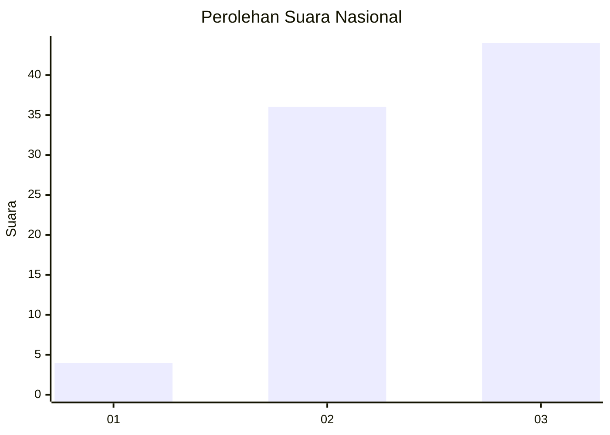
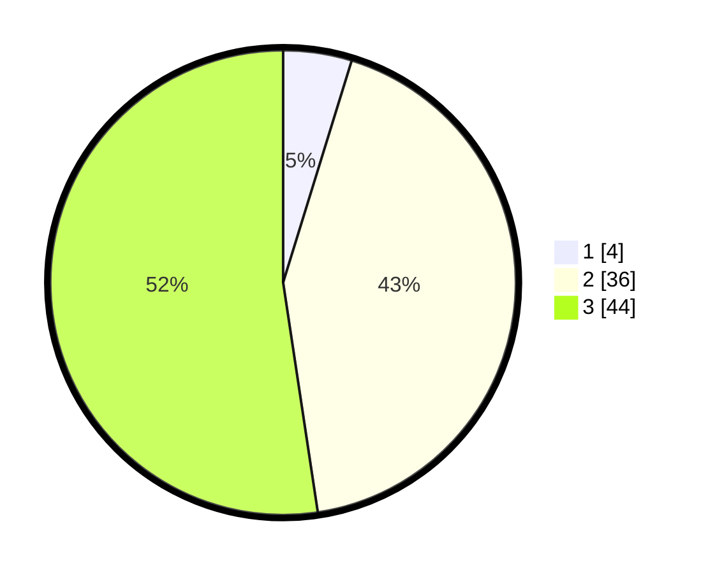

# Hasil

## Grafik

## Tabel

| No. | Nama Paslon    | Suara | Suara (raw) | Persentase |
|:--- |:-------------- | -----:| -----------:| ----------:|
| 1   | ANIES MUHAIMIN | 4     | [4][p-1]    | 4,76       |
| 2   | PRABOWO GIBRAN | 36    | [36][p-2]   | 42,86      |
| 3   | GANJAR MAHFUD  | 44    | [44][p-3]   | 52,38      |

[p-1]: https://github.com/gigit-pemilu/pemilu-2024/blob/main/pilpres/hitung-suara/sub/18-lampung/sub/07-lampung-timur/sub/05-sekampung/sub/2016-mekar-mukti/sub/007-tps/sub/paslon-1.txt
[p-2]: https://github.com/gigit-pemilu/pemilu-2024/blob/main/pilpres/hitung-suara/sub/18-lampung/sub/07-lampung-timur/sub/05-sekampung/sub/2016-mekar-mukti/sub/007-tps/sub/paslon-2.txt
[p-3]: https://github.com/gigit-pemilu/pemilu-2024/blob/main/pilpres/hitung-suara/sub/18-lampung/sub/07-lampung-timur/sub/05-sekampung/sub/2016-mekar-mukti/sub/007-tps/sub/paslon-3.txt

## Foto C Plano

https://sirekap-obj-formc.kpu.go.id/384d/pemilu/ppwp/18/07/05/20/16/1807052016007-20240221-111809--52a36479-02a6-48d3-b1f8-37bb4adabea6.jpg

https://sirekap-obj-formc.kpu.go.id/384d/pemilu/ppwp/18/07/05/20/16/1807052016007-20240221-112056--9f6fead8-1b54-4dab-9cc8-c58b9b91437d.jpg

https://sirekap-obj-formc.kpu.go.id/384d/pemilu/ppwp/18/07/05/20/16/1807052016007-20240221-112407--1ce927a5-1d10-43c7-9a58-bc31ea7e8050.jpg

## Metadata

| Key        | Value               |
| ---------- | ------------------- |
| Time Stamp | 2024-02-21 12:00:00 |

