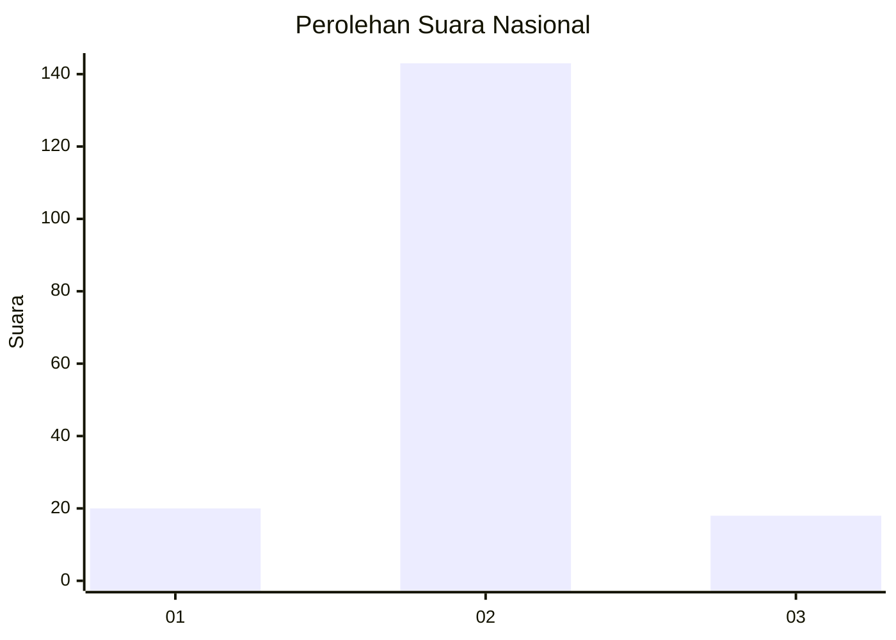
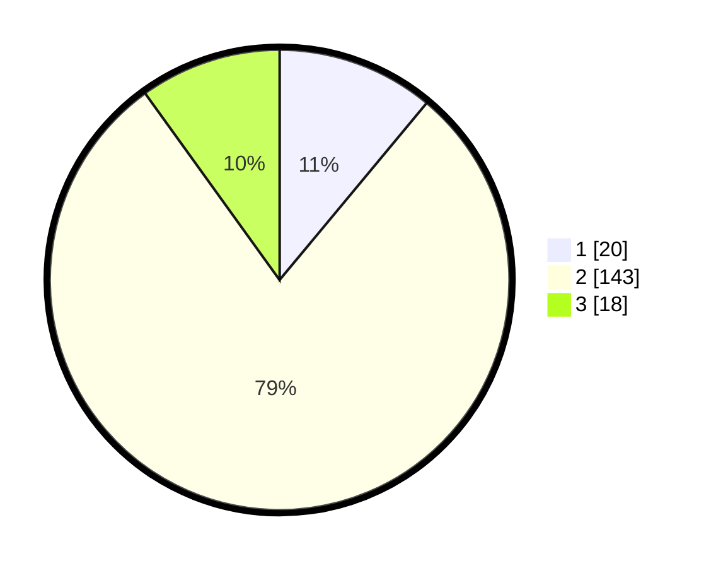

# Hasil

## Grafik

## Tabel

| No. | Nama Paslon    | Suara | Suara (raw) | Persentase |
|:--- |:-------------- | -----:| -----------:| ----------:|
| 1   | ANIES MUHAIMIN | 20    | [20][p-1]   | 11,05      |
| 2   | PRABOWO GIBRAN | 143   | [143][p-2]  | 79,01      |
| 3   | GANJAR MAHFUD  | 18    | [18][p-3]   | 9,94       |

[p-1]: https://github.com/gigit-pemilu/pemilu-2024/blob/main/pilpres/hitung-suara/sub/18-lampung/sub/07-lampung-timur/sub/06-batanghari/sub/2001-banarjoyo/sub/002-tps/sub/paslon-1.txt
[p-2]: https://github.com/gigit-pemilu/pemilu-2024/blob/main/pilpres/hitung-suara/sub/18-lampung/sub/07-lampung-timur/sub/06-batanghari/sub/2001-banarjoyo/sub/002-tps/sub/paslon-2.txt
[p-3]: https://github.com/gigit-pemilu/pemilu-2024/blob/main/pilpres/hitung-suara/sub/18-lampung/sub/07-lampung-timur/sub/06-batanghari/sub/2001-banarjoyo/sub/002-tps/sub/paslon-3.txt

## Foto C Plano

https://sirekap-obj-formc.kpu.go.id/ab60/pemilu/ppwp/18/07/06/20/01/1807062001002-20240216-205831--d681dc2d-779a-4d05-a548-14768177dbca.jpg

https://sirekap-obj-formc.kpu.go.id/ab60/pemilu/ppwp/18/07/06/20/01/1807062001002-20240216-212824--a1de69bb-6820-4b56-92ef-eb89d322a16b.jpg

https://sirekap-obj-formc.kpu.go.id/ab60/pemilu/ppwp/18/07/06/20/01/1807062001002-20240216-213256--b755e478-4866-4d78-a196-5b09b4e4b6ae.jpg

## Metadata

| Key        | Value               |
| ---------- | ------------------- |
| Time Stamp | 2024-02-17 00:28:35 |

## DATA PEMILIH TETAP

Jumlah pemilih dalam DPT: **284**.
 * L: **151**.
 * P: **10**.

## DATA PENGGUNA HAK PILIH

Jumlah pengguna hak pilih dalam DPT: **161**.
 * L: **35**.
 * P: **87**.

Jumlah pengguna hak pilih dalam DPTb: **35**.
 * L: **7**.
 * P: **7**.

Jumlah pengguna hak pilih dalam DPK: **70**.
 * L: **554**.
 * P: **0**.

Jumlah pengguna hak pilih: **77**.
 * L: **11**.
 * P: **36**.

## JUMLAH SUARA SAH DAN TIDAK SAH

JUMLAH SELURUH SUARA SAH: **181**.

JUMLAH SUARA TIDAK SAH: **3**.

JUMLAH SELURUH SUARA SAH DAN SUARA TIDAK SAH: **184**.

