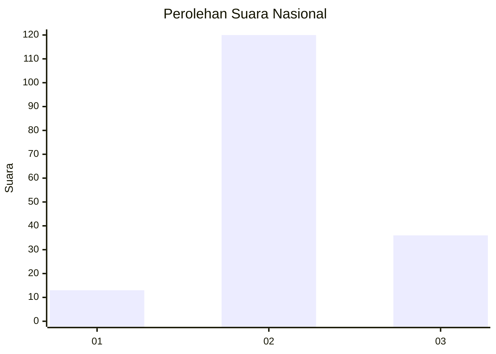
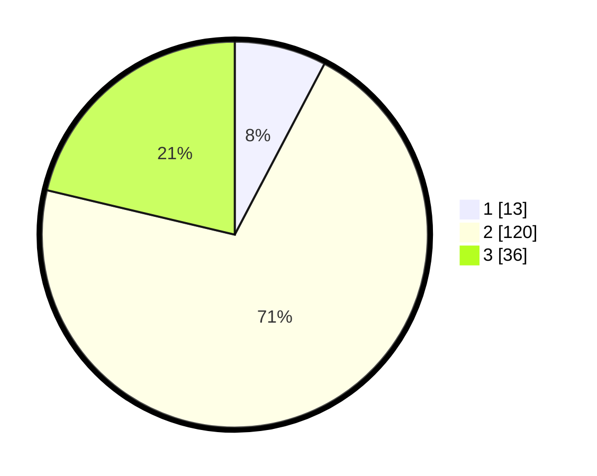

# Hasil

## Grafik

## Tabel

| No. | Nama Paslon    | Suara | Suara (raw) | Persentase |
|:--- |:-------------- | -----:| -----------:| ----------:|
| 1   | ANIES MUHAIMIN | 13    | [13][p-1]   | 7,69       |
| 2   | PRABOWO GIBRAN | 120   | [120][p-2]  | 71,01      |
| 3   | GANJAR MAHFUD  | 36    | [36][p-3]   | 21,30      |

[p-1]: https://github.com/gigit-pemilu/pemilu-2024/blob/main/pilpres/hitung-suara/sub/18-lampung/sub/07-lampung-timur/sub/07-way-jepara/sub/2001-braja-sakti/sub/005-tps/sub/paslon-1.txt
[p-2]: https://github.com/gigit-pemilu/pemilu-2024/blob/main/pilpres/hitung-suara/sub/18-lampung/sub/07-lampung-timur/sub/07-way-jepara/sub/2001-braja-sakti/sub/005-tps/sub/paslon-2.txt
[p-3]: https://github.com/gigit-pemilu/pemilu-2024/blob/main/pilpres/hitung-suara/sub/18-lampung/sub/07-lampung-timur/sub/07-way-jepara/sub/2001-braja-sakti/sub/005-tps/sub/paslon-3.txt

## Foto C Plano

https://sirekap-obj-formc.kpu.go.id/8c3d/pemilu/ppwp/18/07/07/20/01/1807072001005-20240218-101520--5ce735b9-3dea-4388-aed2-2353e81f3a7b.jpg

https://sirekap-obj-formc.kpu.go.id/8c3d/pemilu/ppwp/18/07/07/20/01/1807072001005-20240214-191148--9ac13ef3-2949-4bd1-82ae-faeca7a8347a.jpg

https://sirekap-obj-formc.kpu.go.id/8c3d/pemilu/ppwp/18/07/07/20/01/1807072001005-20240221-170537--7fd20d41-16f7-48a8-be63-f1466e3d6db9.jpg

## Metadata

| Key        | Value               |
| ---------- | ------------------- |
| Time Stamp | 2024-02-21 18:00:00 |

