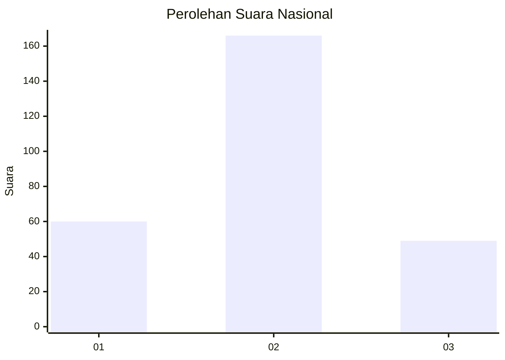
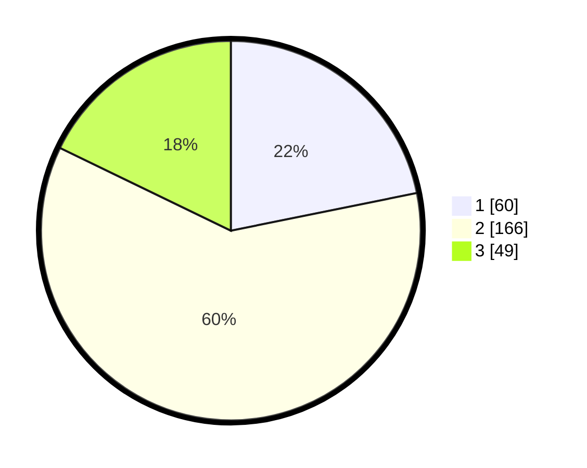

# Hasil

## Grafik

## Tabel

| No. | Nama Paslon    | Suara | Suara (raw) | Persentase |
|:--- |:-------------- | -----:| -----------:| ----------:|
| 1   | ANIES MUHAIMIN | 60    | [60][p-1]   | 21,82      |
| 2   | PRABOWO GIBRAN | 166   | [166][p-2]  | 60,36      |
| 3   | GANJAR MAHFUD  | 49    | [49][p-3]   | 17,82      |

[p-1]: https://github.com/gigit-pemilu/pemilu-2024/blob/main/pilpres/hitung-suara/sub/18-lampung/sub/07-lampung-timur/sub/07-way-jepara/sub/2011-braja-asri/sub/007-tps/sub/paslon-1.txt
[p-2]: https://github.com/gigit-pemilu/pemilu-2024/blob/main/pilpres/hitung-suara/sub/18-lampung/sub/07-lampung-timur/sub/07-way-jepara/sub/2011-braja-asri/sub/007-tps/sub/paslon-2.txt
[p-3]: https://github.com/gigit-pemilu/pemilu-2024/blob/main/pilpres/hitung-suara/sub/18-lampung/sub/07-lampung-timur/sub/07-way-jepara/sub/2011-braja-asri/sub/007-tps/sub/paslon-3.txt

## Foto C Plano

https://sirekap-obj-formc.kpu.go.id/89ec/pemilu/ppwp/18/07/07/20/11/1807072011007-20240215-110859--de694706-98ef-443d-b43b-a6e7836afda3.jpg

https://sirekap-obj-formc.kpu.go.id/89ec/pemilu/ppwp/18/07/07/20/11/1807072011007-20240216-231253--3acc76f8-9438-4e4e-8972-bb806adf0fa7.jpg

https://sirekap-obj-formc.kpu.go.id/89ec/pemilu/ppwp/18/07/07/20/11/1807072011007-20240215-095649--f5733195-e5b2-4acb-9243-a221835bbe30.jpg

## Metadata

| Key        | Value               |
| ---------- | ------------------- |
| Time Stamp | 2024-02-16 23:30:00 |

