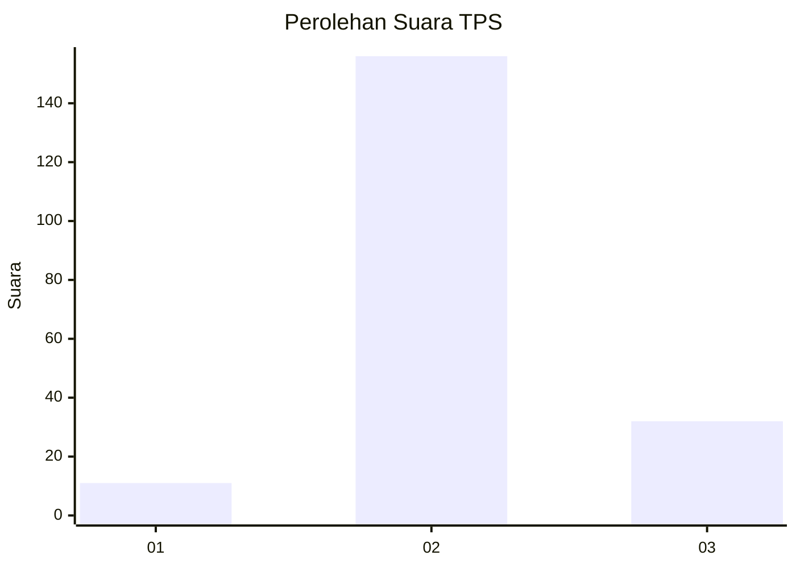
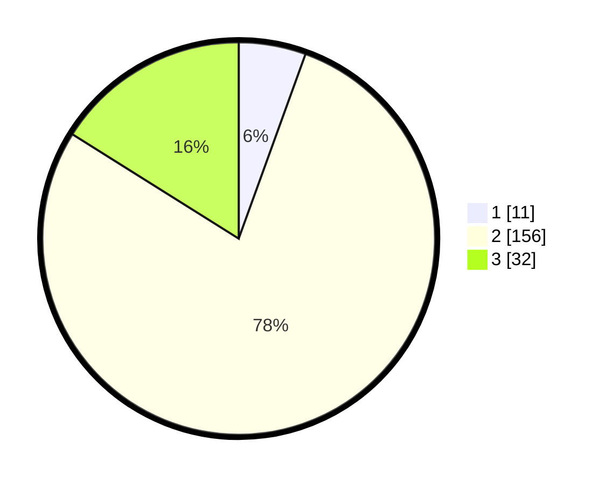

# Hasil

## Grafik

## Tabel

| No. | Nama Paslon    | Suara | Suara (raw) | Persentase |
|:--- |:-------------- | -----:| -----------:| ----------:|
| 1   | ANIES MUHAIMIN | 11    | [11][p-1]   | 5,53       |
| 2   | PRABOWO GIBRAN | 156   | [156][p-2]  | 78,39      |
| 3   | GANJAR MAHFUD  | 32    | [32][p-3]   | 16,08      |

[p-1]: https://github.com/gigit-pemilu/pemilu-2024-18-lampung/blob/main/pilpres/hitung-suara/sub/18-lampung/sub/07-lampung-timur/sub/08-purbolinggo/sub/2001-taman-fajar/sub/005-tps/sub/paslon-1.txt
[p-2]: https://github.com/gigit-pemilu/pemilu-2024-18-lampung/blob/main/pilpres/hitung-suara/sub/18-lampung/sub/07-lampung-timur/sub/08-purbolinggo/sub/2001-taman-fajar/sub/005-tps/sub/paslon-2.txt
[p-3]: https://github.com/gigit-pemilu/pemilu-2024-18-lampung/blob/main/pilpres/hitung-suara/sub/18-lampung/sub/07-lampung-timur/sub/08-purbolinggo/sub/2001-taman-fajar/sub/005-tps/sub/paslon-3.txt

## Foto C Plano

https://sirekap-obj-formc.kpu.go.id/ad78/pemilu/ppwp/18/07/08/20/01/1807082001005-20240220-141744--066e2ef4-bf2c-4ce2-982d-d8060024894b.jpg

https://sirekap-obj-formc.kpu.go.id/ad78/pemilu/ppwp/18/07/08/20/01/1807082001005-20240220-142238--c2bcc847-c84d-41aa-a9a9-8bc93a723f9f.jpg

https://sirekap-obj-formc.kpu.go.id/ad78/pemilu/ppwp/18/07/08/20/01/1807082001005-20240220-143554--d9b18955-3c6c-4eb1-8547-083da46da4f7.jpg

## Metadata

| Key        | Value               |
| ---------- | ------------------- |
| Time Stamp | 2024-02-20 17:00:00 |

