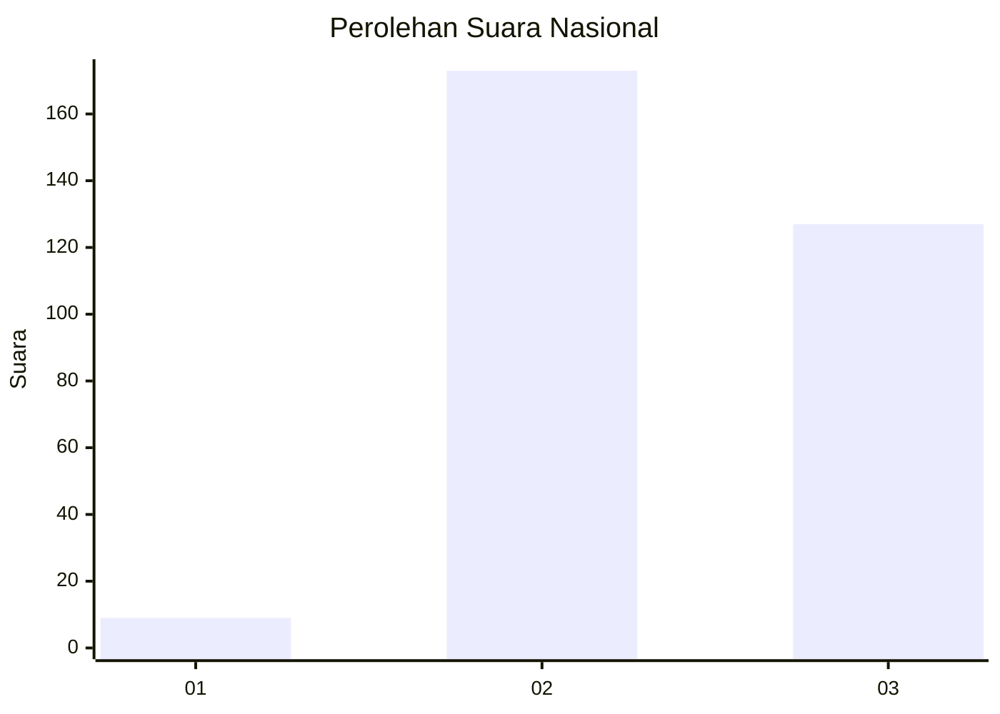
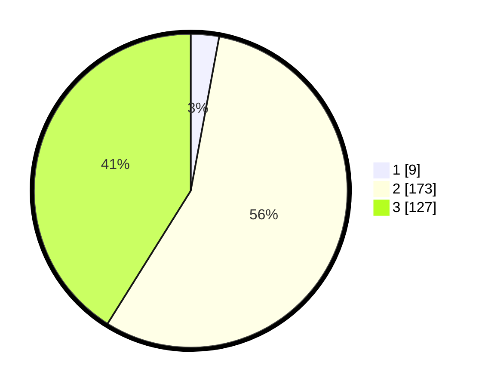

# Hasil

## Grafik

## Tabel

| No. | Nama Paslon    | Suara | Suara (raw) | Persentase |
|:--- |:-------------- | -----:| -----------:| ----------:|
| 1   | ANIES MUHAIMIN | 9     | [9][p-1]    | 2,91       |
| 2   | PRABOWO GIBRAN | 173   | [173][p-2]  | 55,99      |
| 3   | GANJAR MAHFUD  | 127   | [127][p-3]  | 41,10      |

[p-1]: https://github.com/gigit-pemilu/pemilu-2024/blob/main/pilpres/hitung-suara/sub/18-lampung/sub/07-lampung-timur/sub/08-purbolinggo/sub/2010-tegal-yoso/sub/008-tps/sub/paslon-1.txt
[p-2]: https://github.com/gigit-pemilu/pemilu-2024/blob/main/pilpres/hitung-suara/sub/18-lampung/sub/07-lampung-timur/sub/08-purbolinggo/sub/2010-tegal-yoso/sub/008-tps/sub/paslon-2.txt
[p-3]: https://github.com/gigit-pemilu/pemilu-2024/blob/main/pilpres/hitung-suara/sub/18-lampung/sub/07-lampung-timur/sub/08-purbolinggo/sub/2010-tegal-yoso/sub/008-tps/sub/paslon-3.txt

## Foto C Plano

https://sirekap-obj-formc.kpu.go.id/958d/pemilu/ppwp/18/07/08/20/10/1807082010008-20240219-162249--c295da40-1c62-431c-b8b2-fd8da68f6c0f.jpg

https://sirekap-obj-formc.kpu.go.id/958d/pemilu/ppwp/18/07/08/20/10/1807082010008-20240219-170542--1785d186-5238-48a8-ae7e-4cb1c8047fed.jpg

https://sirekap-obj-formc.kpu.go.id/958d/pemilu/ppwp/18/07/08/20/10/1807082010008-20240219-180440--b3608f2f-8f9a-487e-9aeb-651db6d05873.jpg

## Metadata

| Key        | Value               |
| ---------- | ------------------- |
| Time Stamp | 2024-02-20 17:00:00 |

