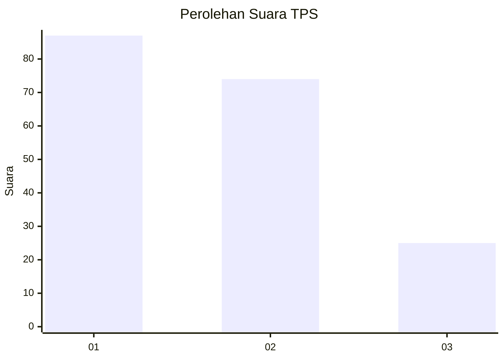
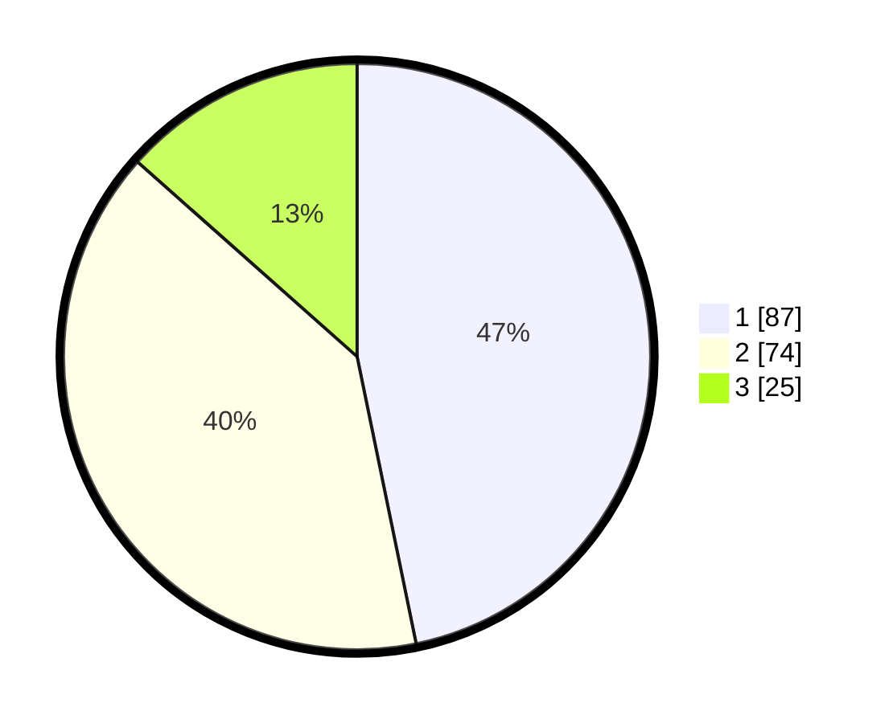

# Hasil

## Grafik

## Tabel

| No. | Nama Paslon    | Suara | Suara (raw) | Persentase |
|:--- |:-------------- | -----:| -----------:| ----------:|
| 1   | ANIES MUHAIMIN | 87    | [87][p-1]   | 46,77      |
| 2   | PRABOWO GIBRAN | 74    | [74][p-2]   | 39,78      |
| 3   | GANJAR MAHFUD  | 25    | [25][p-3]   | 13,44      |

[p-1]: https://github.com/gigit-pemilu/pemilu-2024-18-lampung/blob/main/pilpres/hitung-suara/sub/18-lampung/sub/07-lampung-timur/sub/11-marga-tiga/sub/2001-tanjung-harapan/sub/002-tps/sub/paslon-1.txt
[p-2]: https://github.com/gigit-pemilu/pemilu-2024-18-lampung/blob/main/pilpres/hitung-suara/sub/18-lampung/sub/07-lampung-timur/sub/11-marga-tiga/sub/2001-tanjung-harapan/sub/002-tps/sub/paslon-2.txt
[p-3]: https://github.com/gigit-pemilu/pemilu-2024-18-lampung/blob/main/pilpres/hitung-suara/sub/18-lampung/sub/07-lampung-timur/sub/11-marga-tiga/sub/2001-tanjung-harapan/sub/002-tps/sub/paslon-3.txt

## Foto C Plano

https://sirekap-obj-formc.kpu.go.id/0057/pemilu/ppwp/18/07/11/20/01/1807112001002-20240222-124648--e81a99c3-d340-4ca9-9d37-05406c2dca16.jpg

https://sirekap-obj-formc.kpu.go.id/0057/pemilu/ppwp/18/07/11/20/01/1807112001002-20240222-124804--6b399a60-8a4e-473b-9380-db5fe97d04c6.jpg

https://sirekap-obj-formc.kpu.go.id/0057/pemilu/ppwp/18/07/11/20/01/1807112001002-20240222-124845--e83c1463-abbe-489b-ada6-e966a1f3f1b5.jpg

## Metadata

| Key        | Value               |
| ---------- | ------------------- |
| Time Stamp | 2024-02-22 13:00:00 |

## DATA PEMILIH TETAP

Jumlah pemilih dalam DPT: **253**.
 * L: **530**.
 * P: **733**.

## DATA PENGGUNA HAK PILIH

Jumlah pengguna hak pilih dalam DPT: **203**.
 * L: **45**.
 * P: **602**.

Jumlah pengguna hak pilih dalam DPTb: **222**.
 * L: **5**.
 * P: **583**.

Jumlah pengguna hak pilih dalam DPK: **803**.
 * L: **800**.
 * P: **888**.

Jumlah pengguna hak pilih: **203**.
 * L: **895**.
 * P: **0**.

## JUMLAH SUARA SAH DAN TIDAK SAH

JUMLAH SELURUH SUARA SAH: **293**.

JUMLAH SUARA TIDAK SAH: **883**.

JUMLAH SELURUH SUARA SAH DAN SUARA TIDAK SAH: **203**.

