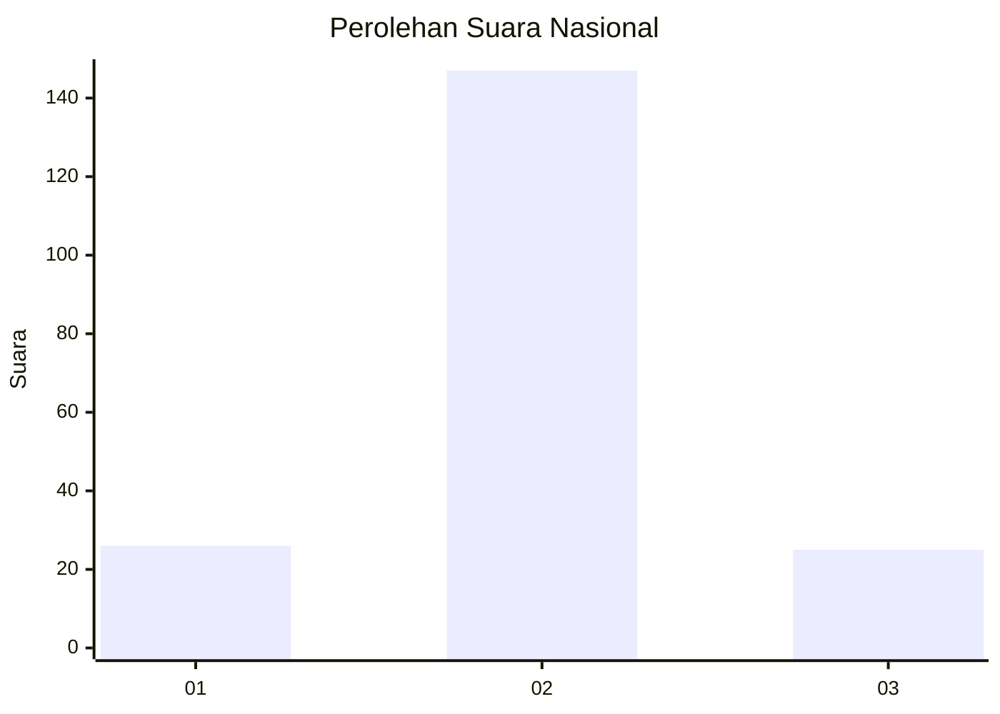
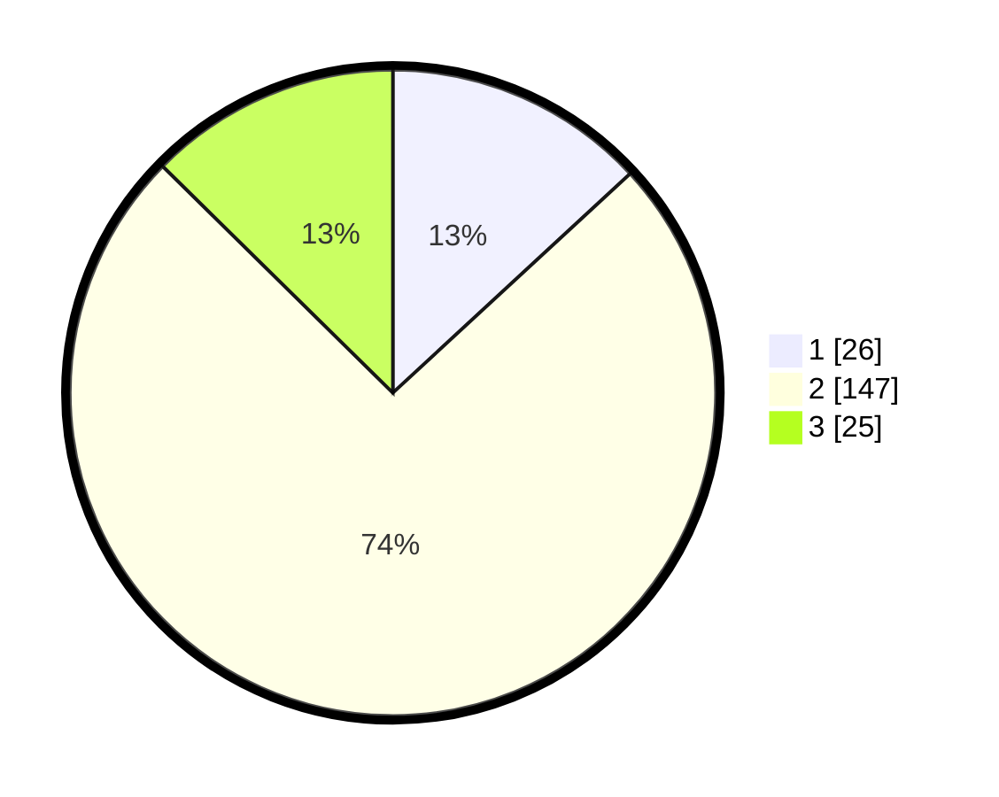

# Hasil

## Grafik

## Tabel

| No. | Nama Paslon    | Suara | Suara (raw) | Persentase |
|:--- |:-------------- | -----:| -----------:| ----------:|
| 1   | ANIES MUHAIMIN | 26    | [26][p-1]   | 13,13      |
| 2   | PRABOWO GIBRAN | 147   | [147][p-2]  | 74,24      |
| 3   | GANJAR MAHFUD  | 25    | [25][p-3]   | 12,63      |

[p-1]: https://github.com/gigit-pemilu/pemilu-2024/blob/main/pilpres/hitung-suara/sub/18-lampung/sub/07-lampung-timur/sub/11-marga-tiga/sub/2001-tanjung-harapan/sub/004-tps/sub/paslon-1.txt
[p-2]: https://github.com/gigit-pemilu/pemilu-2024/blob/main/pilpres/hitung-suara/sub/18-lampung/sub/07-lampung-timur/sub/11-marga-tiga/sub/2001-tanjung-harapan/sub/004-tps/sub/paslon-2.txt
[p-3]: https://github.com/gigit-pemilu/pemilu-2024/blob/main/pilpres/hitung-suara/sub/18-lampung/sub/07-lampung-timur/sub/11-marga-tiga/sub/2001-tanjung-harapan/sub/004-tps/sub/paslon-3.txt

## Foto C Plano

https://sirekap-obj-formc.kpu.go.id/e774/pemilu/ppwp/18/07/11/20/01/1807112001004-20240222-162958--884d2adb-8942-4647-b71f-8e9e435a9a3f.jpg

https://sirekap-obj-formc.kpu.go.id/e774/pemilu/ppwp/18/07/11/20/01/1807112001004-20240222-163142--7ea02e8b-42bf-43e2-8e3d-9a49c2c70ac5.jpg

https://sirekap-obj-formc.kpu.go.id/e774/pemilu/ppwp/18/07/11/20/01/1807112001004-20240222-163321--5fc236fe-8f8e-4880-8945-105e91b81ee0.jpg

## Metadata

| Key        | Value               |
| ---------- | ------------------- |
| Time Stamp | 2024-02-22 17:00:00 |

## DATA PEMILIH TETAP

Jumlah pemilih dalam DPT: **257**.
 * L: **127**.
 * P: **130**.

## DATA PENGGUNA HAK PILIH

Jumlah pengguna hak pilih dalam DPT: **204**.
 * L: **1**.
 * P: **0**.

Jumlah pengguna hak pilih dalam DPTb: **888**.
 * L: **882**.
 * P: **888**.

Jumlah pengguna hak pilih dalam DPK: **880**.
 * L: **488**.
 * P: **888**.

Jumlah pengguna hak pilih: **204**.
 * L: **204**.
 * P: **400**.

## JUMLAH SUARA SAH DAN TIDAK SAH

JUMLAH SELURUH SUARA SAH: **198**.

JUMLAH SUARA TIDAK SAH: **3**.

JUMLAH SELURUH SUARA SAH DAN SUARA TIDAK SAH: **201**.

