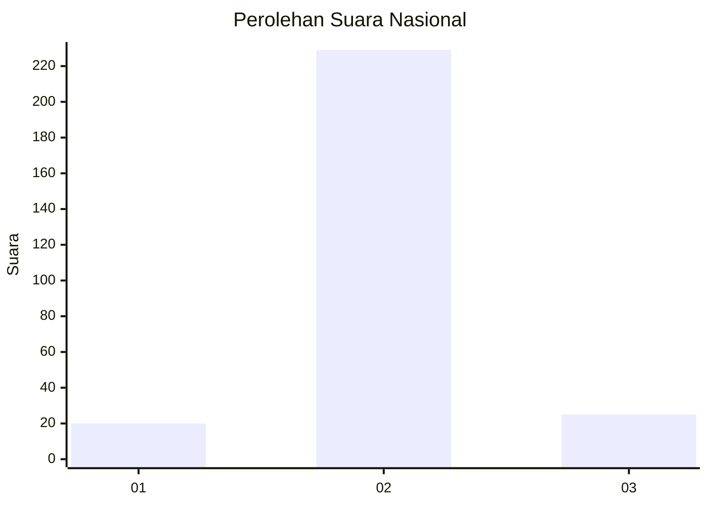
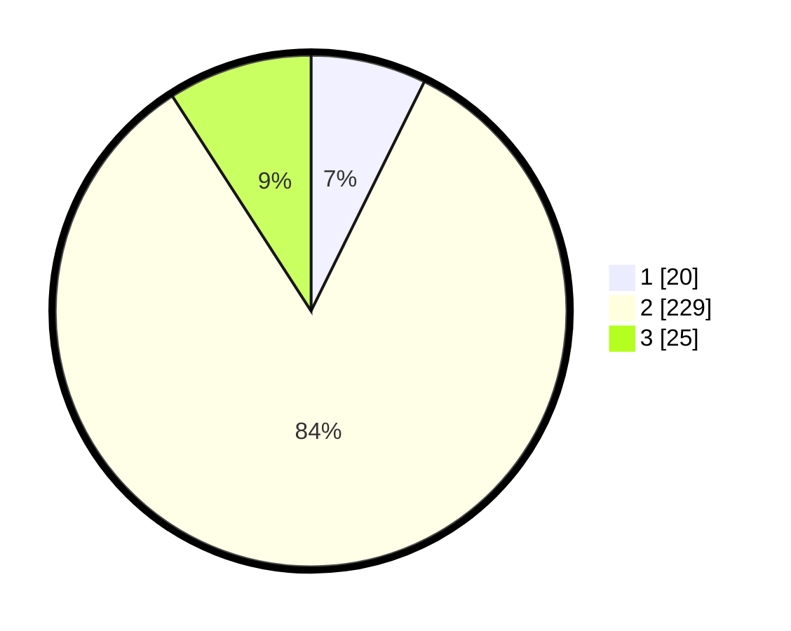

# Hasil

## Grafik

## Tabel

| No. | Nama Paslon    | Suara | Suara (raw) | Persentase |
|:--- |:-------------- | -----:| -----------:| ----------:|
| 1   | ANIES MUHAIMIN | 20    | [20][p-1]   | 7,30       |
| 2   | PRABOWO GIBRAN | 229   | [229][p-2]  | 83,58      |
| 3   | GANJAR MAHFUD  | 25    | [25][p-3]   | 9,12       |

[p-1]: https://github.com/gigit-pemilu/pemilu-2024/blob/main/pilpres/hitung-suara/sub/18-lampung/sub/07-lampung-timur/sub/11-marga-tiga/sub/2001-tanjung-harapan/sub/012-tps/sub/paslon-1.txt
[p-2]: https://github.com/gigit-pemilu/pemilu-2024/blob/main/pilpres/hitung-suara/sub/18-lampung/sub/07-lampung-timur/sub/11-marga-tiga/sub/2001-tanjung-harapan/sub/012-tps/sub/paslon-2.txt
[p-3]: https://github.com/gigit-pemilu/pemilu-2024/blob/main/pilpres/hitung-suara/sub/18-lampung/sub/07-lampung-timur/sub/11-marga-tiga/sub/2001-tanjung-harapan/sub/012-tps/sub/paslon-3.txt

## Foto C Plano

https://sirekap-obj-formc.kpu.go.id/a3ad/pemilu/ppwp/18/07/11/20/01/1807112001012-20240222-172527--eebc8668-2e45-4fe2-bd22-521748f82308.jpg

https://sirekap-obj-formc.kpu.go.id/a3ad/pemilu/ppwp/18/07/11/20/01/1807112001012-20240222-172602--35d2ad16-7f38-4f71-bfba-0874e38025c8.jpg

https://sirekap-obj-formc.kpu.go.id/a3ad/pemilu/ppwp/18/07/11/20/01/1807112001012-20240222-172835--38a95e6c-0fb6-4366-bd61-d4690aa12a69.jpg

## Metadata

| Key        | Value               |
| ---------- | ------------------- |
| Time Stamp | 2024-02-22 18:00:00 |

## DATA PEMILIH TETAP

Jumlah pemilih dalam DPT: **288**.
 * L: **753**.
 * P: **36**.

## DATA PENGGUNA HAK PILIH

Jumlah pengguna hak pilih dalam DPT: **297**.
 * L: **420**.
 * P: **432**.

Jumlah pengguna hak pilih dalam DPTb: **888**.
 * L: **884**.
 * P: **258**.

Jumlah pengguna hak pilih dalam DPK: **845**.
 * L: **888**.
 * P: **888**.

Jumlah pengguna hak pilih: **248**.
 * L: **628**.
 * P: **603**.

## JUMLAH SUARA SAH DAN TIDAK SAH

JUMLAH SELURUH SUARA SAH: **245**.

JUMLAH SUARA TIDAK SAH: **202**.

JUMLAH SELURUH SUARA SAH DAN SUARA TIDAK SAH: **240**.

