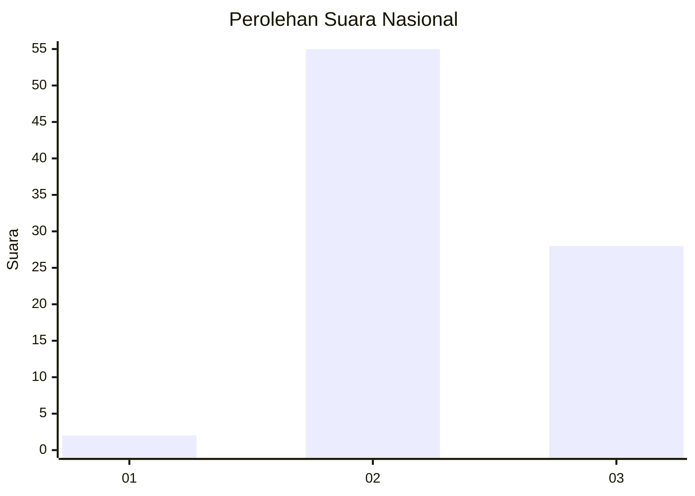
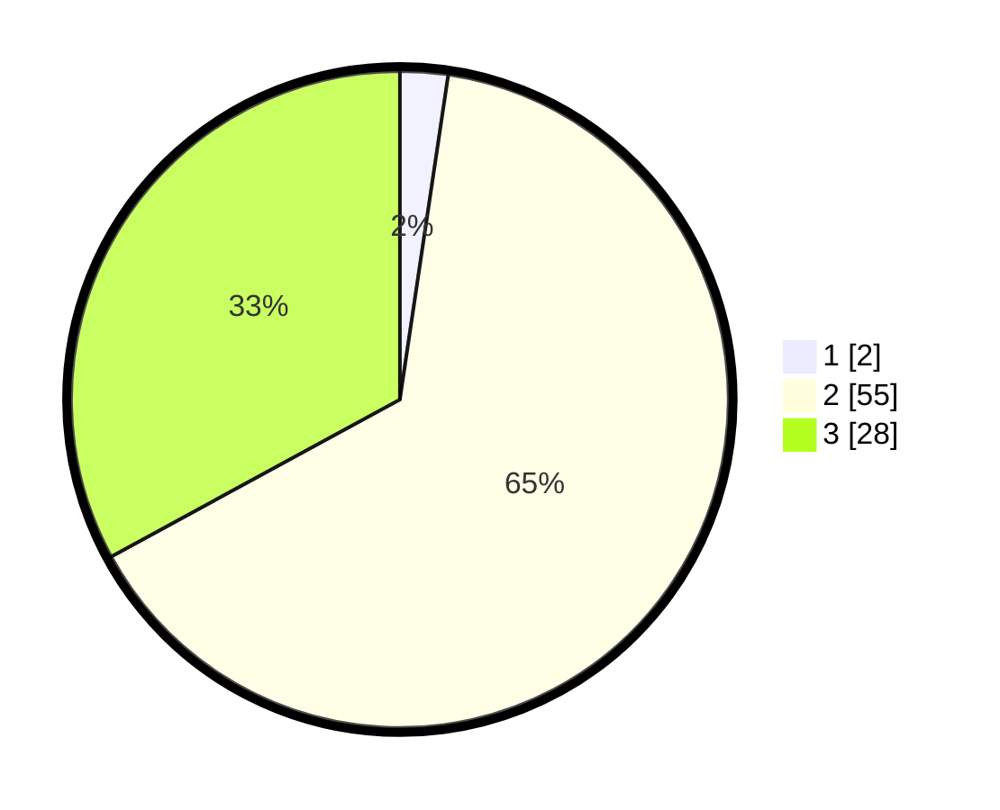

# Hasil

## Grafik

## Tabel

| No. | Nama Paslon    | Suara | Suara (raw) | Persentase |
|:--- |:-------------- | -----:| -----------:| ----------:|
| 1   | ANIES MUHAIMIN | 2     | [2][p-1]    | 2,35       |
| 2   | PRABOWO GIBRAN | 55    | [55][p-2]   | 64,71      |
| 3   | GANJAR MAHFUD  | 28    | [28][p-3]   | 32,94      |

[p-1]: https://github.com/gigit-pemilu/pemilu-2024/blob/main/pilpres/hitung-suara/sub/18-lampung/sub/07-lampung-timur/sub/11-marga-tiga/sub/2003-negeri-katon/sub/004-tps/sub/paslon-1.txt
[p-2]: https://github.com/gigit-pemilu/pemilu-2024/blob/main/pilpres/hitung-suara/sub/18-lampung/sub/07-lampung-timur/sub/11-marga-tiga/sub/2003-negeri-katon/sub/004-tps/sub/paslon-2.txt
[p-3]: https://github.com/gigit-pemilu/pemilu-2024/blob/main/pilpres/hitung-suara/sub/18-lampung/sub/07-lampung-timur/sub/11-marga-tiga/sub/2003-negeri-katon/sub/004-tps/sub/paslon-3.txt

## Foto C Plano

https://sirekap-obj-formc.kpu.go.id/30bc/pemilu/ppwp/18/07/11/20/03/1807112003004-20240222-152416--56bb710b-faaf-4d3d-8a2f-cf62c9a955ac.jpg

https://sirekap-obj-formc.kpu.go.id/30bc/pemilu/ppwp/18/07/11/20/03/1807112003004-20240222-152702--ef2dd7ea-d444-4a06-9481-c7d2670be03f.jpg

https://sirekap-obj-formc.kpu.go.id/30bc/pemilu/ppwp/18/07/11/20/03/1807112003004-20240222-152550--c6b31683-2ef1-4bdd-a11e-d89bb00746b3.jpg

## Metadata

| Key        | Value               |
| ---------- | ------------------- |
| Time Stamp | 2024-02-22 16:00:00 |

## DATA PEMILIH TETAP

Jumlah pemilih dalam DPT: **229**.
 * L: **646**.
 * P: **354**.

## DATA PENGGUNA HAK PILIH

Jumlah pengguna hak pilih dalam DPT: **803**.
 * L: **403**.
 * P: **559**.

Jumlah pengguna hak pilih dalam DPTb: **883**.
 * L: **888**.
 * P: **888**.

Jumlah pengguna hak pilih dalam DPK: **883**.
 * L: **488**.
 * P: **888**.

Jumlah pengguna hak pilih: **243**.
 * L: **233**.
 * P: **369**.

## JUMLAH SUARA SAH DAN TIDAK SAH

JUMLAH SELURUH SUARA SAH: **200**.

JUMLAH SUARA TIDAK SAH: **83**.

JUMLAH SELURUH SUARA SAH DAN SUARA TIDAK SAH: **223**.

