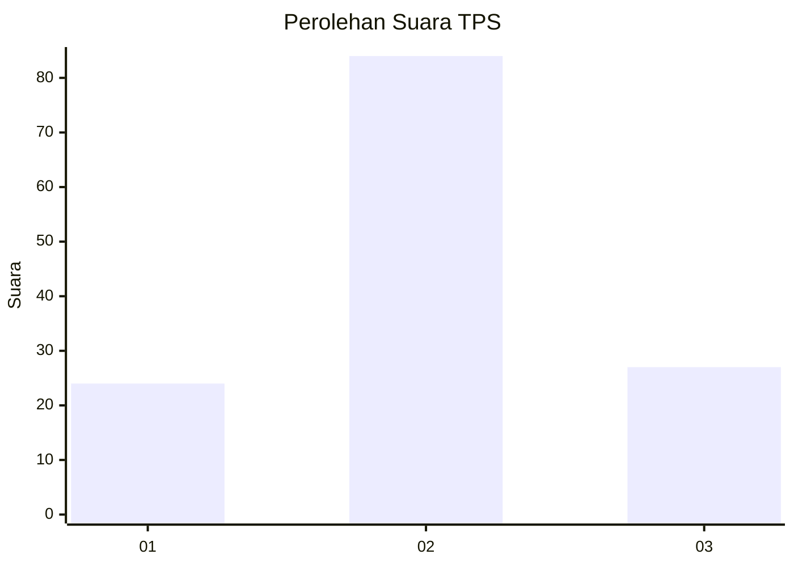
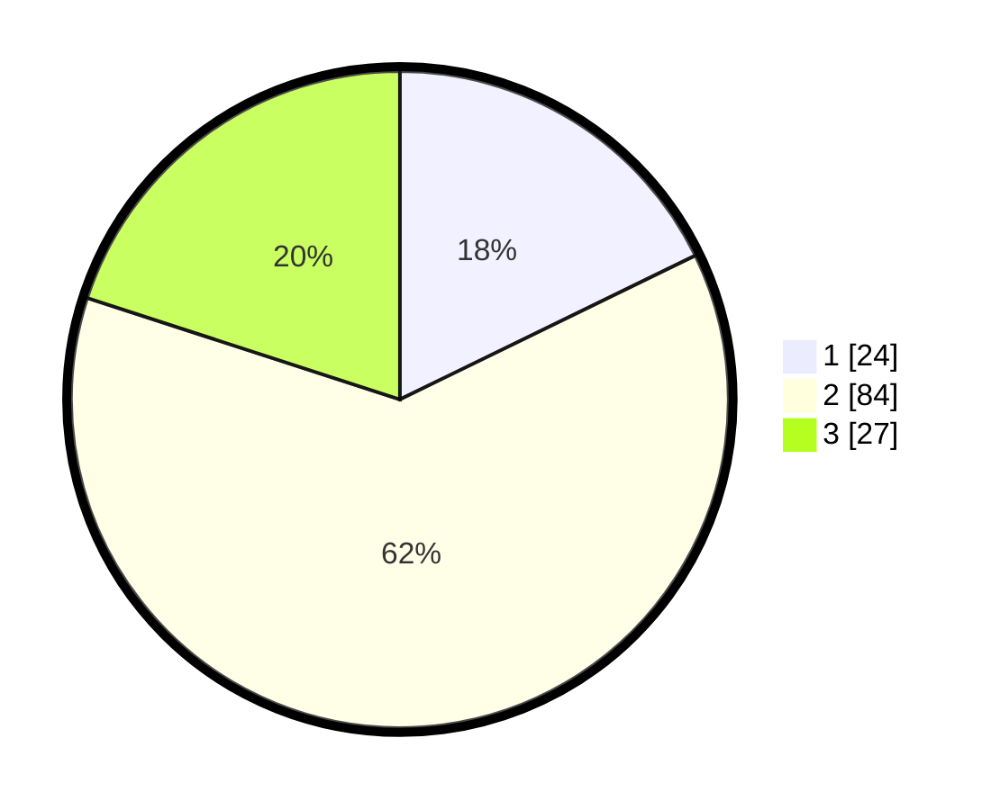

# Hasil

## Grafik

## Tabel

| No. | Nama Paslon    | Suara | Suara (raw) | Persentase |
|:--- |:-------------- | -----:| -----------:| ----------:|
| 1   | ANIES MUHAIMIN | 24    | [24][p-1]   | 17,78      |
| 2   | PRABOWO GIBRAN | 84    | [84][p-2]   | 62,22      |
| 3   | GANJAR MAHFUD  | 27    | [27][p-3]   | 20,00      |

[p-1]: https://github.com/gigit-pemilu/pemilu-2024-18-lampung/blob/main/pilpres/hitung-suara/sub/18-lampung/sub/07-lampung-timur/sub/11-marga-tiga/sub/2003-negeri-katon/sub/005-tps/sub/paslon-1.txt
[p-2]: https://github.com/gigit-pemilu/pemilu-2024-18-lampung/blob/main/pilpres/hitung-suara/sub/18-lampung/sub/07-lampung-timur/sub/11-marga-tiga/sub/2003-negeri-katon/sub/005-tps/sub/paslon-2.txt
[p-3]: https://github.com/gigit-pemilu/pemilu-2024-18-lampung/blob/main/pilpres/hitung-suara/sub/18-lampung/sub/07-lampung-timur/sub/11-marga-tiga/sub/2003-negeri-katon/sub/005-tps/sub/paslon-3.txt

## Foto C Plano

https://sirekap-obj-formc.kpu.go.id/3bb4/pemilu/ppwp/18/07/11/20/03/1807112003005-20240222-121340--1d688081-d9f7-495e-9d99-5a29a89fbe31.jpg

https://sirekap-obj-formc.kpu.go.id/3bb4/pemilu/ppwp/18/07/11/20/03/1807112003005-20240222-122001--e7262e7e-5b81-4490-8cb0-2afab9b8339d.jpg

https://sirekap-obj-formc.kpu.go.id/3bb4/pemilu/ppwp/18/07/11/20/03/1807112003005-20240222-121716--b05063b1-f54f-499f-b24c-8d325949f3a8.jpg

## Metadata

| Key        | Value               |
| ---------- | ------------------- |
| Time Stamp | 2024-02-22 13:00:00 |

## DATA PEMILIH TETAP

Jumlah pemilih dalam DPT: **885**.
 * L: **868**.
 * P: **885**.

## DATA PENGGUNA HAK PILIH

Jumlah pengguna hak pilih dalam DPT: **888**.
 * L: **880**.
 * P: **887**.

Jumlah pengguna hak pilih dalam DPTb: **880**.
 * L: **8**.
 * P: **808**.

Jumlah pengguna hak pilih dalam DPK: **888**.
 * L: **808**.
 * P: **888**.

Jumlah pengguna hak pilih: **868**.
 * L: **880**.
 * P: **887**.

## JUMLAH SUARA SAH DAN TIDAK SAH

JUMLAH SELURUH SUARA SAH: **269**.

JUMLAH SUARA TIDAK SAH: **3**.

JUMLAH SELURUH SUARA SAH DAN SUARA TIDAK SAH: **667**.

