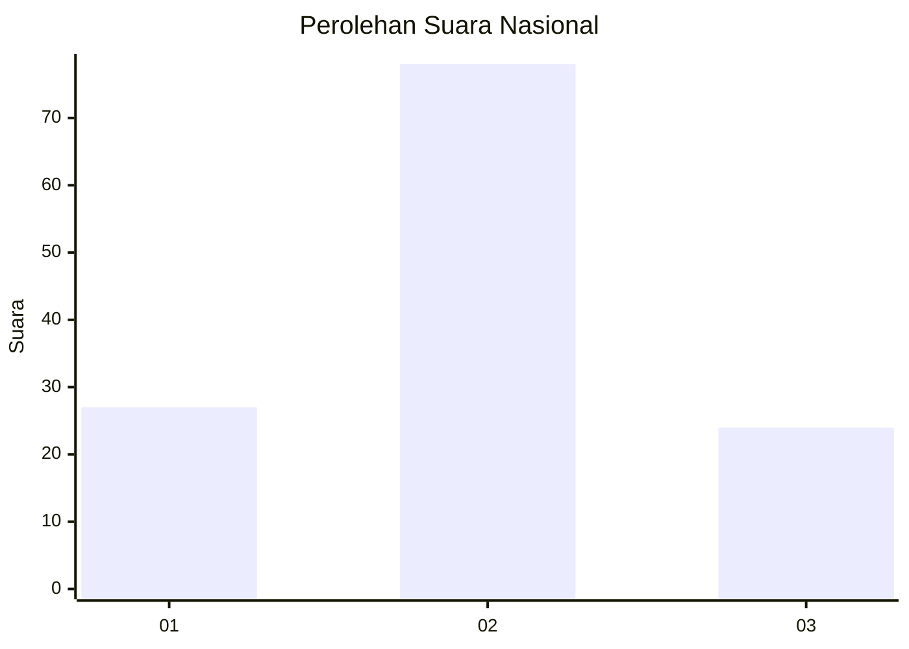
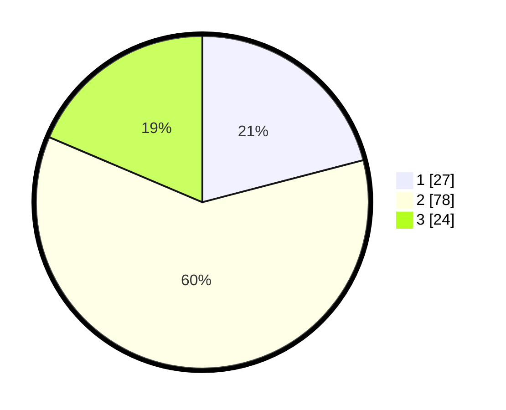

# Hasil

## Grafik

## Tabel

| No. | Nama Paslon    | Suara | Suara (raw) | Persentase |
|:--- |:-------------- | -----:| -----------:| ----------:|
| 1   | ANIES MUHAIMIN | 27    | [27][p-1]   | 20,93      |
| 2   | PRABOWO GIBRAN | 78    | [78][p-2]   | 60,47      |
| 3   | GANJAR MAHFUD  | 24    | [24][p-3]   | 18,60      |

[p-1]: https://github.com/gigit-pemilu/pemilu-2024/blob/main/pilpres/hitung-suara/sub/18-lampung/sub/07-lampung-timur/sub/11-marga-tiga/sub/2003-negeri-katon/sub/007-tps/sub/paslon-1.txt
[p-2]: https://github.com/gigit-pemilu/pemilu-2024/blob/main/pilpres/hitung-suara/sub/18-lampung/sub/07-lampung-timur/sub/11-marga-tiga/sub/2003-negeri-katon/sub/007-tps/sub/paslon-2.txt
[p-3]: https://github.com/gigit-pemilu/pemilu-2024/blob/main/pilpres/hitung-suara/sub/18-lampung/sub/07-lampung-timur/sub/11-marga-tiga/sub/2003-negeri-katon/sub/007-tps/sub/paslon-3.txt

## Foto C Plano

https://sirekap-obj-formc.kpu.go.id/ab76/pemilu/ppwp/18/07/11/20/03/1807112003007-20240222-160251--46e9e1af-3cfd-41d9-a4c2-762a8768d53b.jpg

https://sirekap-obj-formc.kpu.go.id/ab76/pemilu/ppwp/18/07/11/20/03/1807112003007-20240222-160420--3a0bff5a-e857-450b-aeae-8d4f15a4edec.jpg

https://sirekap-obj-formc.kpu.go.id/ab76/pemilu/ppwp/18/07/11/20/03/1807112003007-20240222-160456--0e1a1736-e8d1-448e-bead-2b03c467612f.jpg

## Metadata

| Key        | Value               |
| ---------- | ------------------- |
| Time Stamp | 2024-02-22 17:00:00 |

## DATA PEMILIH TETAP

Jumlah pemilih dalam DPT: **283**.
 * L: **55**.
 * P: **38**.

## DATA PENGGUNA HAK PILIH

Jumlah pengguna hak pilih dalam DPT: **254**.
 * L: **264**.
 * P: **494**.

Jumlah pengguna hak pilih dalam DPTb: **888**.
 * L: **88**.
 * P: **80**.

Jumlah pengguna hak pilih dalam DPK: **864**.
 * L: **885**.
 * P: **88**.

Jumlah pengguna hak pilih: **235**.
 * L: **48**.
 * P: **866**.

## JUMLAH SUARA SAH DAN TIDAK SAH

JUMLAH SELURUH SUARA SAH: **224**.

JUMLAH SUARA TIDAK SAH: **20**.

JUMLAH SELURUH SUARA SAH DAN SUARA TIDAK SAH: **257**.

