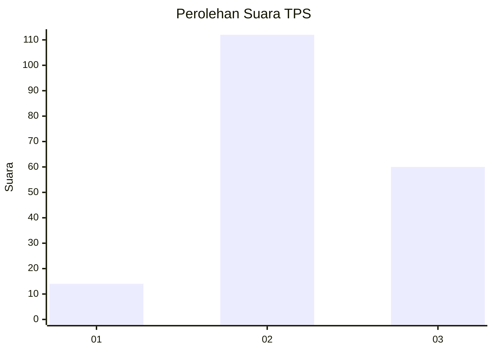
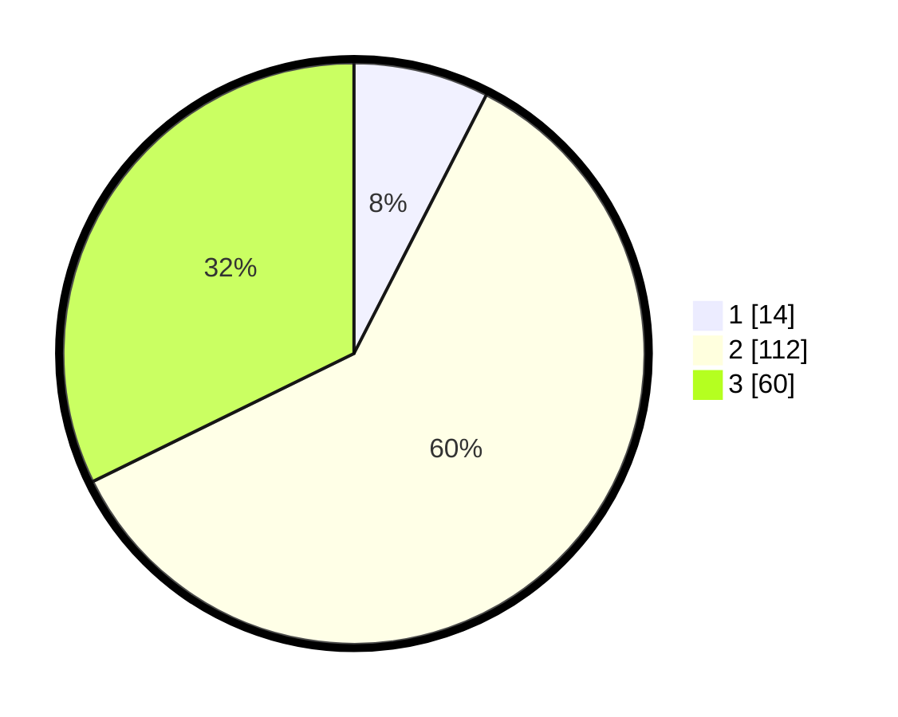

# Hasil

## Grafik

## Tabel

| No. | Nama Paslon    | Suara | Suara (raw) | Persentase |
|:--- |:-------------- | -----:| -----------:| ----------:|
| 1   | ANIES MUHAIMIN | 14    | [14][p-1]   | 7,53       |
| 2   | PRABOWO GIBRAN | 112   | [112][p-2]  | 60,22      |
| 3   | GANJAR MAHFUD  | 60    | [60][p-3]   | 32,26      |

[p-1]: https://github.com/gigit-pemilu/pemilu-2024-18-lampung/blob/main/pilpres/hitung-suara/sub/18-lampung/sub/07-lampung-timur/sub/11-marga-tiga/sub/2005-negeri-jemanten/sub/003-tps/sub/paslon-1.txt
[p-2]: https://github.com/gigit-pemilu/pemilu-2024-18-lampung/blob/main/pilpres/hitung-suara/sub/18-lampung/sub/07-lampung-timur/sub/11-marga-tiga/sub/2005-negeri-jemanten/sub/003-tps/sub/paslon-2.txt
[p-3]: https://github.com/gigit-pemilu/pemilu-2024-18-lampung/blob/main/pilpres/hitung-suara/sub/18-lampung/sub/07-lampung-timur/sub/11-marga-tiga/sub/2005-negeri-jemanten/sub/003-tps/sub/paslon-3.txt

## Foto C Plano

https://sirekap-obj-formc.kpu.go.id/3fb4/pemilu/ppwp/18/07/11/20/05/1807112005003-20240227-202616--be3dab9d-9e82-4686-a571-c270f5b3e450.jpg

https://sirekap-obj-formc.kpu.go.id/3fb4/pemilu/ppwp/18/07/11/20/05/1807112005003-20240227-202507--32786d14-a205-4093-8ad0-db9095109150.jpg

https://sirekap-obj-formc.kpu.go.id/3fb4/pemilu/ppwp/18/07/11/20/05/1807112005003-20240227-202533--a3a0d71e-f2ae-432d-8729-0dd7275b7a5a.jpg

## Metadata

| Key        | Value               |
| ---------- | ------------------- |
| Time Stamp | 2024-02-28 12:00:00 |

## DATA PEMILIH TETAP

Jumlah pemilih dalam DPT: **341**.
 * L: **122**.
 * P: **813**.

## DATA PENGGUNA HAK PILIH

Jumlah pengguna hak pilih dalam DPT: **33**.
 * L: **531**.
 * P: **533**.

Jumlah pengguna hak pilih dalam DPTb: **588**.
 * L: **553**.
 * P: **855**.

Jumlah pengguna hak pilih dalam DPK: **540**.
 * L: **333**.
 * P: **554**.

Jumlah pengguna hak pilih: **133**.
 * L: **331**.
 * P: **592**.

## JUMLAH SUARA SAH DAN TIDAK SAH

JUMLAH SELURUH SUARA SAH: **186**.

JUMLAH SUARA TIDAK SAH: **2**.

JUMLAH SELURUH SUARA SAH DAN SUARA TIDAK SAH: **188**.

