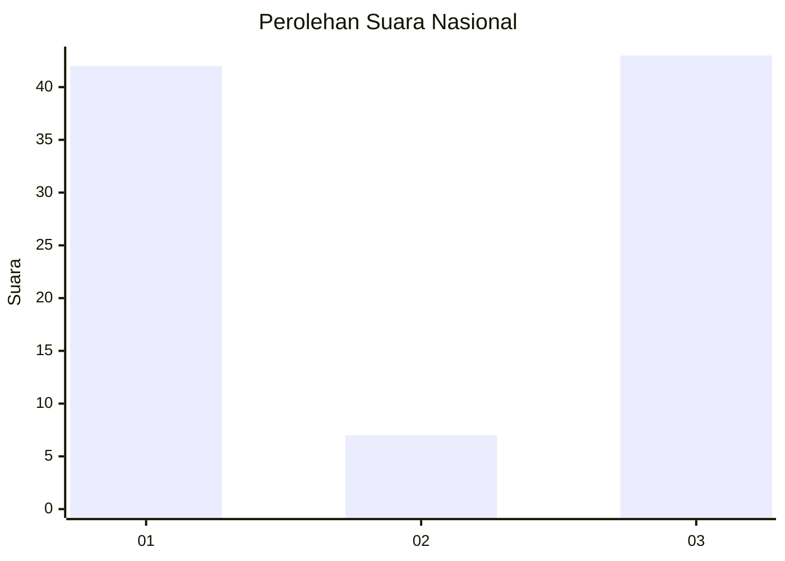
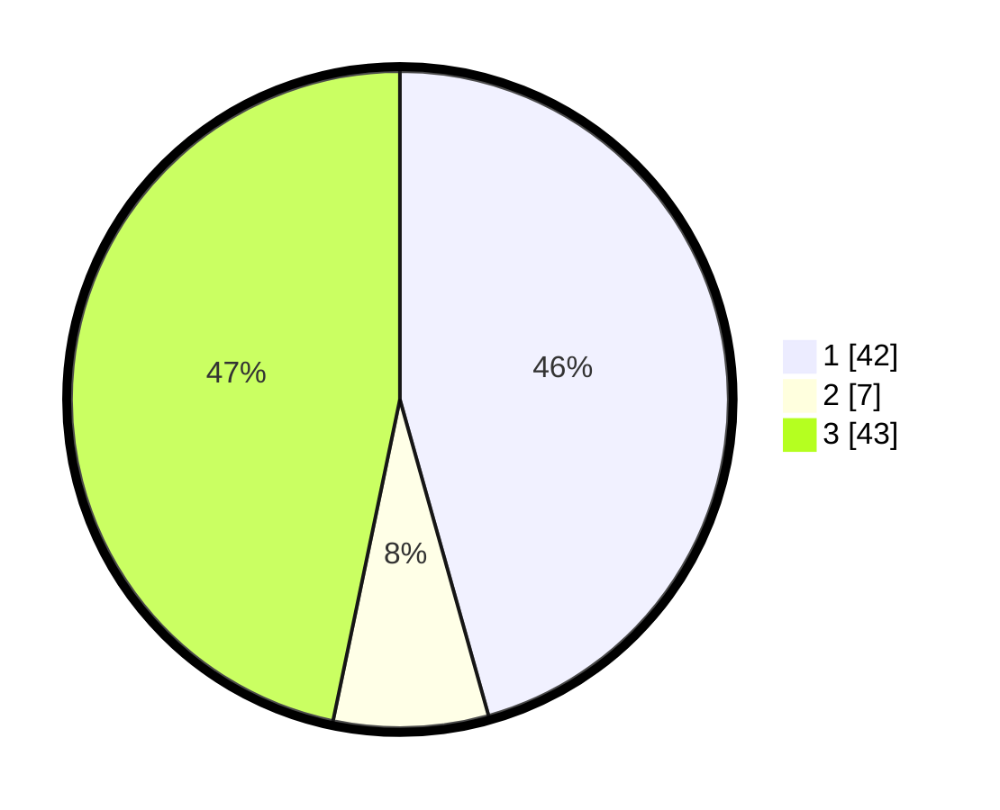

# Hasil

## Grafik

## Tabel

| No. | Nama Paslon    | Suara | Suara (raw) | Persentase |
|:--- |:-------------- | -----:| -----------:| ----------:|
| 1   | ANIES MUHAIMIN | 42    | [42][p-1]   | 45,65      |
| 2   | PRABOWO GIBRAN | 7     | [7][p-2]    | 7,61       |
| 3   | GANJAR MAHFUD  | 43    | [43][p-3]   | 46,74      |

[p-1]: https://github.com/gigit-pemilu/pemilu-2024/blob/main/pilpres/hitung-suara/sub/18-lampung/sub/07-lampung-timur/sub/11-marga-tiga/sub/2005-negeri-jemanten/sub/009-tps/sub/paslon-1.txt
[p-2]: https://github.com/gigit-pemilu/pemilu-2024/blob/main/pilpres/hitung-suara/sub/18-lampung/sub/07-lampung-timur/sub/11-marga-tiga/sub/2005-negeri-jemanten/sub/009-tps/sub/paslon-2.txt
[p-3]: https://github.com/gigit-pemilu/pemilu-2024/blob/main/pilpres/hitung-suara/sub/18-lampung/sub/07-lampung-timur/sub/11-marga-tiga/sub/2005-negeri-jemanten/sub/009-tps/sub/paslon-3.txt

## Foto C Plano

https://sirekap-obj-formc.kpu.go.id/6371/pemilu/ppwp/18/07/11/20/05/1807112005009-20240222-150521--198f8123-e21b-45c8-b865-dcc093e8a135.jpg

https://sirekap-obj-formc.kpu.go.id/6371/pemilu/ppwp/18/07/11/20/05/1807112005009-20240222-150806--c678dd00-1bf5-4660-b148-7b14ffe53fad.jpg

https://sirekap-obj-formc.kpu.go.id/6371/pemilu/ppwp/18/07/11/20/05/1807112005009-20240222-150910--c2c39003-57f6-4ef2-9bea-2c111ee9e8d5.jpg

## Metadata

| Key        | Value               |
| ---------- | ------------------- |
| Time Stamp | 2024-02-22 16:00:00 |

## DATA PEMILIH TETAP

Jumlah pemilih dalam DPT: **255**.
 * L: **802**.
 * P: **504**.

## DATA PENGGUNA HAK PILIH

Jumlah pengguna hak pilih dalam DPT: **672**.
 * L: **882**.
 * P: **884**.

Jumlah pengguna hak pilih dalam DPTb: **88**.
 * L: **880**.
 * P: **888**.

Jumlah pengguna hak pilih dalam DPK: **2**.
 * L: **80**.
 * P: **82**.

Jumlah pengguna hak pilih: **423**.
 * L: **82**.
 * P: **86**.

## JUMLAH SUARA SAH DAN TIDAK SAH

JUMLAH SELURUH SUARA SAH: **873**.

JUMLAH SUARA TIDAK SAH: **800**.

JUMLAH SELURUH SUARA SAH DAN SUARA TIDAK SAH: **373**.

