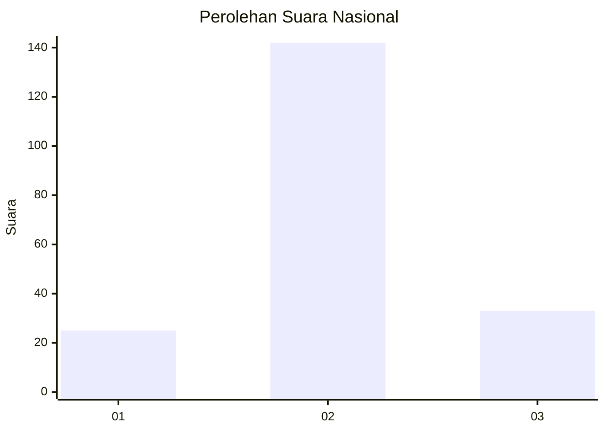
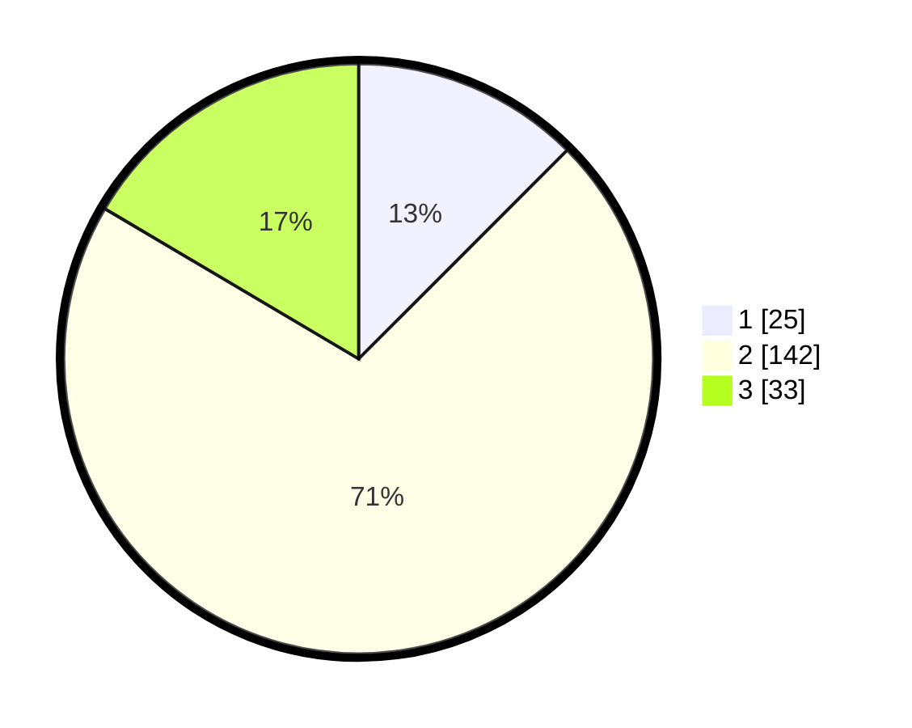

# Hasil

## Grafik

## Tabel

| No. | Nama Paslon    | Suara | Suara (raw) | Persentase |
|:--- |:-------------- | -----:| -----------:| ----------:|
| 1   | ANIES MUHAIMIN | 25    | [25][p-1]   | 12,50      |
| 2   | PRABOWO GIBRAN | 142   | [142][p-2]  | 71,00      |
| 3   | GANJAR MAHFUD  | 33    | [33][p-3]   | 16,50      |

[p-1]: https://github.com/gigit-pemilu/pemilu-2024/blob/main/pilpres/hitung-suara/sub/18-lampung/sub/07-lampung-timur/sub/11-marga-tiga/sub/2006-sukaraja-tiga/sub/004-tps/sub/paslon-1.txt
[p-2]: https://github.com/gigit-pemilu/pemilu-2024/blob/main/pilpres/hitung-suara/sub/18-lampung/sub/07-lampung-timur/sub/11-marga-tiga/sub/2006-sukaraja-tiga/sub/004-tps/sub/paslon-2.txt
[p-3]: https://github.com/gigit-pemilu/pemilu-2024/blob/main/pilpres/hitung-suara/sub/18-lampung/sub/07-lampung-timur/sub/11-marga-tiga/sub/2006-sukaraja-tiga/sub/004-tps/sub/paslon-3.txt

## Foto C Plano

https://sirekap-obj-formc.kpu.go.id/8829/pemilu/ppwp/18/07/11/20/06/1807112006004-20240222-180451--2bf98379-595b-403d-9fd7-486bb9574c85.jpg

https://sirekap-obj-formc.kpu.go.id/8829/pemilu/ppwp/18/07/11/20/06/1807112006004-20240222-180531--31daff0c-1052-4110-83c6-79e81f600f63.jpg

https://sirekap-obj-formc.kpu.go.id/8829/pemilu/ppwp/18/07/11/20/06/1807112006004-20240222-180649--4ccba408-0b27-40ac-9c9d-fa81435823b1.jpg

## Metadata

| Key        | Value               |
| ---------- | ------------------- |
| Time Stamp | 2024-02-22 19:00:00 |

## DATA PEMILIH TETAP

Jumlah pemilih dalam DPT: **252**.
 * L: **620**.
 * P: **532**.

## DATA PENGGUNA HAK PILIH

Jumlah pengguna hak pilih dalam DPT: **197**.
 * L: **92**.
 * P: **104**.

Jumlah pengguna hak pilih dalam DPTb: **888**.
 * L: **488**.
 * P: **888**.

Jumlah pengguna hak pilih dalam DPK: **822**.
 * L: **887**.
 * P: **883**.

Jumlah pengguna hak pilih: **209**.
 * L: **399**.
 * P: **509**.

## JUMLAH SUARA SAH DAN TIDAK SAH

JUMLAH SELURUH SUARA SAH: **209**.

JUMLAH SUARA TIDAK SAH: **0**.

JUMLAH SELURUH SUARA SAH DAN SUARA TIDAK SAH: **209**.

