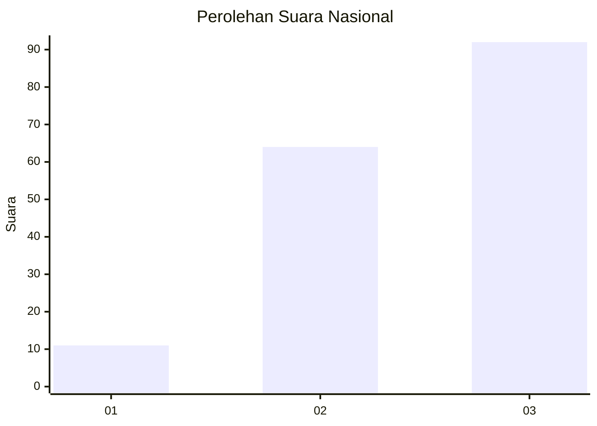
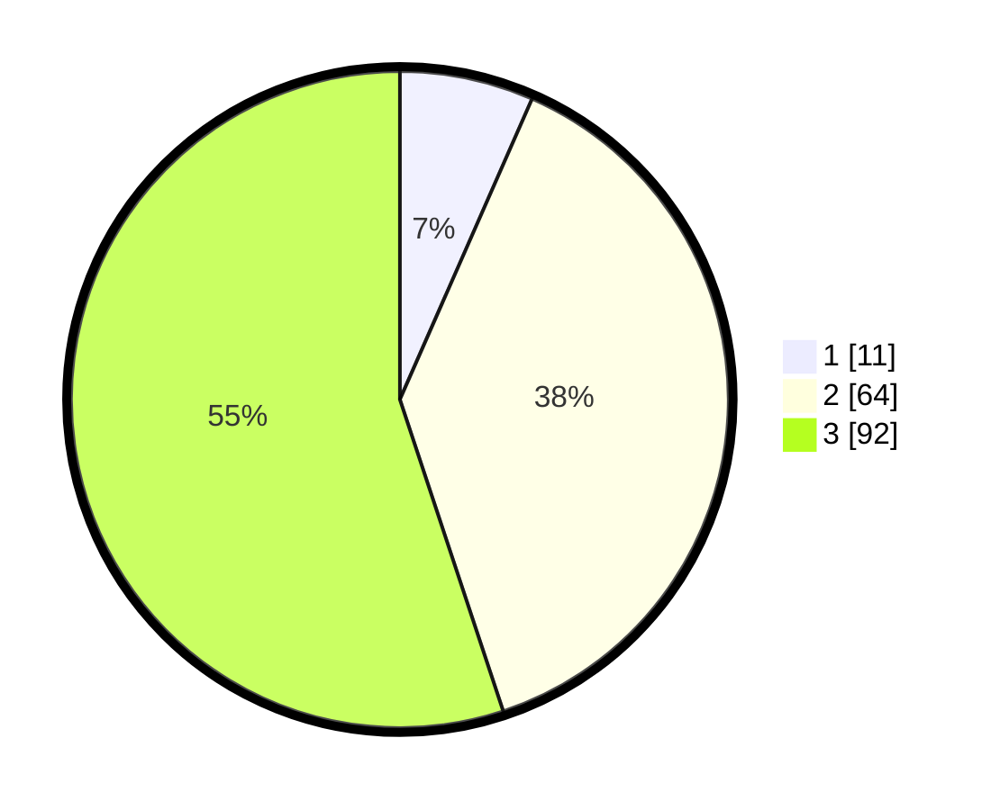

# Hasil

## Grafik

## Tabel

| No. | Nama Paslon    | Suara | Suara (raw) | Persentase |
|:--- |:-------------- | -----:| -----------:| ----------:|
| 1   | ANIES MUHAIMIN | 11    | [11][p-1]   | 6,59       |
| 2   | PRABOWO GIBRAN | 64    | [64][p-2]   | 38,32      |
| 3   | GANJAR MAHFUD  | 92    | [92][p-3]   | 55,09      |

[p-1]: https://github.com/gigit-pemilu/pemilu-2024/blob/main/pilpres/hitung-suara/sub/18-lampung/sub/07-lampung-timur/sub/11-marga-tiga/sub/2013-trisinar/sub/001-tps/sub/paslon-1.txt
[p-2]: https://github.com/gigit-pemilu/pemilu-2024/blob/main/pilpres/hitung-suara/sub/18-lampung/sub/07-lampung-timur/sub/11-marga-tiga/sub/2013-trisinar/sub/001-tps/sub/paslon-2.txt
[p-3]: https://github.com/gigit-pemilu/pemilu-2024/blob/main/pilpres/hitung-suara/sub/18-lampung/sub/07-lampung-timur/sub/11-marga-tiga/sub/2013-trisinar/sub/001-tps/sub/paslon-3.txt

## Foto C Plano

https://sirekap-obj-formc.kpu.go.id/cc22/pemilu/ppwp/18/07/11/20/13/1807112013001-20240226-235911--d498e055-76f4-4765-b674-c267b8acd91e.jpg

https://sirekap-obj-formc.kpu.go.id/cc22/pemilu/ppwp/18/07/11/20/13/1807112013001-20240214-212531--d4a06c24-3ff4-45cd-9d73-2ad11abb67dc.jpg

https://sirekap-obj-formc.kpu.go.id/cc22/pemilu/ppwp/18/07/11/20/13/1807112013001-20240214-212435--398c1517-c7c7-4dfd-9cd7-4d544a7c338f.jpg

## Metadata

| Key        | Value               |
| ---------- | ------------------- |
| Time Stamp | 2024-02-27 00:00:00 |

