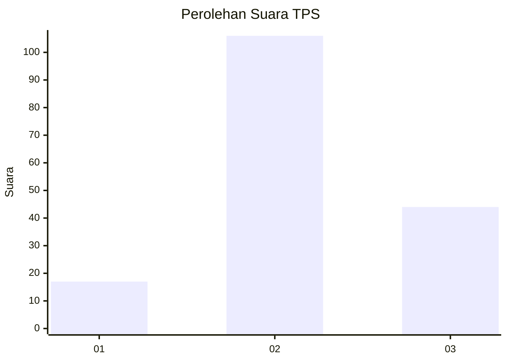
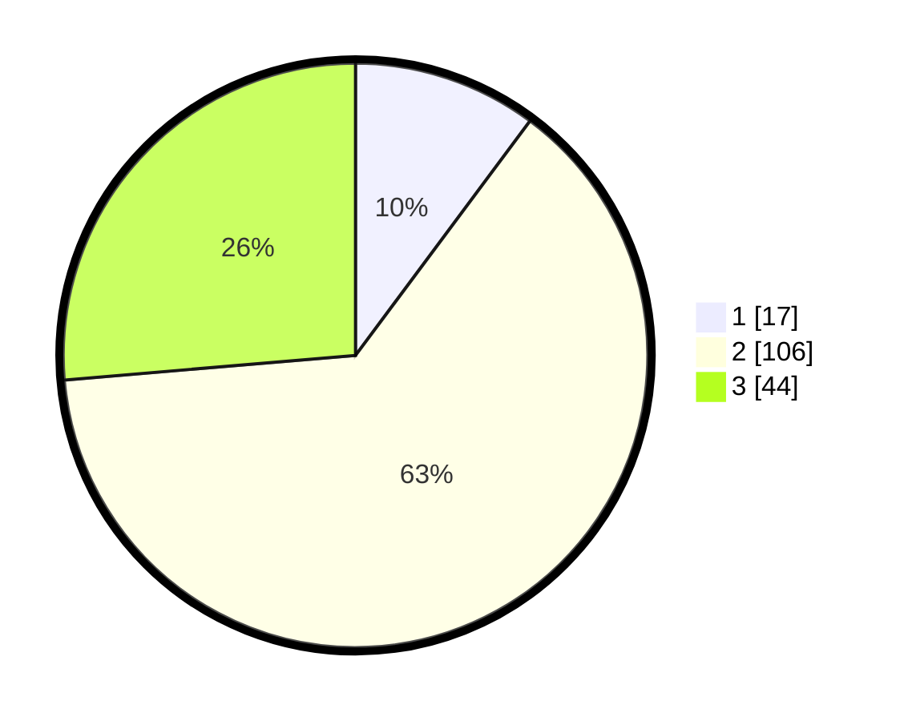

# Hasil

## Grafik

## Tabel

| No. | Nama Paslon    | Suara | Suara (raw) | Persentase |
|:--- |:-------------- | -----:| -----------:| ----------:|
| 1   | ANIES MUHAIMIN | 17    | [17][p-1]   | 10,18      |
| 2   | PRABOWO GIBRAN | 106   | [106][p-2]  | 63,47      |
| 3   | GANJAR MAHFUD  | 44    | [44][p-3]   | 26,35      |

[p-1]: https://github.com/gigit-pemilu/pemilu-2024-18-lampung/blob/main/pilpres/hitung-suara/sub/18-lampung/sub/07-lampung-timur/sub/11-marga-tiga/sub/2013-trisinar/sub/003-tps/sub/paslon-1.txt
[p-2]: https://github.com/gigit-pemilu/pemilu-2024-18-lampung/blob/main/pilpres/hitung-suara/sub/18-lampung/sub/07-lampung-timur/sub/11-marga-tiga/sub/2013-trisinar/sub/003-tps/sub/paslon-2.txt
[p-3]: https://github.com/gigit-pemilu/pemilu-2024-18-lampung/blob/main/pilpres/hitung-suara/sub/18-lampung/sub/07-lampung-timur/sub/11-marga-tiga/sub/2013-trisinar/sub/003-tps/sub/paslon-3.txt

## Foto C Plano

https://sirekap-obj-formc.kpu.go.id/85d1/pemilu/ppwp/18/07/11/20/13/1807112013003-20240227-002908--7ec6f97a-5558-4879-bde8-4781c0e9e49e.jpg

https://sirekap-obj-formc.kpu.go.id/85d1/pemilu/ppwp/18/07/11/20/13/1807112013003-20240227-003014--bd826180-c335-405f-9c86-de601aa6bce9.jpg

https://sirekap-obj-formc.kpu.go.id/85d1/pemilu/ppwp/18/07/11/20/13/1807112013003-20240227-003147--a33197ee-2248-4d0d-9fb6-835eec5d1a65.jpg

## Metadata

| Key        | Value               |
| ---------- | ------------------- |
| Time Stamp | 2024-02-27 22:00:00 |

## DATA PEMILIH TETAP

Jumlah pemilih dalam DPT: **823**.
 * L: **108**.
 * P: **100**.

## DATA PENGGUNA HAK PILIH

Jumlah pengguna hak pilih dalam DPT: **523**.
 * L: **829**.
 * P: **879**.

Jumlah pengguna hak pilih dalam DPTb: **840**.
 * L: **338**.
 * P: **838**.

Jumlah pengguna hak pilih dalam DPK: **408**.
 * L: **354**.
 * P: **885**.

Jumlah pengguna hak pilih: **857**.
 * L: **325**.
 * P: **332**.

## JUMLAH SUARA SAH DAN TIDAK SAH

JUMLAH SELURUH SUARA SAH: **167**.

JUMLAH SUARA TIDAK SAH: **0**.

JUMLAH SELURUH SUARA SAH DAN SUARA TIDAK SAH: **167**.

