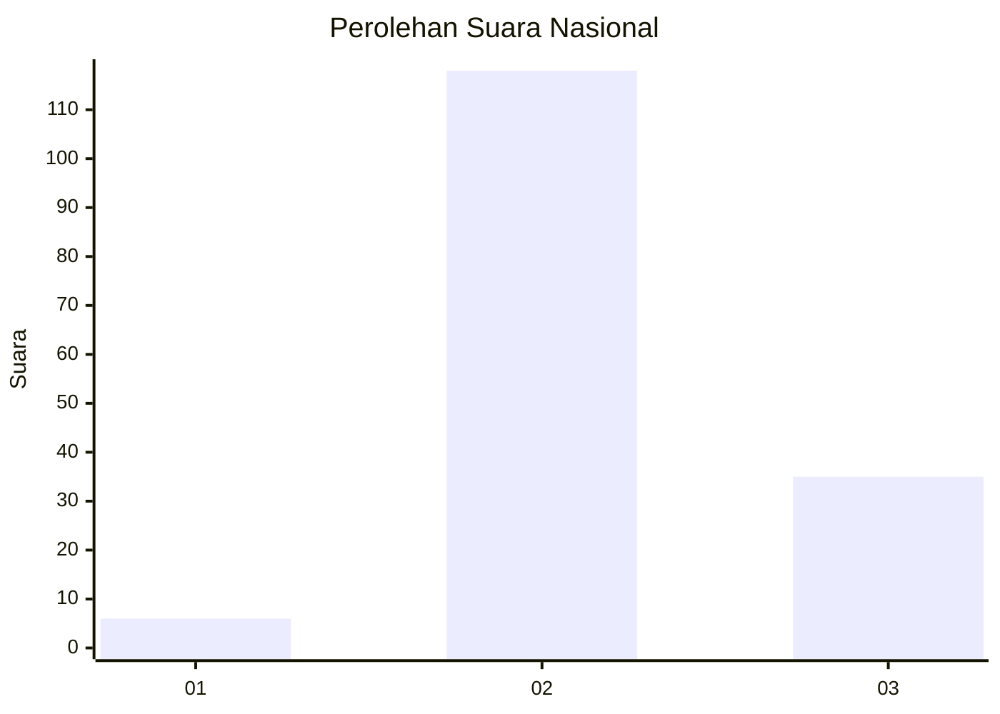

# Hasil

## Grafik

## Tabel

| No. | Nama Paslon    | Suara | Suara (raw) | Persentase |
|:--- |:-------------- | -----:| -----------:| ----------:|
| 1   | ANIES MUHAIMIN | 6     | [6][p-1]    | 3,77       |
| 2   | PRABOWO GIBRAN | 118   | [118][p-2]  | 74,21      |
| 3   | GANJAR MAHFUD  | 35    | [35][p-3]   | 22,01      |

[p-1]: https://github.com/gigit-pemilu/pemilu-2024/blob/main/pilpres/hitung-suara/sub/18-lampung/sub/07-lampung-timur/sub/11-marga-tiga/sub/2013-trisinar/sub/005-tps/sub/paslon-1.txt
[p-2]: https://github.com/gigit-pemilu/pemilu-2024/blob/main/pilpres/hitung-suara/sub/18-lampung/sub/07-lampung-timur/sub/11-marga-tiga/sub/2013-trisinar/sub/005-tps/sub/paslon-2.txt
[p-3]: https://github.com/gigit-pemilu/pemilu-2024/blob/main/pilpres/hitung-suara/sub/18-lampung/sub/07-lampung-timur/sub/11-marga-tiga/sub/2013-trisinar/sub/005-tps/sub/paslon-3.txt

## Foto C Plano

https://sirekap-obj-formc.kpu.go.id/00bb/pemilu/ppwp/18/07/11/20/13/1807112013005-20240227-003619--3c82fd53-9c99-49e0-a94a-5330e4c5fa99.jpg

https://sirekap-obj-formc.kpu.go.id/00bb/pemilu/ppwp/18/07/11/20/13/1807112013005-20240227-003701--88639004-b8ad-49b5-8ed4-08509cdc0a3f.jpg

https://sirekap-obj-formc.kpu.go.id/00bb/pemilu/ppwp/18/07/11/20/13/1807112013005-20240227-003738--3177f753-c32d-4333-8c73-5930da58f655.jpg

## Metadata

| Key        | Value               |
| ---------- | ------------------- |
| Time Stamp | 2024-02-27 22:00:00 |

## DATA PEMILIH TETAP

Jumlah pemilih dalam DPT: **200**.
 * L: **837**.
 * P: **777**.

## DATA PENGGUNA HAK PILIH

Jumlah pengguna hak pilih dalam DPT: **459**.
 * L: **886**.
 * P: **873**.

Jumlah pengguna hak pilih dalam DPTb: **888**.
 * L: **288**.
 * P: **882**.

Jumlah pengguna hak pilih dalam DPK: **800**.
 * L: **888**.
 * P: **844**.

Jumlah pengguna hak pilih: **823**.
 * L: **846**.
 * P: **445**.

## JUMLAH SUARA SAH DAN TIDAK SAH

JUMLAH SELURUH SUARA SAH: **159**.

JUMLAH SUARA TIDAK SAH: **1**.

JUMLAH SELURUH SUARA SAH DAN SUARA TIDAK SAH: **160**.

