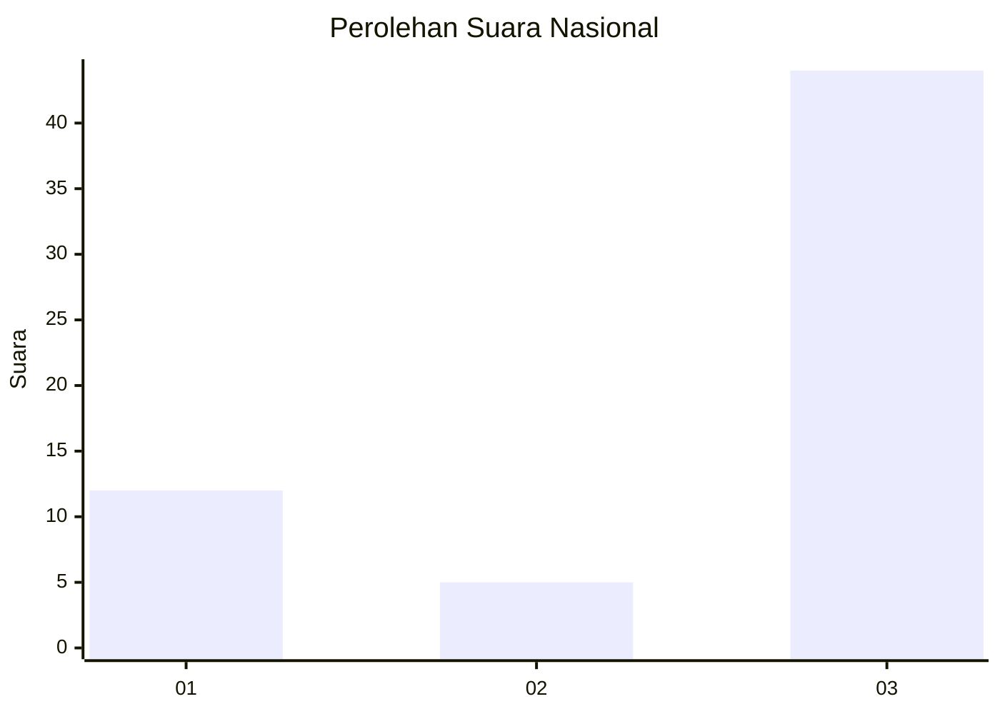
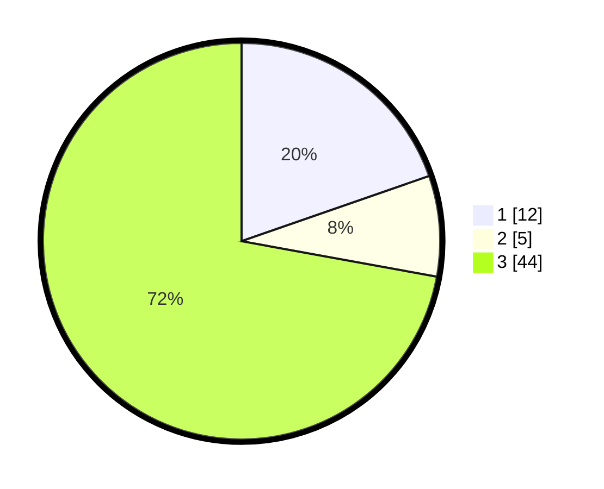

# Hasil

## Grafik

## Tabel

| No. | Nama Paslon    | Suara | Suara (raw) | Persentase |
|:--- |:-------------- | -----:| -----------:| ----------:|
| 1   | ANIES MUHAIMIN | 12    | [12][p-1]   | 19,67      |
| 2   | PRABOWO GIBRAN | 5     | [5][p-2]    | 8,20       |
| 3   | GANJAR MAHFUD  | 44    | [44][p-3]   | 72,13      |

[p-1]: https://github.com/gigit-pemilu/pemilu-2024/blob/main/pilpres/hitung-suara/sub/18-lampung/sub/07-lampung-timur/sub/11-marga-tiga/sub/2013-trisinar/sub/008-tps/sub/paslon-1.txt
[p-2]: https://github.com/gigit-pemilu/pemilu-2024/blob/main/pilpres/hitung-suara/sub/18-lampung/sub/07-lampung-timur/sub/11-marga-tiga/sub/2013-trisinar/sub/008-tps/sub/paslon-2.txt
[p-3]: https://github.com/gigit-pemilu/pemilu-2024/blob/main/pilpres/hitung-suara/sub/18-lampung/sub/07-lampung-timur/sub/11-marga-tiga/sub/2013-trisinar/sub/008-tps/sub/paslon-3.txt

## Foto C Plano

https://sirekap-obj-formc.kpu.go.id/ad65/pemilu/ppwp/18/07/11/20/13/1807112013008-20240223-164214--ae0b6e65-b19b-492f-bfaf-dd82700b2770.jpg

https://sirekap-obj-formc.kpu.go.id/ad65/pemilu/ppwp/18/07/11/20/13/1807112013008-20240223-164343--b3db7890-ee4e-4098-ab9c-d0b18ce4c147.jpg

https://sirekap-obj-formc.kpu.go.id/ad65/pemilu/ppwp/18/07/11/20/13/1807112013008-20240223-164711--27b6b350-9dba-41c3-a686-55806e4425e3.jpg

## Metadata

| Key        | Value               |
| ---------- | ------------------- |
| Time Stamp | 2024-02-24 22:31:28 |

## DATA PEMILIH TETAP

Jumlah pemilih dalam DPT: **175**.
 * L: **700**.
 * P: **0**.

## DATA PENGGUNA HAK PILIH

Jumlah pengguna hak pilih dalam DPT: **0**.
 * L: **550**.
 * P: **500**.

Jumlah pengguna hak pilih dalam DPTb: **553**.
 * L: **555**.
 * P: **555**.

Jumlah pengguna hak pilih dalam DPK: **707**.
 * L: **0**.
 * P: **8**.

Jumlah pengguna hak pilih: **444**.
 * L: **87**.
 * P: **74**.

## JUMLAH SUARA SAH DAN TIDAK SAH

JUMLAH SELURUH SUARA SAH: **156**.

JUMLAH SUARA TIDAK SAH: **1**.

JUMLAH SELURUH SUARA SAH DAN SUARA TIDAK SAH: **157**.

