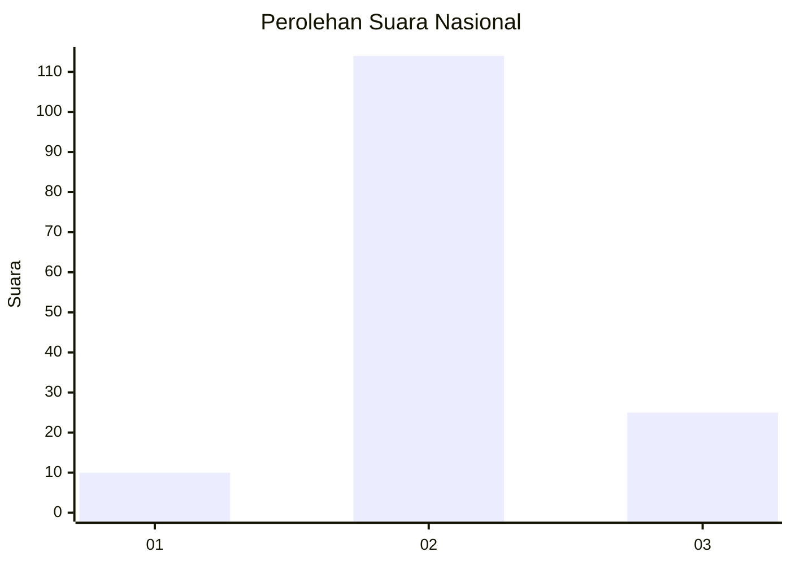
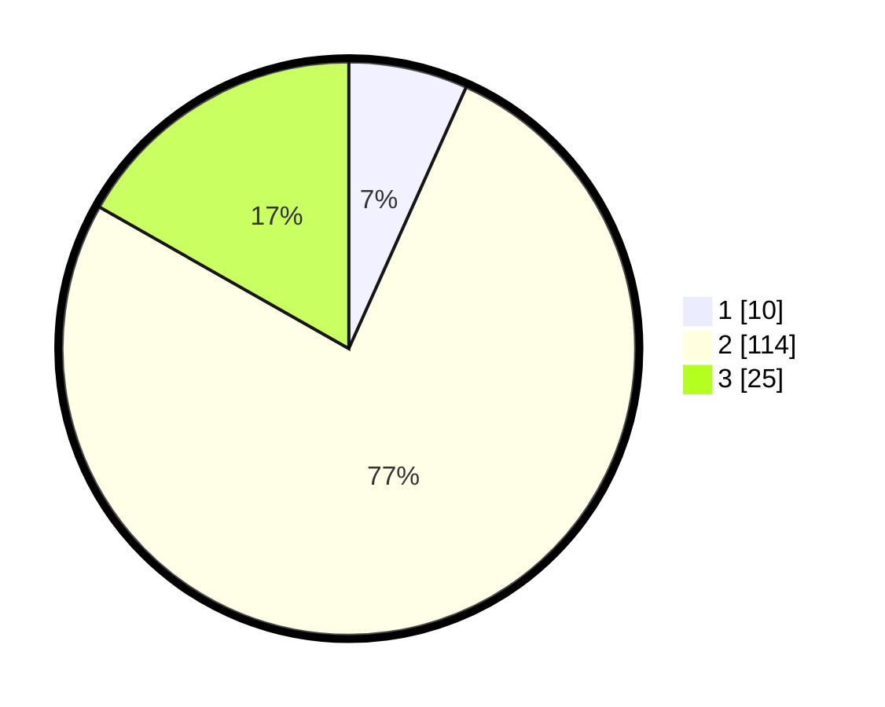

# Hasil

## Grafik

## Tabel

| No. | Nama Paslon    | Suara | Suara (raw) | Persentase |
|:--- |:-------------- | -----:| -----------:| ----------:|
| 1   | ANIES MUHAIMIN | 10    | [10][p-1]   | 6,71       |
| 2   | PRABOWO GIBRAN | 114   | [114][p-2]  | 76,51      |
| 3   | GANJAR MAHFUD  | 25    | [25][p-3]   | 16,78      |

[p-1]: https://github.com/gigit-pemilu/pemilu-2024/blob/main/pilpres/hitung-suara/sub/18-lampung/sub/07-lampung-timur/sub/13-batanghari-nuban/sub/2001-sukaraja-nuban/sub/003-tps/sub/paslon-1.txt
[p-2]: https://github.com/gigit-pemilu/pemilu-2024/blob/main/pilpres/hitung-suara/sub/18-lampung/sub/07-lampung-timur/sub/13-batanghari-nuban/sub/2001-sukaraja-nuban/sub/003-tps/sub/paslon-2.txt
[p-3]: https://github.com/gigit-pemilu/pemilu-2024/blob/main/pilpres/hitung-suara/sub/18-lampung/sub/07-lampung-timur/sub/13-batanghari-nuban/sub/2001-sukaraja-nuban/sub/003-tps/sub/paslon-3.txt

## Foto C Plano

https://sirekap-obj-formc.kpu.go.id/035f/pemilu/ppwp/18/07/13/20/01/1807132001003-20240214-204357--b12f7fec-a93f-4eed-81d7-baa61852ba4b.jpg

https://sirekap-obj-formc.kpu.go.id/035f/pemilu/ppwp/18/07/13/20/01/1807132001003-20240214-204620--94bd99d5-8d5f-40d0-a52d-d76f8d2335c3.jpg

https://sirekap-obj-formc.kpu.go.id/035f/pemilu/ppwp/18/07/13/20/01/1807132001003-20240214-204725--03458de8-4259-4877-a534-e20188cae065.jpg

## Metadata

| Key        | Value               |
| ---------- | ------------------- |
| Time Stamp | 2024-02-15 15:00:29 |

