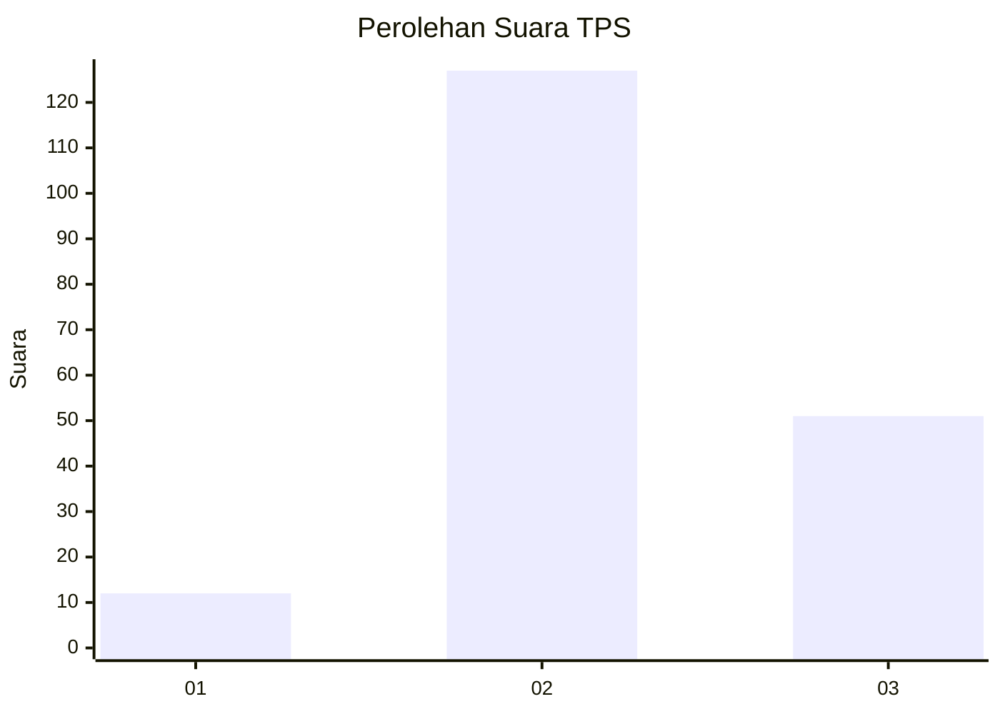

# Hasil

## Grafik

## Tabel

| No. | Nama Paslon    | Suara | Suara (raw) | Persentase |
|:--- |:-------------- | -----:| -----------:| ----------:|
| 1   | ANIES MUHAIMIN | 12    | [12][p-1]   | 6,32       |
| 2   | PRABOWO GIBRAN | 127   | [127][p-2]  | 66,84      |
| 3   | GANJAR MAHFUD  | 51    | [51][p-3]   | 26,84      |

[p-1]: https://github.com/gigit-pemilu/pemilu-2024-18-lampung/blob/main/pilpres/hitung-suara/sub/18-lampung/sub/07-lampung-timur/sub/14-bumi-agung/sub/2001-donomulyo/sub/002-tps/sub/paslon-1.txt
[p-2]: https://github.com/gigit-pemilu/pemilu-2024-18-lampung/blob/main/pilpres/hitung-suara/sub/18-lampung/sub/07-lampung-timur/sub/14-bumi-agung/sub/2001-donomulyo/sub/002-tps/sub/paslon-2.txt
[p-3]: https://github.com/gigit-pemilu/pemilu-2024-18-lampung/blob/main/pilpres/hitung-suara/sub/18-lampung/sub/07-lampung-timur/sub/14-bumi-agung/sub/2001-donomulyo/sub/002-tps/sub/paslon-3.txt

## Foto C Plano

https://sirekap-obj-formc.kpu.go.id/90db/pemilu/ppwp/18/07/14/20/01/1807142001002-20240218-195109--99e5d4ee-f1fd-4bad-a210-b39d860ce8cc.jpg

https://sirekap-obj-formc.kpu.go.id/90db/pemilu/ppwp/18/07/14/20/01/1807142001002-20240215-071129--08c3b172-3c3c-41e1-9cc6-ab8c855951c1.jpg

https://sirekap-obj-formc.kpu.go.id/90db/pemilu/ppwp/18/07/14/20/01/1807142001002-20240217-115450--3733502b-d8e0-46ab-b498-b2c905d968f4.jpg

## Metadata

| Key        | Value               |
| ---------- | ------------------- |
| Time Stamp | 2024-02-19 06:16:00 |

