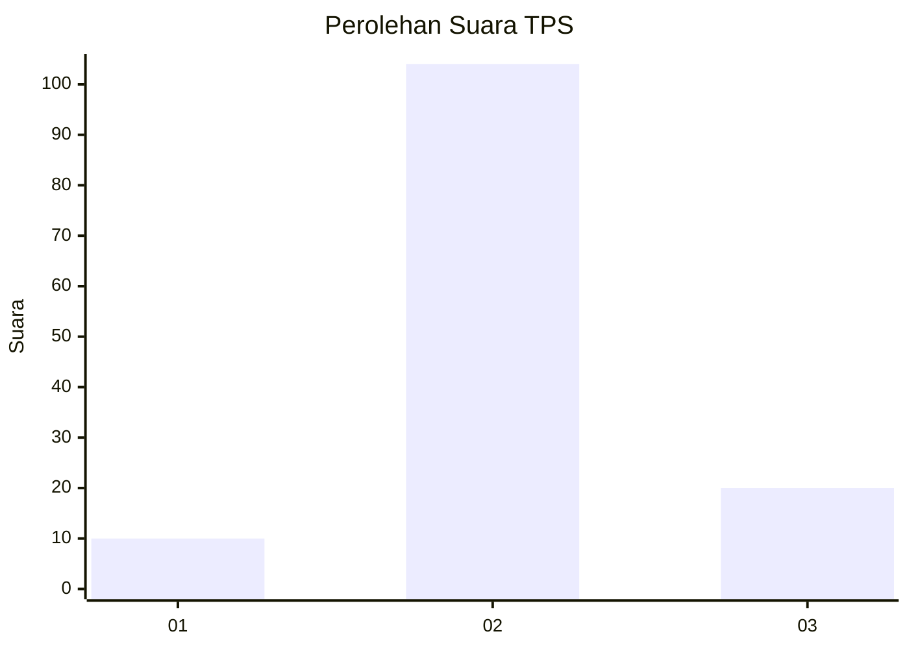

# Hasil

## Grafik

## Tabel

| No. | Nama Paslon    | Suara | Suara (raw) | Persentase |
|:--- |:-------------- | -----:| -----------:| ----------:|
| 1   | ANIES MUHAIMIN | 10    | [10][p-1]   | 7,46       |
| 2   | PRABOWO GIBRAN | 104   | [104][p-2]  | 77,61      |
| 3   | GANJAR MAHFUD  | 20    | [20][p-3]   | 14,93      |

[p-1]: https://github.com/gigit-pemilu/pemilu-2024-18-lampung/blob/main/pilpres/hitung-suara/sub/18-lampung/sub/07-lampung-timur/sub/16-mataram-baru/sub/2001-mataram-baru/sub/001-tps/sub/paslon-1.txt
[p-2]: https://github.com/gigit-pemilu/pemilu-2024-18-lampung/blob/main/pilpres/hitung-suara/sub/18-lampung/sub/07-lampung-timur/sub/16-mataram-baru/sub/2001-mataram-baru/sub/001-tps/sub/paslon-2.txt
[p-3]: https://github.com/gigit-pemilu/pemilu-2024-18-lampung/blob/main/pilpres/hitung-suara/sub/18-lampung/sub/07-lampung-timur/sub/16-mataram-baru/sub/2001-mataram-baru/sub/001-tps/sub/paslon-3.txt

## Foto C Plano

https://sirekap-obj-formc.kpu.go.id/3776/pemilu/ppwp/18/07/16/20/01/1807162001001-20240215-172008--81b1bbbf-21b6-4802-b9b3-e12eecd5d319.jpg

https://sirekap-obj-formc.kpu.go.id/3776/pemilu/ppwp/18/07/16/20/01/1807162001001-20240215-172012--e7d92619-467c-4d96-88c6-1cafec6f7982.jpg

https://sirekap-obj-formc.kpu.go.id/3776/pemilu/ppwp/18/07/16/20/01/1807162001001-20240215-172018--d0249e6e-3260-4c29-8cc4-5c98e7b74324.jpg

## Metadata

| Key        | Value               |
| ---------- | ------------------- |
| Time Stamp | 2024-02-16 21:01:00 |

