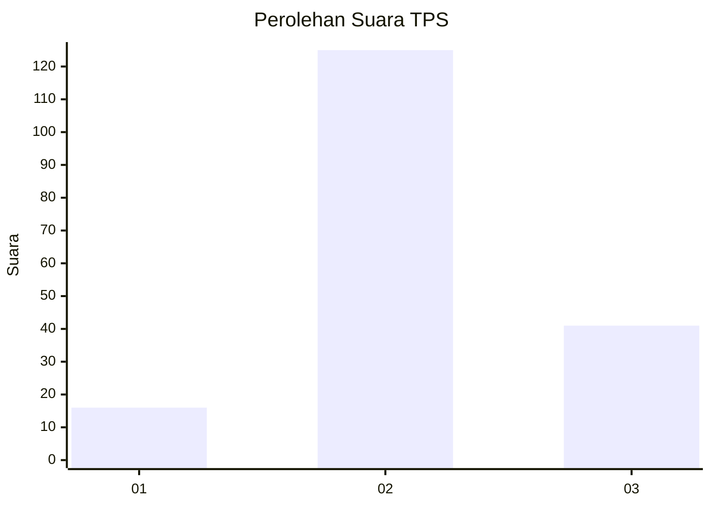
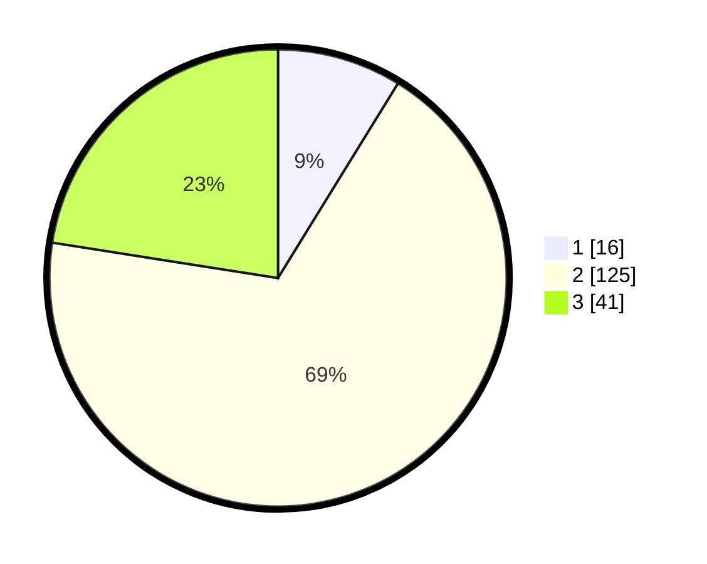

# Hasil

## Grafik

## Tabel

| No. | Nama Paslon    | Suara | Suara (raw) | Persentase |
|:--- |:-------------- | -----:| -----------:| ----------:|
| 1   | ANIES MUHAIMIN | 16    | [16][p-1]   | 8,79       |
| 2   | PRABOWO GIBRAN | 125   | [125][p-2]  | 68,68      |
| 3   | GANJAR MAHFUD  | 41    | [41][p-3]   | 22,53      |

[p-1]: https://github.com/gigit-pemilu/pemilu-2024-18-lampung/blob/main/pilpres/hitung-suara/sub/18-lampung/sub/07-lampung-timur/sub/16-mataram-baru/sub/2001-mataram-baru/sub/002-tps/sub/paslon-1.txt
[p-2]: https://github.com/gigit-pemilu/pemilu-2024-18-lampung/blob/main/pilpres/hitung-suara/sub/18-lampung/sub/07-lampung-timur/sub/16-mataram-baru/sub/2001-mataram-baru/sub/002-tps/sub/paslon-2.txt
[p-3]: https://github.com/gigit-pemilu/pemilu-2024-18-lampung/blob/main/pilpres/hitung-suara/sub/18-lampung/sub/07-lampung-timur/sub/16-mataram-baru/sub/2001-mataram-baru/sub/002-tps/sub/paslon-3.txt

## Foto C Plano

https://sirekap-obj-formc.kpu.go.id/e170/pemilu/ppwp/18/07/16/20/01/1807162001002-20240226-203118--51d32876-4f4d-40a8-98c9-bf075fbf043d.jpg

https://sirekap-obj-formc.kpu.go.id/e170/pemilu/ppwp/18/07/16/20/01/1807162001002-20240226-203344--6a4015ba-6dee-41fa-bc58-da138531935b.jpg

https://sirekap-obj-formc.kpu.go.id/e170/pemilu/ppwp/18/07/16/20/01/1807162001002-20240226-205921--18cf2660-6420-41ed-8934-eaba14278084.jpg

## Metadata

| Key        | Value               |
| ---------- | ------------------- |
| Time Stamp | 2024-02-26 21:00:00 |

