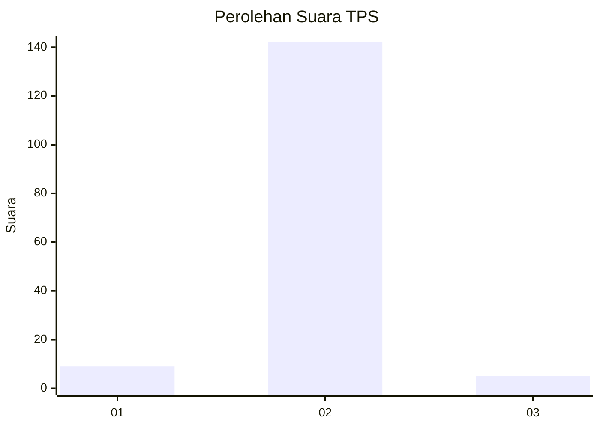
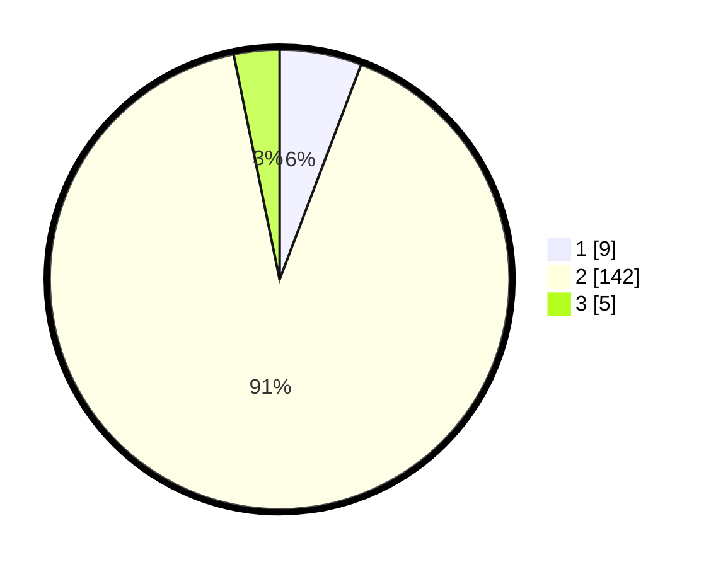

# Hasil

## Grafik

## Tabel

| No. | Nama Paslon    | Suara | Suara (raw) | Persentase |
|:--- |:-------------- | -----:| -----------:| ----------:|
| 1   | ANIES MUHAIMIN | 9     | [9][p-1]    | 5,77       |
| 2   | PRABOWO GIBRAN | 142   | [142][p-2]  | 91,03      |
| 3   | GANJAR MAHFUD  | 5     | [5][p-3]    | 3,21       |

[p-1]: https://github.com/gigit-pemilu/pemilu-2024-18-lampung/blob/main/pilpres/hitung-suara/sub/18-lampung/sub/07-lampung-timur/sub/16-mataram-baru/sub/2001-mataram-baru/sub/003-tps/sub/paslon-1.txt
[p-2]: https://github.com/gigit-pemilu/pemilu-2024-18-lampung/blob/main/pilpres/hitung-suara/sub/18-lampung/sub/07-lampung-timur/sub/16-mataram-baru/sub/2001-mataram-baru/sub/003-tps/sub/paslon-2.txt
[p-3]: https://github.com/gigit-pemilu/pemilu-2024-18-lampung/blob/main/pilpres/hitung-suara/sub/18-lampung/sub/07-lampung-timur/sub/16-mataram-baru/sub/2001-mataram-baru/sub/003-tps/sub/paslon-3.txt

## Foto C Plano

https://sirekap-obj-formc.kpu.go.id/09ff/pemilu/ppwp/18/07/16/20/01/1807162001003-20240214-141453--a4952987-4708-4a84-b9aa-b9d3855e1aa5.jpg

https://sirekap-obj-formc.kpu.go.id/09ff/pemilu/ppwp/18/07/16/20/01/1807162001003-20240214-141632--fe1b6284-4cc6-42f7-b245-89cc51d0a751.jpg

https://sirekap-obj-formc.kpu.go.id/09ff/pemilu/ppwp/18/07/16/20/01/1807162001003-20240214-141727--4def86e1-d805-4d1f-80b9-9daaa544c0c1.jpg

## Metadata

| Key        | Value               |
| ---------- | ------------------- |
| Time Stamp | 2024-02-14 21:46:01 |

