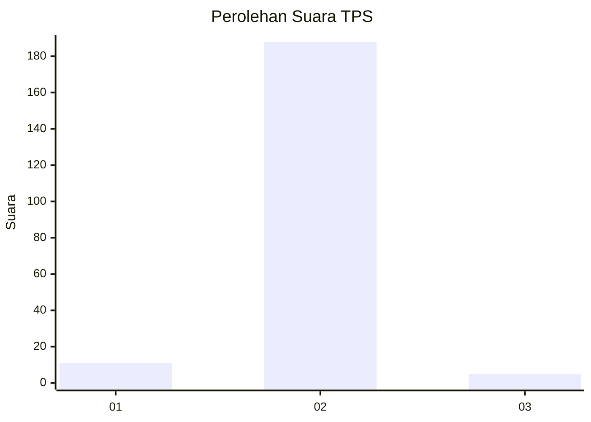
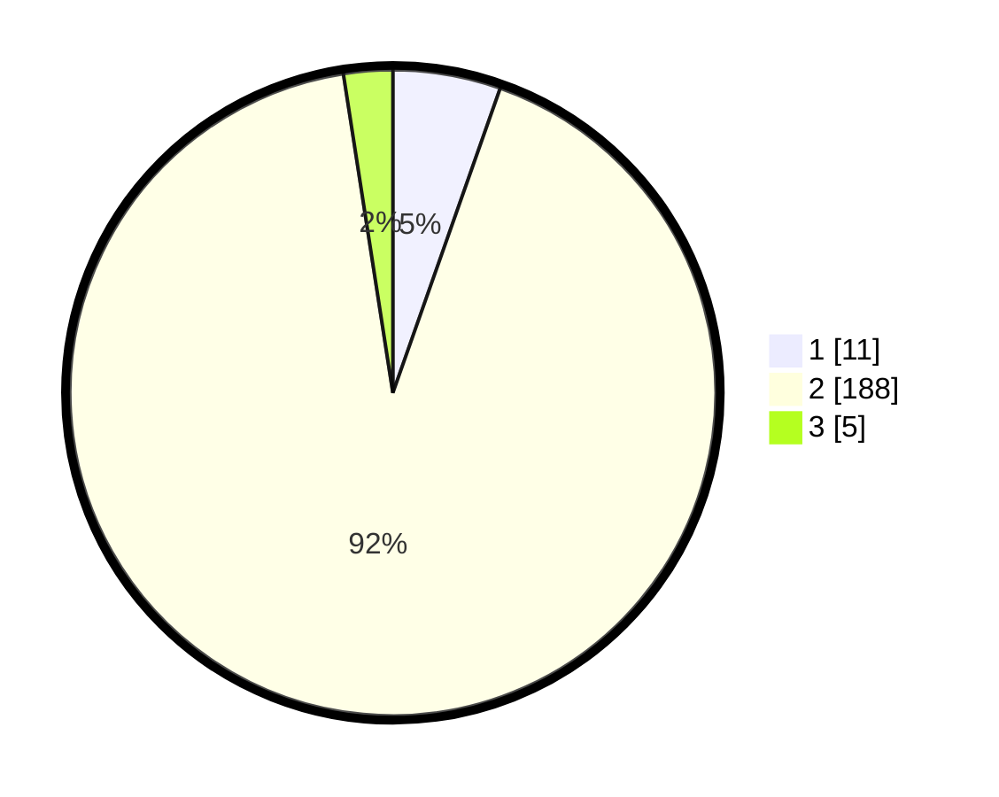

# Hasil

## Grafik

## Tabel

| No. | Nama Paslon    | Suara | Suara (raw) | Persentase |
|:--- |:-------------- | -----:| -----------:| ----------:|
| 1   | ANIES MUHAIMIN | 11    | [11][p-1]   | 5,39       |
| 2   | PRABOWO GIBRAN | 188   | [188][p-2]  | 92,16      |
| 3   | GANJAR MAHFUD  | 5     | [5][p-3]    | 2,45       |

[p-1]: https://github.com/gigit-pemilu/pemilu-2024-18-lampung/blob/main/pilpres/hitung-suara/sub/18-lampung/sub/07-lampung-timur/sub/16-mataram-baru/sub/2001-mataram-baru/sub/004-tps/sub/paslon-1.txt
[p-2]: https://github.com/gigit-pemilu/pemilu-2024-18-lampung/blob/main/pilpres/hitung-suara/sub/18-lampung/sub/07-lampung-timur/sub/16-mataram-baru/sub/2001-mataram-baru/sub/004-tps/sub/paslon-2.txt
[p-3]: https://github.com/gigit-pemilu/pemilu-2024-18-lampung/blob/main/pilpres/hitung-suara/sub/18-lampung/sub/07-lampung-timur/sub/16-mataram-baru/sub/2001-mataram-baru/sub/004-tps/sub/paslon-3.txt

## Foto C Plano

https://sirekap-obj-formc.kpu.go.id/183e/pemilu/ppwp/18/07/16/20/01/1807162001004-20240214-224604--f6fd3458-d5ae-4e3f-8d6d-2bc4c7e35c6d.jpg

https://sirekap-obj-formc.kpu.go.id/183e/pemilu/ppwp/18/07/16/20/01/1807162001004-20240214-224711--fe531422-de98-4e4e-96de-6d9ac413b915.jpg

https://sirekap-obj-formc.kpu.go.id/183e/pemilu/ppwp/18/07/16/20/01/1807162001004-20240214-225031--a2b8c7c8-5367-420a-8e03-8745df73e7e5.jpg

## Metadata

| Key        | Value               |
| ---------- | ------------------- |
| Time Stamp | 2024-02-16 21:01:00 |

