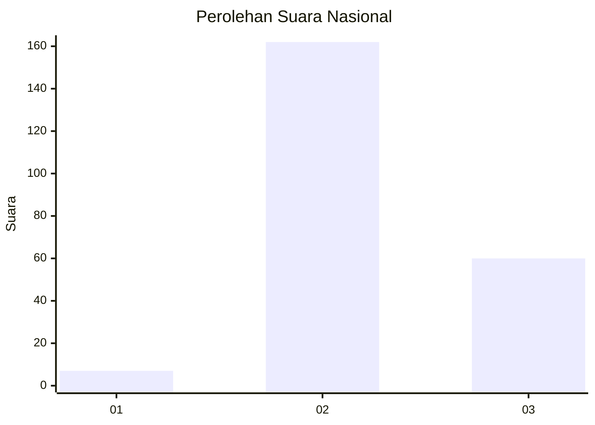
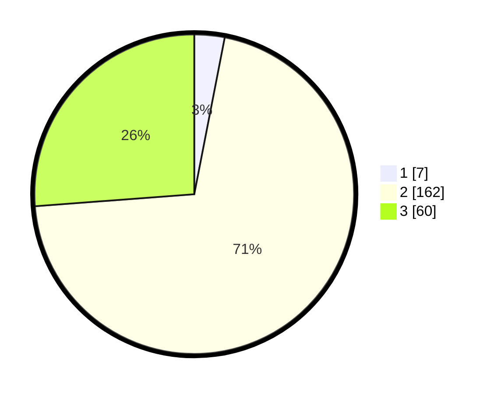

# Hasil

## Grafik

## Tabel

| No. | Nama Paslon    | Suara | Suara (raw) | Persentase |
|:--- |:-------------- | -----:| -----------:| ----------:|
| 1   | ANIES MUHAIMIN | 7     | [7][p-1]    | 3,06       |
| 2   | PRABOWO GIBRAN | 162   | [162][p-2]  | 70,74      |
| 3   | GANJAR MAHFUD  | 60    | [60][p-3]   | 26,20      |

[p-1]: https://github.com/gigit-pemilu/pemilu-2024/blob/main/pilpres/hitung-suara/sub/18-lampung/sub/07-lampung-timur/sub/16-mataram-baru/sub/2001-mataram-baru/sub/005-tps/sub/paslon-1.txt
[p-2]: https://github.com/gigit-pemilu/pemilu-2024/blob/main/pilpres/hitung-suara/sub/18-lampung/sub/07-lampung-timur/sub/16-mataram-baru/sub/2001-mataram-baru/sub/005-tps/sub/paslon-2.txt
[p-3]: https://github.com/gigit-pemilu/pemilu-2024/blob/main/pilpres/hitung-suara/sub/18-lampung/sub/07-lampung-timur/sub/16-mataram-baru/sub/2001-mataram-baru/sub/005-tps/sub/paslon-3.txt

## Foto C Plano

https://sirekap-obj-formc.kpu.go.id/a920/pemilu/ppwp/18/07/16/20/01/1807162001005-20240214-194815--0208ebdc-0759-4f60-950e-689513c232d2.jpg

https://sirekap-obj-formc.kpu.go.id/a920/pemilu/ppwp/18/07/16/20/01/1807162001005-20240214-194820--e91bc4d3-0851-4d8c-9013-a7373938d39f.jpg

https://sirekap-obj-formc.kpu.go.id/a920/pemilu/ppwp/18/07/16/20/01/1807162001005-20240214-194826--d9751bf2-f017-49bf-946b-e508bbbe836b.jpg

## Metadata

| Key        | Value               |
| ---------- | ------------------- |
| Time Stamp | 2024-02-16 21:01:00 |

