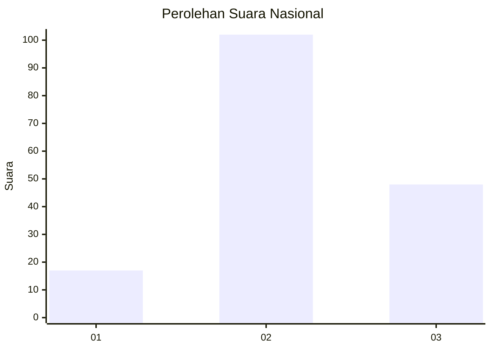
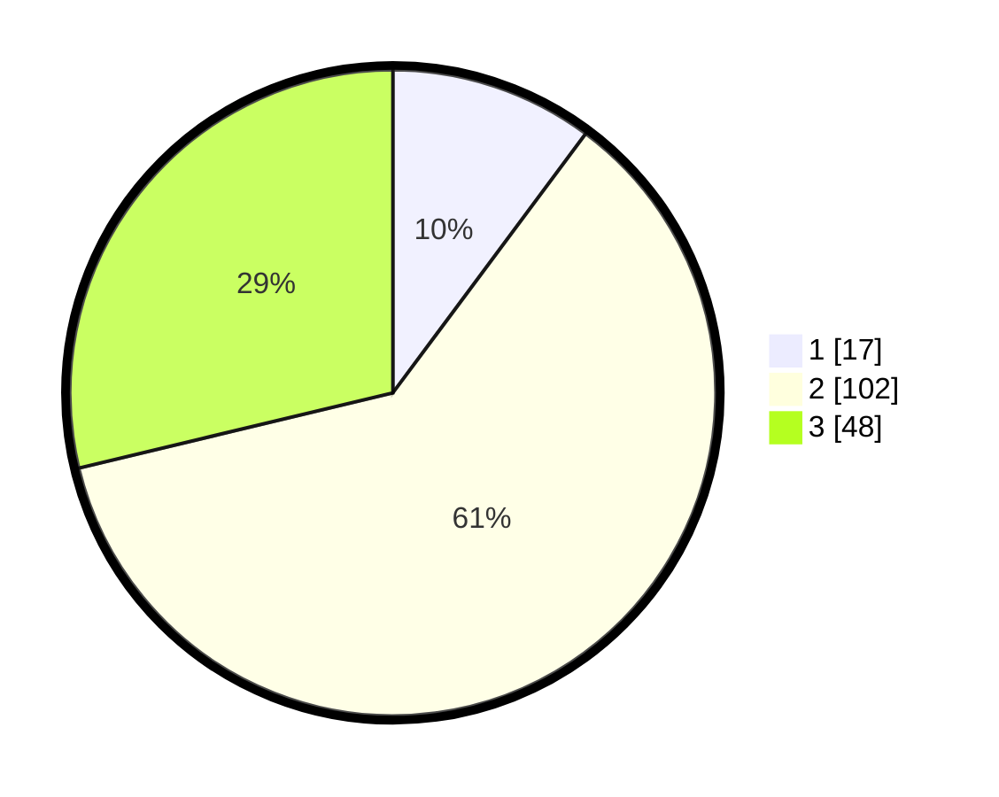

# Hasil

## Grafik

## Tabel

| No. | Nama Paslon    | Suara | Suara (raw) | Persentase |
|:--- |:-------------- | -----:| -----------:| ----------:|
| 1   | ANIES MUHAIMIN | 17    | [17][p-1]   | 10,18      |
| 2   | PRABOWO GIBRAN | 102   | [102][p-2]  | 61,08      |
| 3   | GANJAR MAHFUD  | 48    | [48][p-3]   | 28,74      |

[p-1]: https://github.com/gigit-pemilu/pemilu-2024/blob/main/pilpres/hitung-suara/sub/18-lampung/sub/07-lampung-timur/sub/16-mataram-baru/sub/2006-mandala-sari/sub/001-tps/sub/paslon-1.txt
[p-2]: https://github.com/gigit-pemilu/pemilu-2024/blob/main/pilpres/hitung-suara/sub/18-lampung/sub/07-lampung-timur/sub/16-mataram-baru/sub/2006-mandala-sari/sub/001-tps/sub/paslon-2.txt
[p-3]: https://github.com/gigit-pemilu/pemilu-2024/blob/main/pilpres/hitung-suara/sub/18-lampung/sub/07-lampung-timur/sub/16-mataram-baru/sub/2006-mandala-sari/sub/001-tps/sub/paslon-3.txt

## Foto C Plano

https://sirekap-obj-formc.kpu.go.id/e458/pemilu/ppwp/18/07/16/20/06/1807162006001-20240226-192249--167a6b48-2fc1-4e84-9ca8-3b01c4e91c4d.jpg

https://sirekap-obj-formc.kpu.go.id/e458/pemilu/ppwp/18/07/16/20/06/1807162006001-20240226-192612--cd42ff93-f054-472a-a25d-5ffc302f124d.jpg

https://sirekap-obj-formc.kpu.go.id/e458/pemilu/ppwp/18/07/16/20/06/1807162006001-20240226-192816--e7eb0592-b11b-423a-aab7-cac13698fbd6.jpg

## Metadata

| Key        | Value               |
| ---------- | ------------------- |
| Time Stamp | 2024-02-26 22:00:00 |

## DATA PEMILIH TETAP

Jumlah pemilih dalam DPT: **252**.
 * L: **131**.
 * P: **121**.

## DATA PENGGUNA HAK PILIH

Jumlah pengguna hak pilih dalam DPT: **193**.
 * L: **895**.
 * P: **73**.

Jumlah pengguna hak pilih dalam DPTb: **702**.
 * L: **0**.
 * P: **88**.

Jumlah pengguna hak pilih dalam DPK: **3**.
 * L: **0**.
 * P: **81**.

Jumlah pengguna hak pilih: **733**.
 * L: **895**.
 * P: **335**.

## JUMLAH SUARA SAH DAN TIDAK SAH

JUMLAH SELURUH SUARA SAH: **189**.

JUMLAH SUARA TIDAK SAH: **3**.

JUMLAH SELURUH SUARA SAH DAN SUARA TIDAK SAH: **551**.

