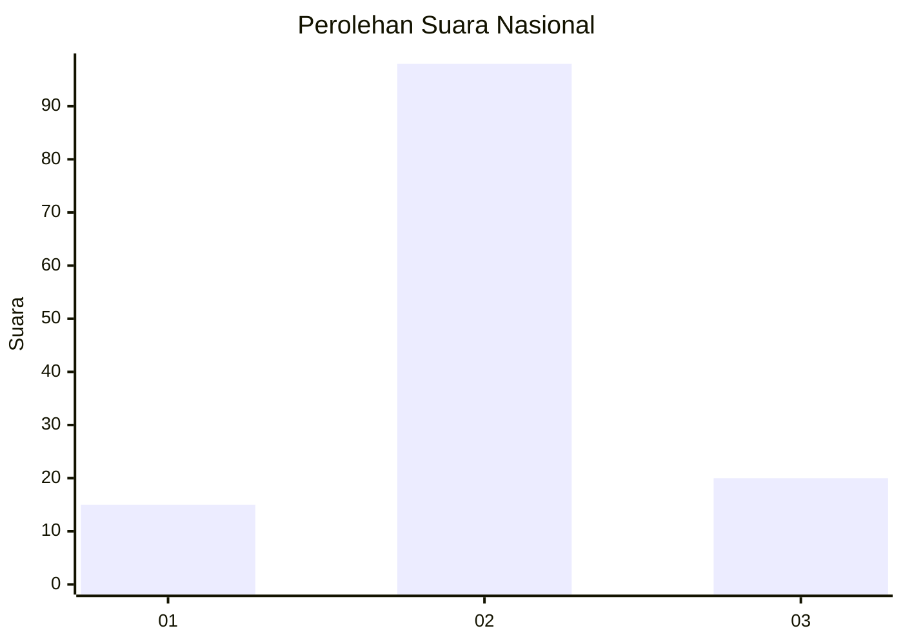
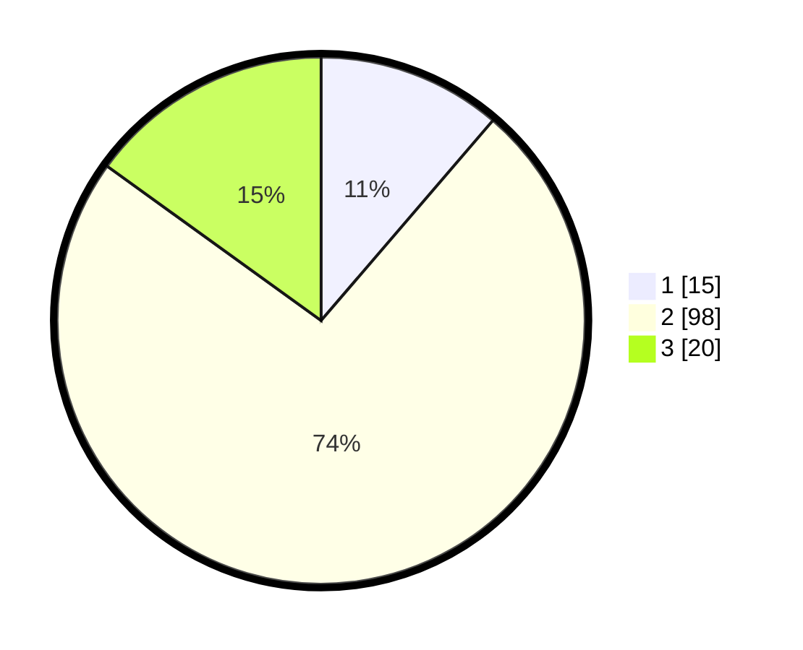

# Hasil

## Grafik

## Tabel

| No. | Nama Paslon    | Suara | Suara (raw) | Persentase |
|:--- |:-------------- | -----:| -----------:| ----------:|
| 1   | ANIES MUHAIMIN | 15    | [15][p-1]   | 11,28      |
| 2   | PRABOWO GIBRAN | 98    | [98][p-2]   | 73,68      |
| 3   | GANJAR MAHFUD  | 20    | [20][p-3]   | 15,04      |

[p-1]: https://github.com/gigit-pemilu/pemilu-2024/blob/main/pilpres/hitung-suara/sub/18-lampung/sub/07-lampung-timur/sub/22-braja-selebah/sub/2006-braja-luhur/sub/005-tps/sub/paslon-1.txt
[p-2]: https://github.com/gigit-pemilu/pemilu-2024/blob/main/pilpres/hitung-suara/sub/18-lampung/sub/07-lampung-timur/sub/22-braja-selebah/sub/2006-braja-luhur/sub/005-tps/sub/paslon-2.txt
[p-3]: https://github.com/gigit-pemilu/pemilu-2024/blob/main/pilpres/hitung-suara/sub/18-lampung/sub/07-lampung-timur/sub/22-braja-selebah/sub/2006-braja-luhur/sub/005-tps/sub/paslon-3.txt

## Foto C Plano

https://sirekap-obj-formc.kpu.go.id/e665/pemilu/ppwp/18/07/22/20/06/1807222006005-20240216-202402--cbbe910c-9fbb-4dad-9d44-a6ae5ea5655e.jpg

https://sirekap-obj-formc.kpu.go.id/e665/pemilu/ppwp/18/07/22/20/06/1807222006005-20240216-202156--99ea7f87-2207-445e-b095-ceb8654eaf0c.jpg

https://sirekap-obj-formc.kpu.go.id/e665/pemilu/ppwp/18/07/22/20/06/1807222006005-20240216-202702--85bccc63-84f8-4764-b8ee-a1149f71511e.jpg

## Metadata

| Key        | Value               |
| ---------- | ------------------- |
| Time Stamp | 2024-02-16 21:01:00 |

## DATA PEMILIH TETAP

Jumlah pemilih dalam DPT: **242**.
 * L: **422**.
 * P: **890**.

## DATA PENGGUNA HAK PILIH

Jumlah pengguna hak pilih dalam DPT: **827**.
 * L: **58**.
 * P: **869**.

Jumlah pengguna hak pilih dalam DPTb: **388**.
 * L: **288**.
 * P: **800**.

Jumlah pengguna hak pilih dalam DPK: **502**.
 * L: **430**.
 * P: **880**.

Jumlah pengguna hak pilih: **428**.
 * L: **888**.
 * P: **70**.

## JUMLAH SUARA SAH DAN TIDAK SAH

JUMLAH SELURUH SUARA SAH: **123**.

JUMLAH SUARA TIDAK SAH: **5**.

JUMLAH SELURUH SUARA SAH DAN SUARA TIDAK SAH: **828**.

