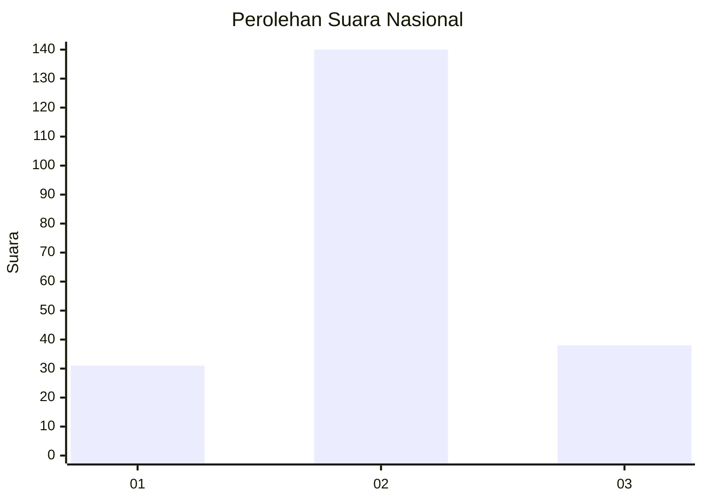
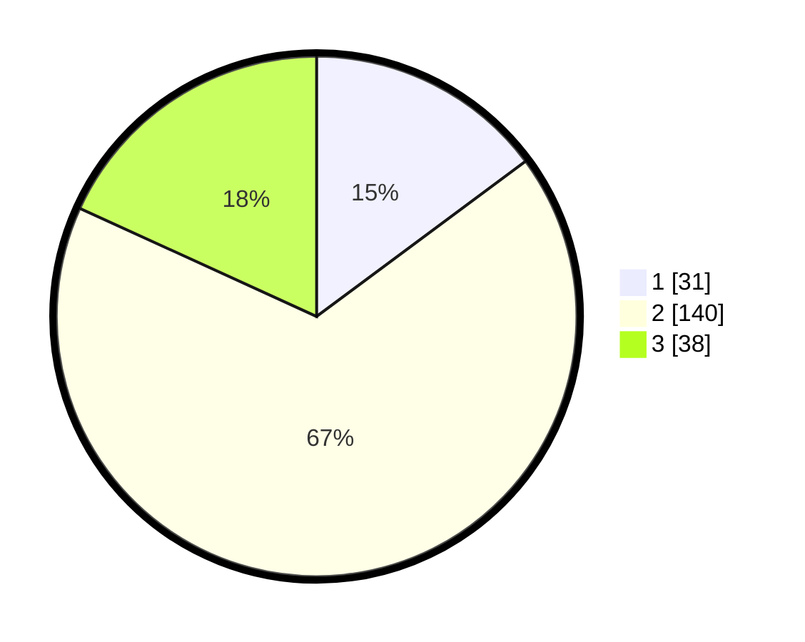

# Hasil

## Grafik

## Tabel

| No. | Nama Paslon    | Suara | Suara (raw) | Persentase |
|:--- |:-------------- | -----:| -----------:| ----------:|
| 1   | ANIES MUHAIMIN | 31    | [31][p-1]   | 14,83      |
| 2   | PRABOWO GIBRAN | 140   | [140][p-2]  | 66,99      |
| 3   | GANJAR MAHFUD  | 38    | [38][p-3]   | 18,18      |

[p-1]: https://github.com/gigit-pemilu/pemilu-2024/blob/main/pilpres/hitung-suara/sub/18-lampung/sub/07-lampung-timur/sub/23-way-bungur/sub/2002-tanjung-qencono/sub/005-tps/sub/paslon-1.txt
[p-2]: https://github.com/gigit-pemilu/pemilu-2024/blob/main/pilpres/hitung-suara/sub/18-lampung/sub/07-lampung-timur/sub/23-way-bungur/sub/2002-tanjung-qencono/sub/005-tps/sub/paslon-2.txt
[p-3]: https://github.com/gigit-pemilu/pemilu-2024/blob/main/pilpres/hitung-suara/sub/18-lampung/sub/07-lampung-timur/sub/23-way-bungur/sub/2002-tanjung-qencono/sub/005-tps/sub/paslon-3.txt

## Foto C Plano

https://sirekap-obj-formc.kpu.go.id/0eb8/pemilu/ppwp/18/07/23/20/02/1807232002005-20240214-224511--2bb3df3b-9cda-4d1e-b1f2-0d2897ffbf4b.jpg

https://sirekap-obj-formc.kpu.go.id/0eb8/pemilu/ppwp/18/07/23/20/02/1807232002005-20240214-224529--e3da076c-bf2b-4077-8d74-171e9428ac28.jpg

https://sirekap-obj-formc.kpu.go.id/0eb8/pemilu/ppwp/18/07/23/20/02/1807232002005-20240215-020845--9a534f80-74ec-45c1-892b-9f469fb47777.jpg

## Metadata

| Key        | Value               |
| ---------- | ------------------- |
| Time Stamp | 2024-02-16 21:01:00 |

