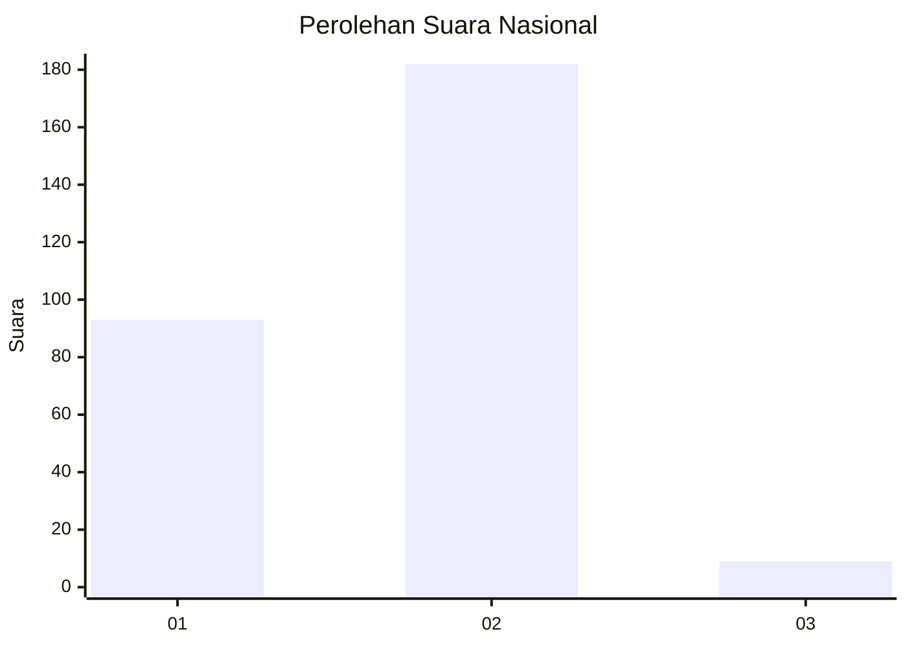
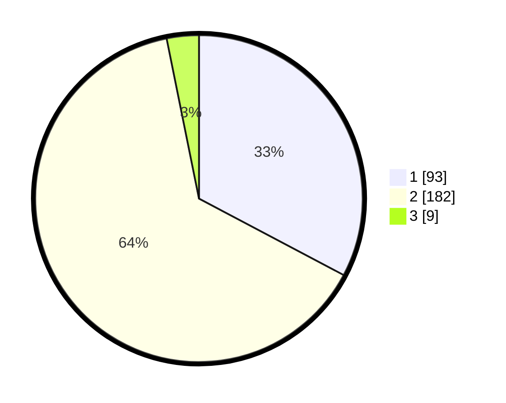

# Hasil

## Grafik

## Tabel

| No. | Nama Paslon    | Suara | Suara (raw) | Persentase |
|:--- |:-------------- | -----:| -----------:| ----------:|
| 1   | ANIES MUHAIMIN | 93    | [93][p-1]   | 32,75      |
| 2   | PRABOWO GIBRAN | 182   | [182][p-2]  | 64,08      |
| 3   | GANJAR MAHFUD  | 9     | [9][p-3]    | 3,17       |

[p-1]: https://github.com/gigit-pemilu/pemilu-2024/blob/main/pilpres/hitung-suara/sub/18-lampung/sub/09-pesawaran/sub/01-gedong-tataan/sub/2011-kurungan-nyawa/sub/008-tps/sub/paslon-1.txt
[p-2]: https://github.com/gigit-pemilu/pemilu-2024/blob/main/pilpres/hitung-suara/sub/18-lampung/sub/09-pesawaran/sub/01-gedong-tataan/sub/2011-kurungan-nyawa/sub/008-tps/sub/paslon-2.txt
[p-3]: https://github.com/gigit-pemilu/pemilu-2024/blob/main/pilpres/hitung-suara/sub/18-lampung/sub/09-pesawaran/sub/01-gedong-tataan/sub/2011-kurungan-nyawa/sub/008-tps/sub/paslon-3.txt

## Foto C Plano

https://sirekap-obj-formc.kpu.go.id/44fb/pemilu/ppwp/18/09/01/20/11/1809012011008-20240215-004026--1bbd5819-a2c5-469f-8963-47fad06b2481.jpg

https://sirekap-obj-formc.kpu.go.id/44fb/pemilu/ppwp/18/09/01/20/11/1809012011008-20240215-053247--827ddc79-1cf3-402d-8543-e24d9183caf9.jpg

https://sirekap-obj-formc.kpu.go.id/44fb/pemilu/ppwp/18/09/01/20/11/1809012011008-20240215-030217--d8c7717d-d2bb-420f-a5a3-e3d162009b2e.jpg

## Metadata

| Key        | Value               |
| ---------- | ------------------- |
| Time Stamp | 2024-02-15 20:00:44 |

