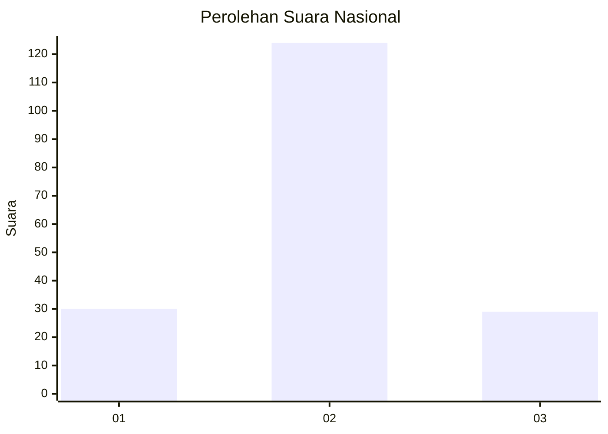
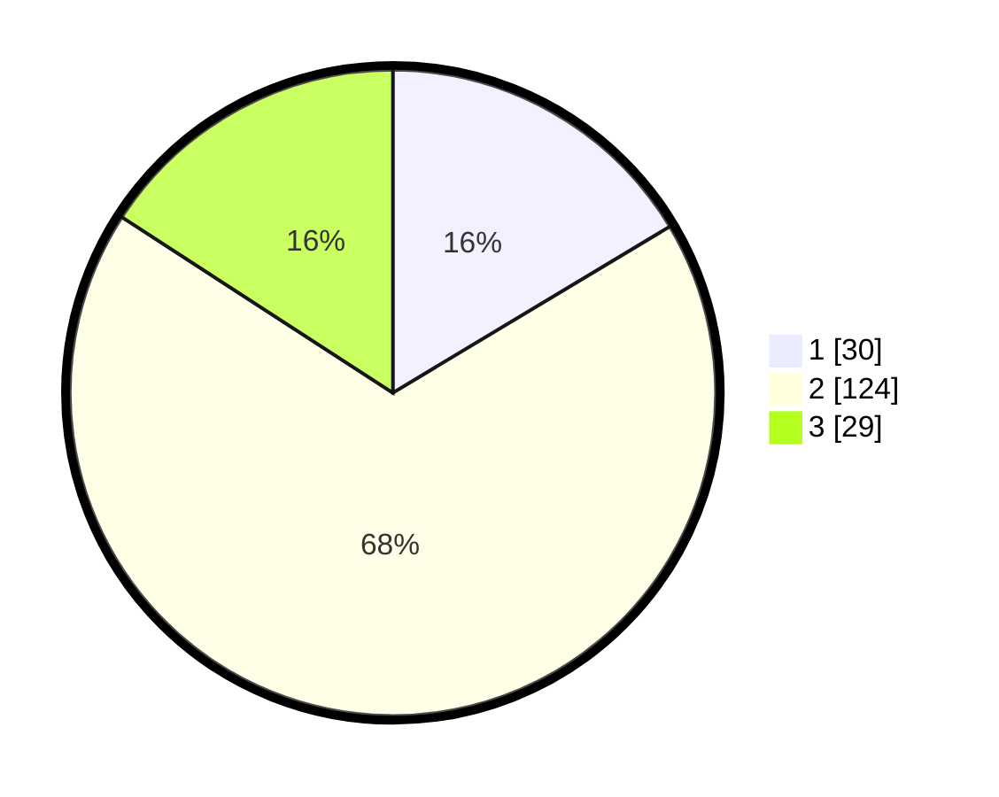

# Hasil

## Grafik

## Tabel

| No. | Nama Paslon    | Suara | Suara (raw) | Persentase |
|:--- |:-------------- | -----:| -----------:| ----------:|
| 1   | ANIES MUHAIMIN | 30    | [30][p-1]   | 16,39      |
| 2   | PRABOWO GIBRAN | 124   | [124][p-2]  | 67,76      |
| 3   | GANJAR MAHFUD  | 29    | [29][p-3]   | 15,85      |

[p-1]: https://github.com/gigit-pemilu/pemilu-2024/blob/main/pilpres/hitung-suara/sub/18-lampung/sub/11-mesuji/sub/01-mesuji/sub/2001-wiralaga-i/sub/001-tps/sub/paslon-1.txt
[p-2]: https://github.com/gigit-pemilu/pemilu-2024/blob/main/pilpres/hitung-suara/sub/18-lampung/sub/11-mesuji/sub/01-mesuji/sub/2001-wiralaga-i/sub/001-tps/sub/paslon-2.txt
[p-3]: https://github.com/gigit-pemilu/pemilu-2024/blob/main/pilpres/hitung-suara/sub/18-lampung/sub/11-mesuji/sub/01-mesuji/sub/2001-wiralaga-i/sub/001-tps/sub/paslon-3.txt

## Foto C Plano

https://sirekap-obj-formc.kpu.go.id/a13c/pemilu/ppwp/18/11/01/20/01/1811012001001-20240216-111943--823dc842-f8da-403c-bfc7-6b0cc810e0c8.jpg

https://sirekap-obj-formc.kpu.go.id/a13c/pemilu/ppwp/18/11/01/20/01/1811012001001-20240216-112026--e67e84c4-e963-4b4b-bd58-aad17238afbe.jpg

https://sirekap-obj-formc.kpu.go.id/a13c/pemilu/ppwp/18/11/01/20/01/1811012001001-20240216-112054--9ab109d3-3b30-4459-8f5a-ffa2e0bd4bf9.jpg

## Metadata

| Key        | Value               |
| ---------- | ------------------- |
| Time Stamp | 2024-02-16 12:51:22 |

