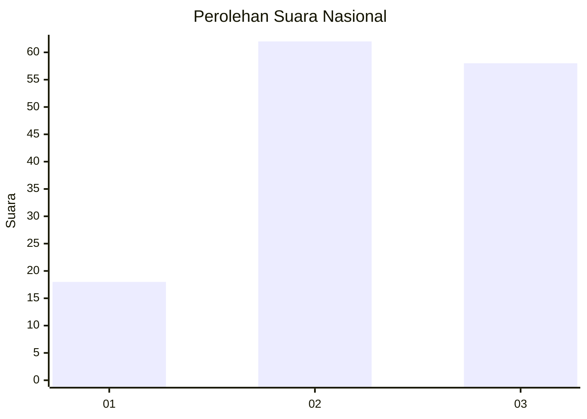
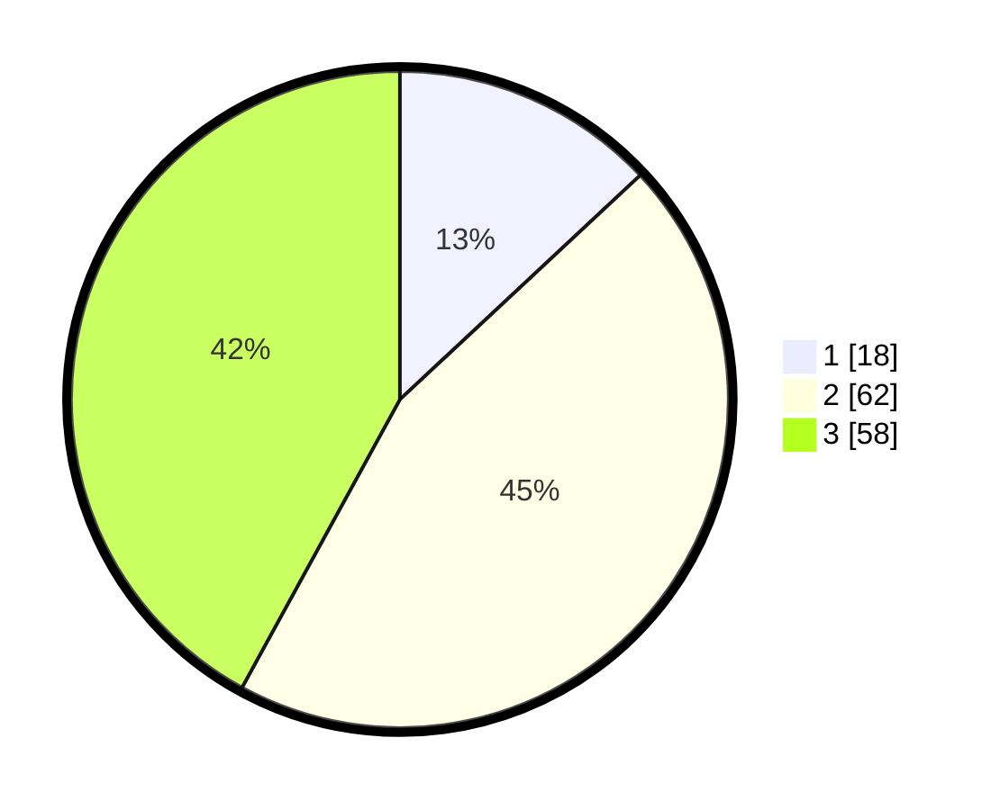

# Hasil

## Grafik

## Tabel

| No. | Nama Paslon    | Suara | Suara (raw) | Persentase |
|:--- |:-------------- | -----:| -----------:| ----------:|
| 1   | ANIES MUHAIMIN | 18    | [18][p-1]   | 13,04      |
| 2   | PRABOWO GIBRAN | 62    | [62][p-2]   | 44,93      |
| 3   | GANJAR MAHFUD  | 58    | [58][p-3]   | 42,03      |

[p-1]: https://github.com/gigit-pemilu/pemilu-2024/blob/main/pilpres/hitung-suara/sub/18-lampung/sub/11-mesuji/sub/01-mesuji/sub/2003-sungai-badak/sub/009-tps/sub/paslon-1.txt
[p-2]: https://github.com/gigit-pemilu/pemilu-2024/blob/main/pilpres/hitung-suara/sub/18-lampung/sub/11-mesuji/sub/01-mesuji/sub/2003-sungai-badak/sub/009-tps/sub/paslon-2.txt
[p-3]: https://github.com/gigit-pemilu/pemilu-2024/blob/main/pilpres/hitung-suara/sub/18-lampung/sub/11-mesuji/sub/01-mesuji/sub/2003-sungai-badak/sub/009-tps/sub/paslon-3.txt

## Foto C Plano

https://sirekap-obj-formc.kpu.go.id/3789/pemilu/ppwp/18/11/01/20/03/1811012003009-20240220-175239--85412068-016e-4550-a2a2-bcdf743498c0.jpg

https://sirekap-obj-formc.kpu.go.id/3789/pemilu/ppwp/18/11/01/20/03/1811012003009-20240220-175356--9235a9b7-2311-4782-b7a0-fe5c0182a4a7.jpg

https://sirekap-obj-formc.kpu.go.id/3789/pemilu/ppwp/18/11/01/20/03/1811012003009-20240220-175513--90096844-3f0e-4e1b-9373-7fba1ee991f0.jpg

## Metadata

| Key        | Value               |
| ---------- | ------------------- |
| Time Stamp | 2024-02-20 19:00:00 |

## DATA PEMILIH TETAP

Jumlah pemilih dalam DPT: **242**.
 * L: **22**.
 * P: **42**.

## DATA PENGGUNA HAK PILIH

Jumlah pengguna hak pilih dalam DPT: **734**.
 * L: **577**.
 * P: **775**.

Jumlah pengguna hak pilih dalam DPTb: **22**.
 * L: **777**.
 * P: **771**.

Jumlah pengguna hak pilih dalam DPK: **777**.
 * L: **414**.
 * P: **772**.

Jumlah pengguna hak pilih: **227**.
 * L: **575**.
 * P: **555**.

## JUMLAH SUARA SAH DAN TIDAK SAH

JUMLAH SELURUH SUARA SAH: **258**.

JUMLAH SUARA TIDAK SAH: **2**.

JUMLAH SELURUH SUARA SAH DAN SUARA TIDAK SAH: **222**.

