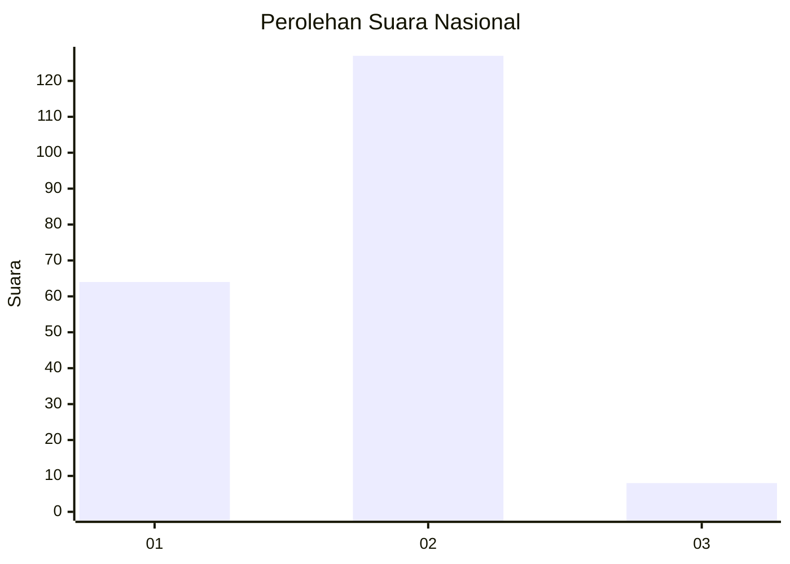
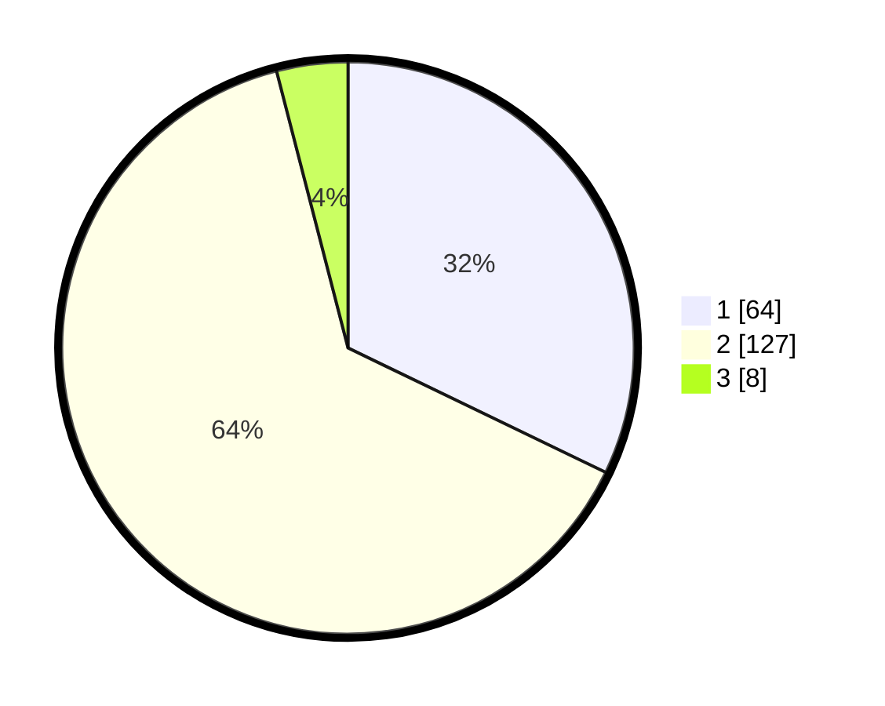

# Hasil

## Grafik

## Tabel

| No. | Nama Paslon    | Suara | Suara (raw) | Persentase |
|:--- |:-------------- | -----:| -----------:| ----------:|
| 1   | ANIES MUHAIMIN | 64    | [64][p-1]   | 32,16      |
| 2   | PRABOWO GIBRAN | 127   | [127][p-2]  | 63,82      |
| 3   | GANJAR MAHFUD  | 8     | [8][p-3]    | 4,02       |

[p-1]: https://github.com/gigit-pemilu/pemilu-2024/blob/main/pilpres/hitung-suara/sub/18-lampung/sub/13-pesisir-barat/sub/04-pesisir-utara/sub/2001-kuripan/sub/001-tps/sub/paslon-1.txt
[p-2]: https://github.com/gigit-pemilu/pemilu-2024/blob/main/pilpres/hitung-suara/sub/18-lampung/sub/13-pesisir-barat/sub/04-pesisir-utara/sub/2001-kuripan/sub/001-tps/sub/paslon-2.txt
[p-3]: https://github.com/gigit-pemilu/pemilu-2024/blob/main/pilpres/hitung-suara/sub/18-lampung/sub/13-pesisir-barat/sub/04-pesisir-utara/sub/2001-kuripan/sub/001-tps/sub/paslon-3.txt

## Foto C Plano

https://sirekap-obj-formc.kpu.go.id/6510/pemilu/ppwp/18/13/04/20/01/1813042001001-20240221-201623--bd966fc6-d23e-4d2c-9334-0d22bec6c900.jpg

https://sirekap-obj-formc.kpu.go.id/6510/pemilu/ppwp/18/13/04/20/01/1813042001001-20240221-201714--1710b2f8-b4ae-4daf-b44f-d27378636361.jpg

https://sirekap-obj-formc.kpu.go.id/6510/pemilu/ppwp/18/13/04/20/01/1813042001001-20240221-201745--752b7b95-5913-41f9-8beb-6cba2b5e8137.jpg

## Metadata

| Key        | Value               |
| ---------- | ------------------- |
| Time Stamp | 2024-02-25 00:00:00 |

