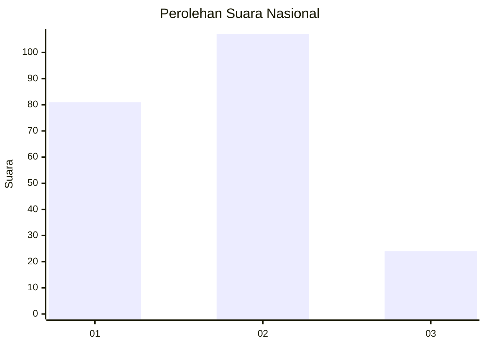
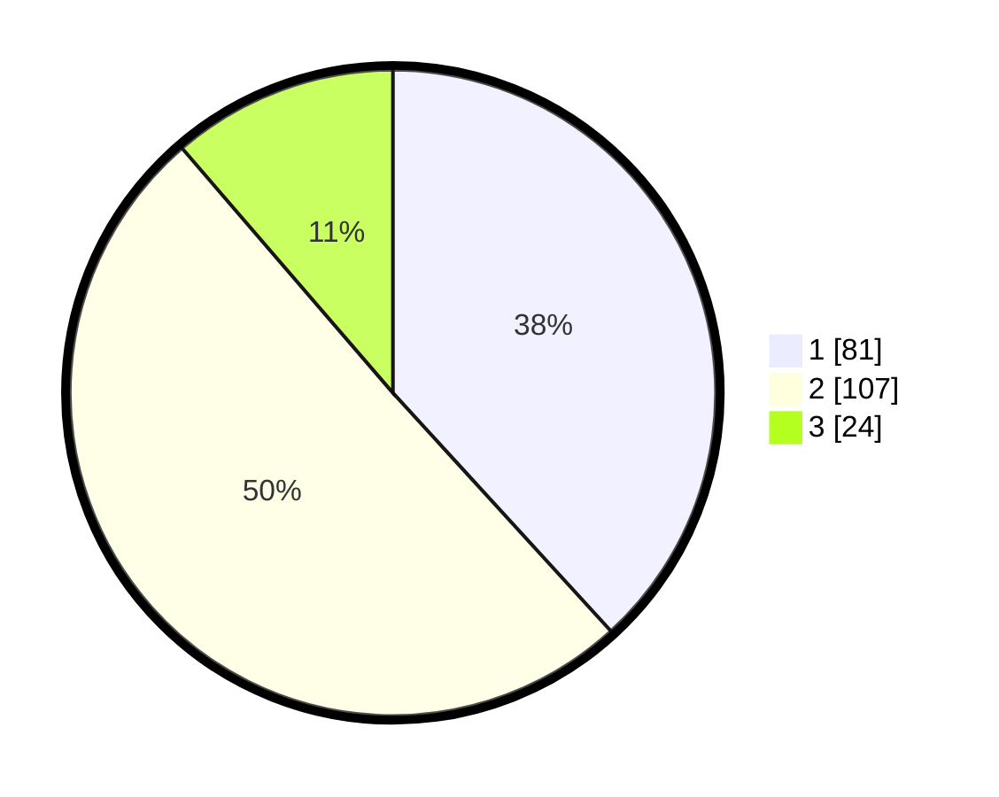

# Hasil

## Grafik

## Tabel

| No. | Nama Paslon    | Suara | Suara (raw) | Persentase |
|:--- |:-------------- | -----:| -----------:| ----------:|
| 1   | ANIES MUHAIMIN | 81    | [81][p-1]   | 38,21      |
| 2   | PRABOWO GIBRAN | 107   | [107][p-2]  | 50,47      |
| 3   | GANJAR MAHFUD  | 24    | [24][p-3]   | 11,32      |

[p-1]: https://github.com/gigit-pemilu/pemilu-2024/blob/main/pilpres/hitung-suara/sub/18-lampung/sub/13-pesisir-barat/sub/06-pulau-pisang/sub/2002-labuhan/sub/001-tps/sub/paslon-1.txt
[p-2]: https://github.com/gigit-pemilu/pemilu-2024/blob/main/pilpres/hitung-suara/sub/18-lampung/sub/13-pesisir-barat/sub/06-pulau-pisang/sub/2002-labuhan/sub/001-tps/sub/paslon-2.txt
[p-3]: https://github.com/gigit-pemilu/pemilu-2024/blob/main/pilpres/hitung-suara/sub/18-lampung/sub/13-pesisir-barat/sub/06-pulau-pisang/sub/2002-labuhan/sub/001-tps/sub/paslon-3.txt

## Foto C Plano

https://sirekap-obj-formc.kpu.go.id/976c/pemilu/ppwp/18/13/06/20/02/1813062002001-20240227-083133--8219ba3e-6fbc-4676-9469-9d2d9d944364.jpg

https://sirekap-obj-formc.kpu.go.id/976c/pemilu/ppwp/18/13/06/20/02/1813062002001-20240227-083426--9eec097a-9120-4cab-bc01-dfb32e05f18f.jpg

https://sirekap-obj-formc.kpu.go.id/976c/pemilu/ppwp/18/13/06/20/02/1813062002001-20240227-083640--3dcc3e94-e8db-4071-b04e-18b3ba1e16f4.jpg

## Metadata

| Key        | Value               |
| ---------- | ------------------- |
| Time Stamp | 2024-02-29 10:00:00 |

