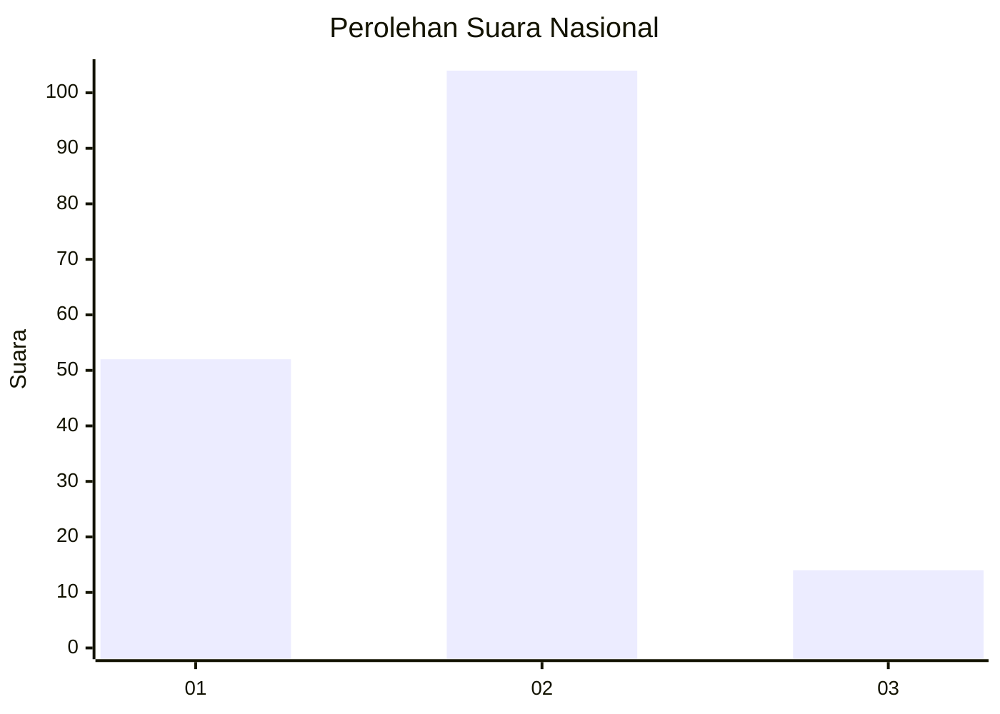
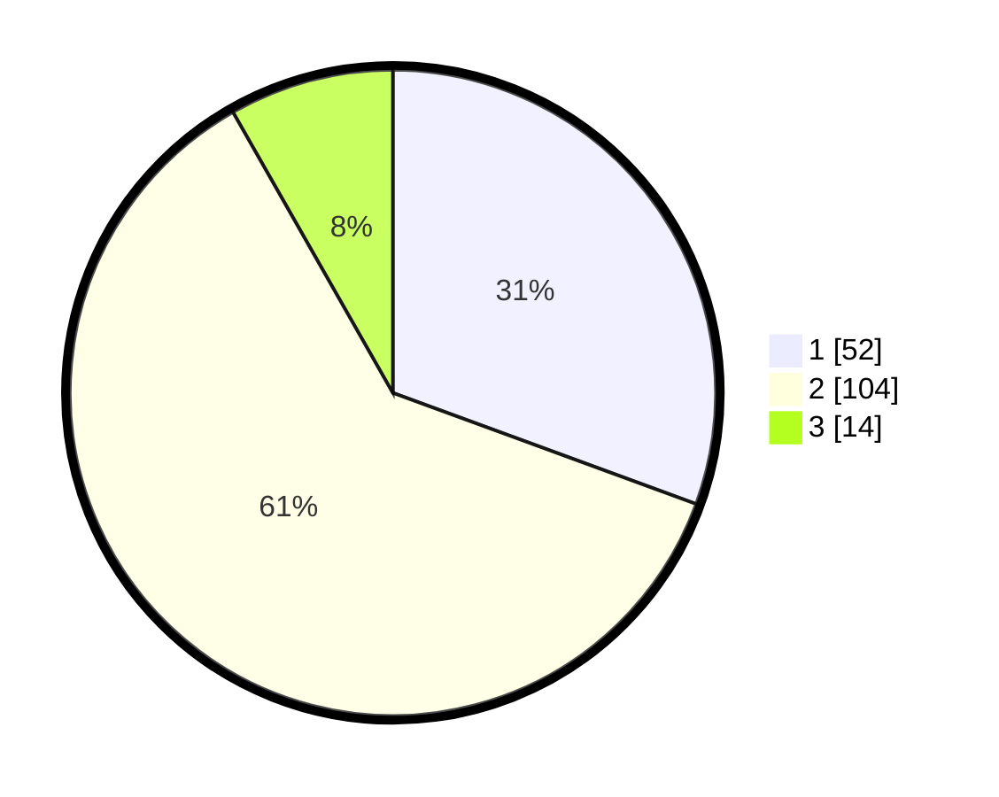

# Hasil

## Grafik

## Tabel

| No. | Nama Paslon    | Suara | Suara (raw) | Persentase |
|:--- |:-------------- | -----:| -----------:| ----------:|
| 1   | ANIES MUHAIMIN | 52    | [52][p-1]   | 30,59      |
| 2   | PRABOWO GIBRAN | 104   | [104][p-2]  | 61,18      |
| 3   | GANJAR MAHFUD  | 14    | [14][p-3]   | 8,24       |

[p-1]: https://github.com/gigit-pemilu/pemilu-2024/blob/main/pilpres/hitung-suara/sub/18-lampung/sub/13-pesisir-barat/sub/07-way-krui/sub/2001-pajar-bulan/sub/001-tps/sub/paslon-1.txt
[p-2]: https://github.com/gigit-pemilu/pemilu-2024/blob/main/pilpres/hitung-suara/sub/18-lampung/sub/13-pesisir-barat/sub/07-way-krui/sub/2001-pajar-bulan/sub/001-tps/sub/paslon-2.txt
[p-3]: https://github.com/gigit-pemilu/pemilu-2024/blob/main/pilpres/hitung-suara/sub/18-lampung/sub/13-pesisir-barat/sub/07-way-krui/sub/2001-pajar-bulan/sub/001-tps/sub/paslon-3.txt

## Foto C Plano

https://sirekap-obj-formc.kpu.go.id/a363/pemilu/ppwp/18/13/07/20/01/1813072001001-20240217-150432--a044ec3d-bda1-42b3-9e98-c975a6e815ba.jpg

https://sirekap-obj-formc.kpu.go.id/a363/pemilu/ppwp/18/13/07/20/01/1813072001001-20240217-145837--b63c67e3-73d0-4ef7-b662-a672e27f35c7.jpg

https://sirekap-obj-formc.kpu.go.id/a363/pemilu/ppwp/18/13/07/20/01/1813072001001-20240217-150645--1cf1d831-afb2-4e1d-9557-47c2b49d0c69.jpg

## Metadata

| Key        | Value               |
| ---------- | ------------------- |
| Time Stamp | 2024-02-17 16:00:02 |

