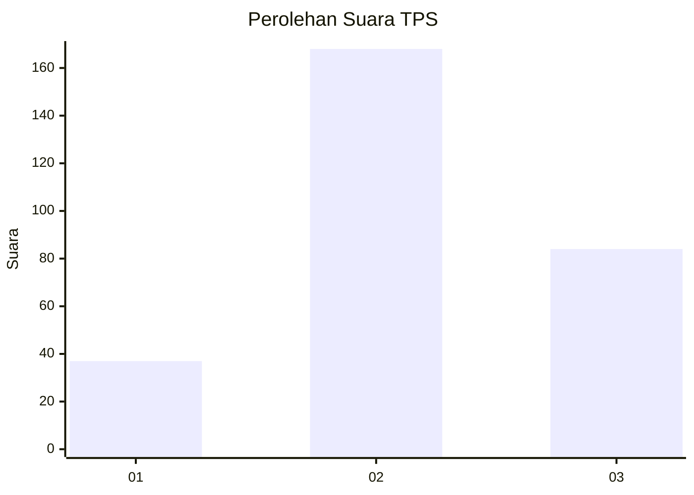
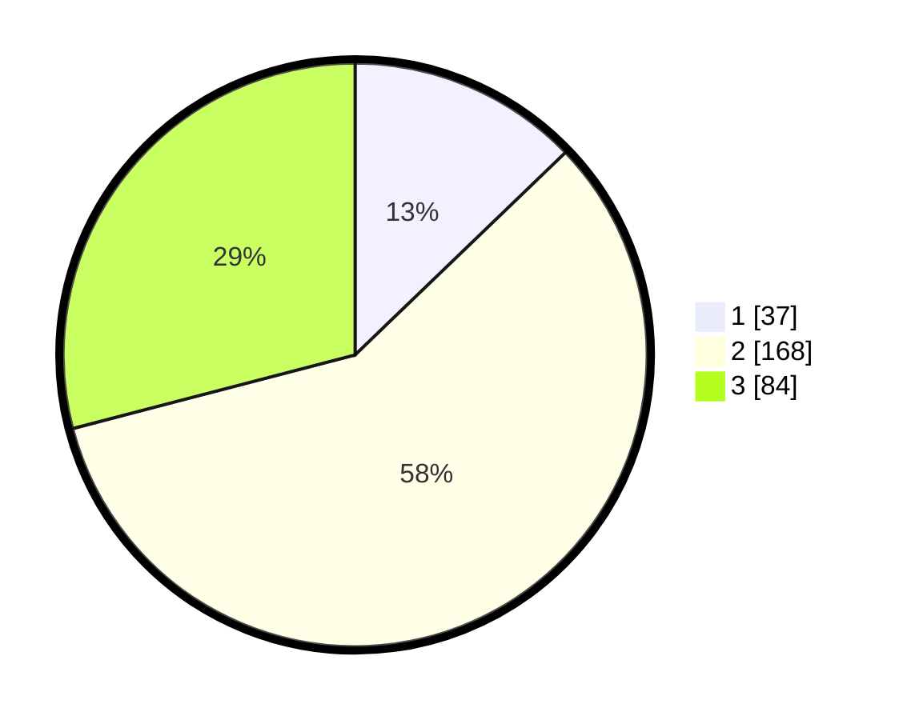

# Hasil

## Grafik

## Tabel

| No. | Nama Paslon    | Suara | Suara (raw) | Persentase |
|:--- |:-------------- | -----:| -----------:| ----------:|
| 1   | ANIES MUHAIMIN | 37    | [37][p-1]   | 12,80      |
| 2   | PRABOWO GIBRAN | 168   | [168][p-2]  | 58,13      |
| 3   | GANJAR MAHFUD  | 84    | [84][p-3]   | 29,07      |

[p-1]: https://github.com/gigit-pemilu/pemilu-2024-18-lampung/blob/main/pilpres/hitung-suara/sub/18-lampung/sub/13-pesisir-barat/sub/09-ngambur/sub/2005-gedung-cahya-kuningan/sub/004-tps/sub/paslon-1.txt
[p-2]: https://github.com/gigit-pemilu/pemilu-2024-18-lampung/blob/main/pilpres/hitung-suara/sub/18-lampung/sub/13-pesisir-barat/sub/09-ngambur/sub/2005-gedung-cahya-kuningan/sub/004-tps/sub/paslon-2.txt
[p-3]: https://github.com/gigit-pemilu/pemilu-2024-18-lampung/blob/main/pilpres/hitung-suara/sub/18-lampung/sub/13-pesisir-barat/sub/09-ngambur/sub/2005-gedung-cahya-kuningan/sub/004-tps/sub/paslon-3.txt

## Foto C Plano

https://sirekap-obj-formc.kpu.go.id/b1f2/pemilu/ppwp/18/13/09/20/05/1813092005004-20240214-232551--8e0ed0b7-207b-4a5e-8cc0-c25d8774e7ae.jpg

https://sirekap-obj-formc.kpu.go.id/b1f2/pemilu/ppwp/18/13/09/20/05/1813092005004-20240214-233522--8d43472e-a8ff-4907-a32d-963d137dd3fd.jpg

https://sirekap-obj-formc.kpu.go.id/b1f2/pemilu/ppwp/18/13/09/20/05/1813092005004-20240214-233528--d3c0ce0d-a1e2-46f4-a468-a46cbedba43c.jpg

## Metadata

| Key        | Value               |
| ---------- | ------------------- |
| Time Stamp | 2024-02-16 00:00:26 |

## DATA PEMILIH TETAP

Jumlah pemilih dalam DPT: **294**.
 * L: **156**.
 * P: **138**.

## DATA PENGGUNA HAK PILIH

Jumlah pengguna hak pilih dalam DPT: **261**.
 * L: **136**.
 * P: **125**.

Jumlah pengguna hak pilih dalam DPTb: **1**.
 * L: **0**.
 * P: **1**.

Jumlah pengguna hak pilih dalam DPK: **35**.
 * L: **16**.
 * P: **19**.

Jumlah pengguna hak pilih: **297**.
 * L: **152**.
 * P: **145**.

## JUMLAH SUARA SAH DAN TIDAK SAH

JUMLAH SELURUH SUARA SAH: **289**.

JUMLAH SUARA TIDAK SAH: **8**.

JUMLAH SELURUH SUARA SAH DAN SUARA TIDAK SAH: **297**.

