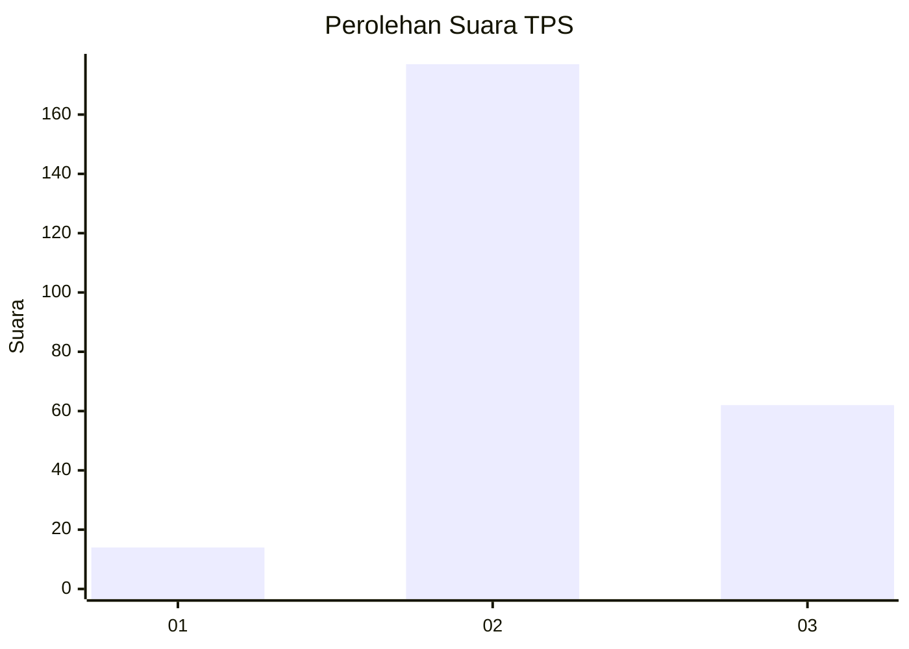
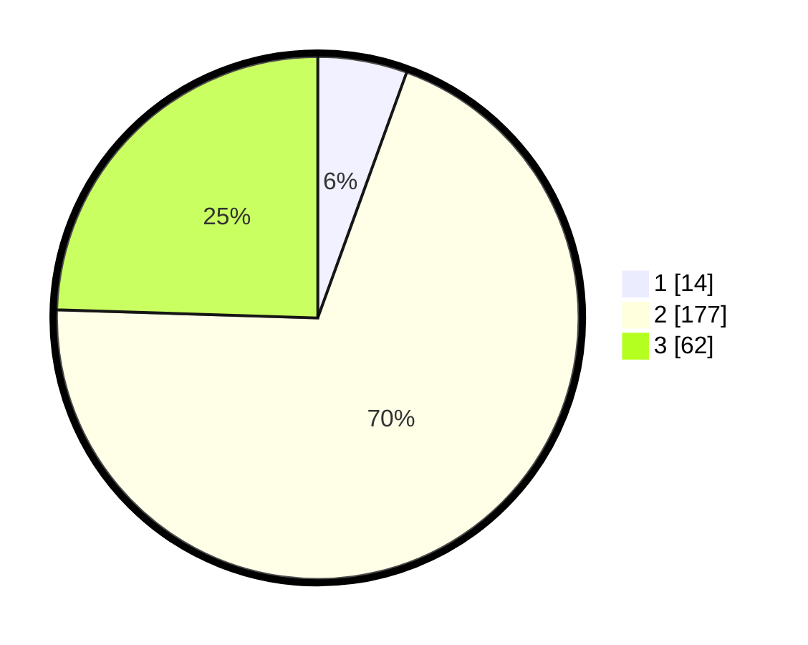

# Hasil

## Grafik

## Tabel

| No. | Nama Paslon    | Suara | Suara (raw) | Persentase |
|:--- |:-------------- | -----:| -----------:| ----------:|
| 1   | ANIES MUHAIMIN | 14    | [14][p-1]   | 5,53       |
| 2   | PRABOWO GIBRAN | 177   | [177][p-2]  | 69,96      |
| 3   | GANJAR MAHFUD  | 62    | [62][p-3]   | 24,51      |

[p-1]: https://github.com/gigit-pemilu/pemilu-2024-18-lampung/blob/main/pilpres/hitung-suara/sub/18-lampung/sub/13-pesisir-barat/sub/11-bangkunat/sub/2001-pagar-bukit/sub/003-tps/sub/paslon-1.txt
[p-2]: https://github.com/gigit-pemilu/pemilu-2024-18-lampung/blob/main/pilpres/hitung-suara/sub/18-lampung/sub/13-pesisir-barat/sub/11-bangkunat/sub/2001-pagar-bukit/sub/003-tps/sub/paslon-2.txt
[p-3]: https://github.com/gigit-pemilu/pemilu-2024-18-lampung/blob/main/pilpres/hitung-suara/sub/18-lampung/sub/13-pesisir-barat/sub/11-bangkunat/sub/2001-pagar-bukit/sub/003-tps/sub/paslon-3.txt

## Foto C Plano

https://sirekap-obj-formc.kpu.go.id/a5b5/pemilu/ppwp/18/13/11/20/01/1813112001003-20240214-223551--ef87e6cc-d82c-4e09-b0cc-2fb074dce83c.jpg

https://sirekap-obj-formc.kpu.go.id/a5b5/pemilu/ppwp/18/13/11/20/01/1813112001003-20240215-043852--6bdc7045-3005-4c20-8b0f-2fc3889cc502.jpg

https://sirekap-obj-formc.kpu.go.id/a5b5/pemilu/ppwp/18/13/11/20/01/1813112001003-20240215-001302--c11f7c42-3f0a-4585-8a0a-671659f8d6a4.jpg

## Metadata

| Key        | Value               |
| ---------- | ------------------- |
| Time Stamp | 2024-02-16 00:00:26 |

