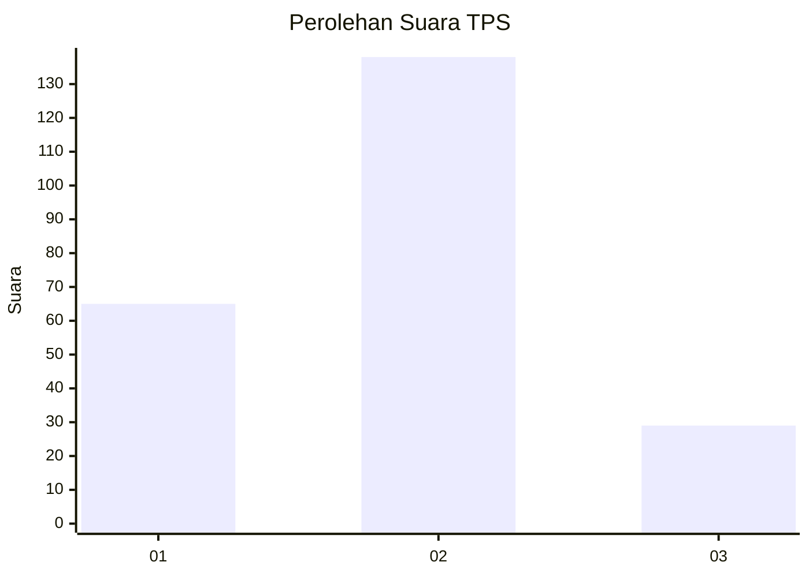
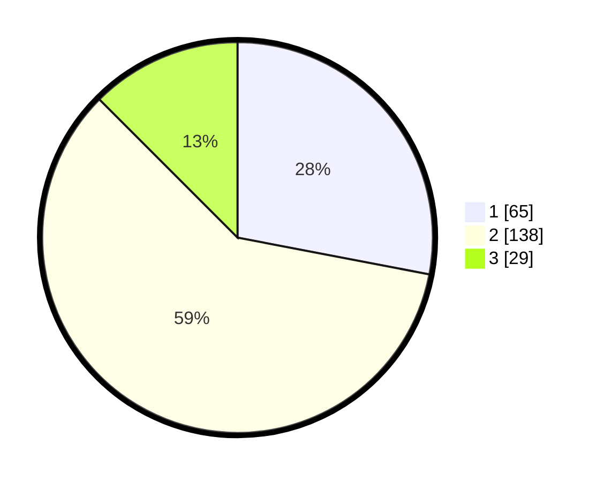

# Hasil

## Grafik

## Tabel

| No. | Nama Paslon    | Suara | Suara (raw) | Persentase |
|:--- |:-------------- | -----:| -----------:| ----------:|
| 1   | ANIES MUHAIMIN | 65    | [65][p-1]   | 28,02      |
| 2   | PRABOWO GIBRAN | 138   | [138][p-2]  | 59,48      |
| 3   | GANJAR MAHFUD  | 29    | [29][p-3]   | 12,50      |

[p-1]: https://github.com/gigit-pemilu/pemilu-2024-18-lampung/blob/main/pilpres/hitung-suara/sub/18-lampung/sub/71-kota-bandar-lampung/sub/01-kedaton/sub/1003-kedaton/sub/003-tps/sub/paslon-1.txt
[p-2]: https://github.com/gigit-pemilu/pemilu-2024-18-lampung/blob/main/pilpres/hitung-suara/sub/18-lampung/sub/71-kota-bandar-lampung/sub/01-kedaton/sub/1003-kedaton/sub/003-tps/sub/paslon-2.txt
[p-3]: https://github.com/gigit-pemilu/pemilu-2024-18-lampung/blob/main/pilpres/hitung-suara/sub/18-lampung/sub/71-kota-bandar-lampung/sub/01-kedaton/sub/1003-kedaton/sub/003-tps/sub/paslon-3.txt

## Foto C Plano

https://sirekap-obj-formc.kpu.go.id/f1ea/pemilu/ppwp/18/71/01/10/03/1871011003003-20240215-043523--a645c304-bcd4-4bfc-89ee-79a2bf83ff9b.jpg

https://sirekap-obj-formc.kpu.go.id/f1ea/pemilu/ppwp/18/71/01/10/03/1871011003003-20240214-155356--553a6579-eae0-4dbe-8790-16862eb1812a.jpg

https://sirekap-obj-formc.kpu.go.id/f1ea/pemilu/ppwp/18/71/01/10/03/1871011003003-20240214-155400--fb2a6353-5783-420d-b82a-12b52b6496de.jpg

## Metadata

| Key        | Value               |
| ---------- | ------------------- |
| Time Stamp | 2024-02-15 16:30:25 |

