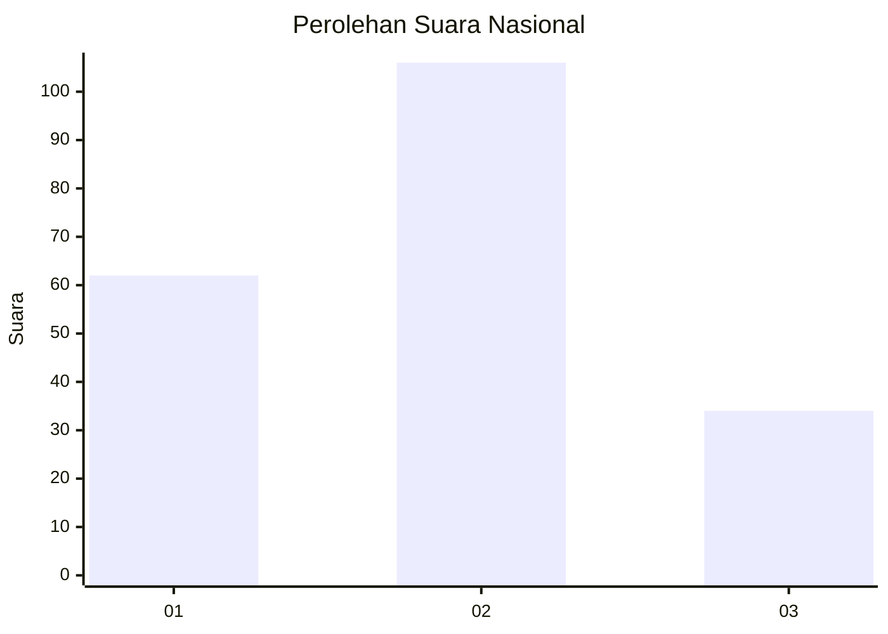
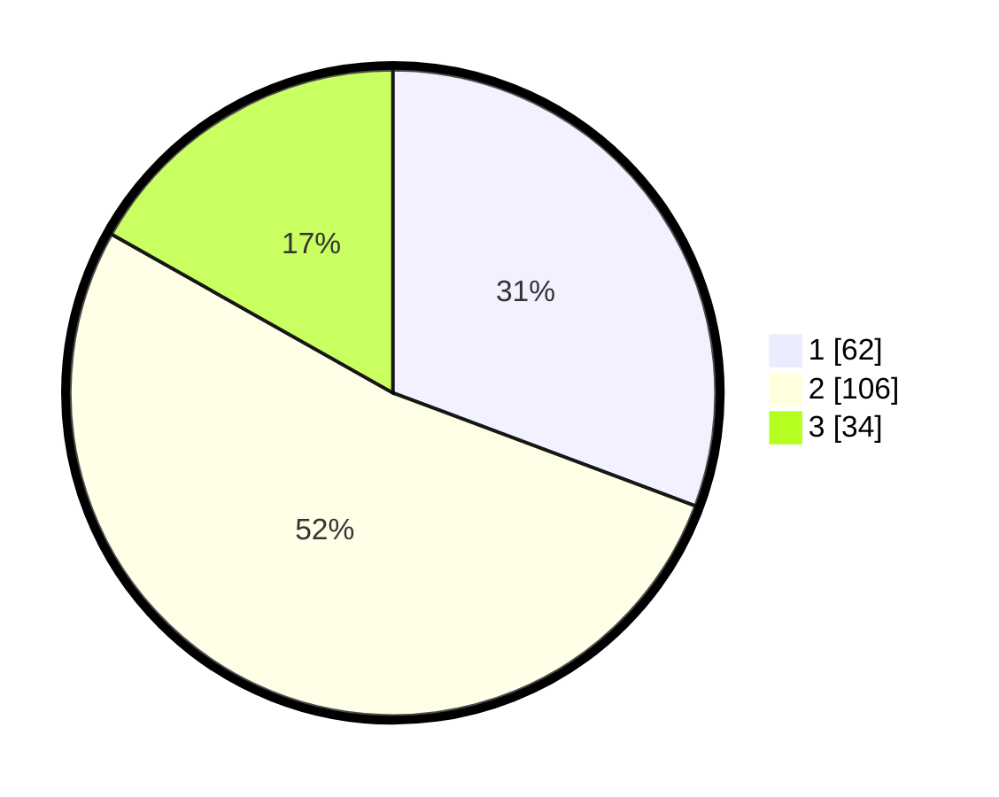

# Hasil

## Grafik

## Tabel

| No. | Nama Paslon    | Suara | Suara (raw) | Persentase |
|:--- |:-------------- | -----:| -----------:| ----------:|
| 1   | ANIES MUHAIMIN | 62    | [62][p-1]   | 30,69      |
| 2   | PRABOWO GIBRAN | 106   | [106][p-2]  | 52,48      |
| 3   | GANJAR MAHFUD  | 34    | [34][p-3]   | 16,83      |

[p-1]: https://github.com/gigit-pemilu/pemilu-2024/blob/main/pilpres/hitung-suara/sub/18-lampung/sub/71-kota-bandar-lampung/sub/01-kedaton/sub/1003-kedaton/sub/004-tps/sub/paslon-1.txt
[p-2]: https://github.com/gigit-pemilu/pemilu-2024/blob/main/pilpres/hitung-suara/sub/18-lampung/sub/71-kota-bandar-lampung/sub/01-kedaton/sub/1003-kedaton/sub/004-tps/sub/paslon-2.txt
[p-3]: https://github.com/gigit-pemilu/pemilu-2024/blob/main/pilpres/hitung-suara/sub/18-lampung/sub/71-kota-bandar-lampung/sub/01-kedaton/sub/1003-kedaton/sub/004-tps/sub/paslon-3.txt

## Foto C Plano

https://sirekap-obj-formc.kpu.go.id/0aea/pemilu/ppwp/18/71/01/10/03/1871011003004-20240221-205346--e9be4e4a-9eba-4305-bbb6-4e12dfd01733.jpg

https://sirekap-obj-formc.kpu.go.id/0aea/pemilu/ppwp/18/71/01/10/03/1871011003004-20240221-113426--d590659c-a6e8-4b1a-8ed4-2f8c787e0755.jpg

https://sirekap-obj-formc.kpu.go.id/0aea/pemilu/ppwp/18/71/01/10/03/1871011003004-20240221-205127--e7c45de2-c0e9-49c1-9196-d2f5904b1e8f.jpg

## Metadata

| Key        | Value               |
| ---------- | ------------------- |
| Time Stamp | 2024-02-24 22:31:28 |

