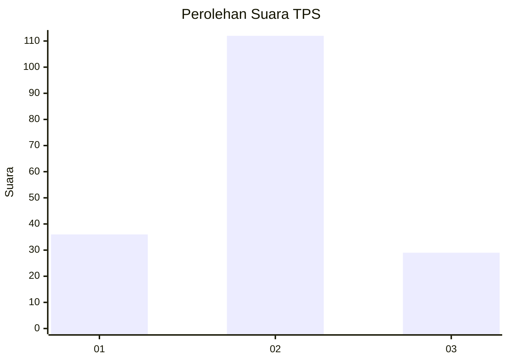

# Hasil

## Grafik

## Tabel

| No. | Nama Paslon    | Suara | Suara (raw) | Persentase |
|:--- |:-------------- | -----:| -----------:| ----------:|
| 1   | ANIES MUHAIMIN | 36    | [36][p-1]   | 20,34      |
| 2   | PRABOWO GIBRAN | 112   | [112][p-2]  | 63,28      |
| 3   | GANJAR MAHFUD  | 29    | [29][p-3]   | 16,38      |

[p-1]: https://github.com/gigit-pemilu/pemilu-2024-18-lampung/blob/main/pilpres/hitung-suara/sub/18-lampung/sub/71-kota-bandar-lampung/sub/01-kedaton/sub/1003-kedaton/sub/006-tps/sub/paslon-1.txt
[p-2]: https://github.com/gigit-pemilu/pemilu-2024-18-lampung/blob/main/pilpres/hitung-suara/sub/18-lampung/sub/71-kota-bandar-lampung/sub/01-kedaton/sub/1003-kedaton/sub/006-tps/sub/paslon-2.txt
[p-3]: https://github.com/gigit-pemilu/pemilu-2024-18-lampung/blob/main/pilpres/hitung-suara/sub/18-lampung/sub/71-kota-bandar-lampung/sub/01-kedaton/sub/1003-kedaton/sub/006-tps/sub/paslon-3.txt

## Foto C Plano

https://sirekap-obj-formc.kpu.go.id/2e40/pemilu/ppwp/18/71/01/10/03/1871011003006-20240221-115712--b500986b-4250-4dc8-9408-19de2c4a4e96.jpg

https://sirekap-obj-formc.kpu.go.id/2e40/pemilu/ppwp/18/71/01/10/03/1871011003006-20240221-115740--b0c5677e-7f54-4471-9521-3e79cd89c5d3.jpg

https://sirekap-obj-formc.kpu.go.id/2e40/pemilu/ppwp/18/71/01/10/03/1871011003006-20240221-115810--37ec1a72-abbe-4eac-be32-6b704b62bf54.jpg

## Metadata

| Key        | Value               |
| ---------- | ------------------- |
| Time Stamp | 2024-02-21 21:00:04 |

