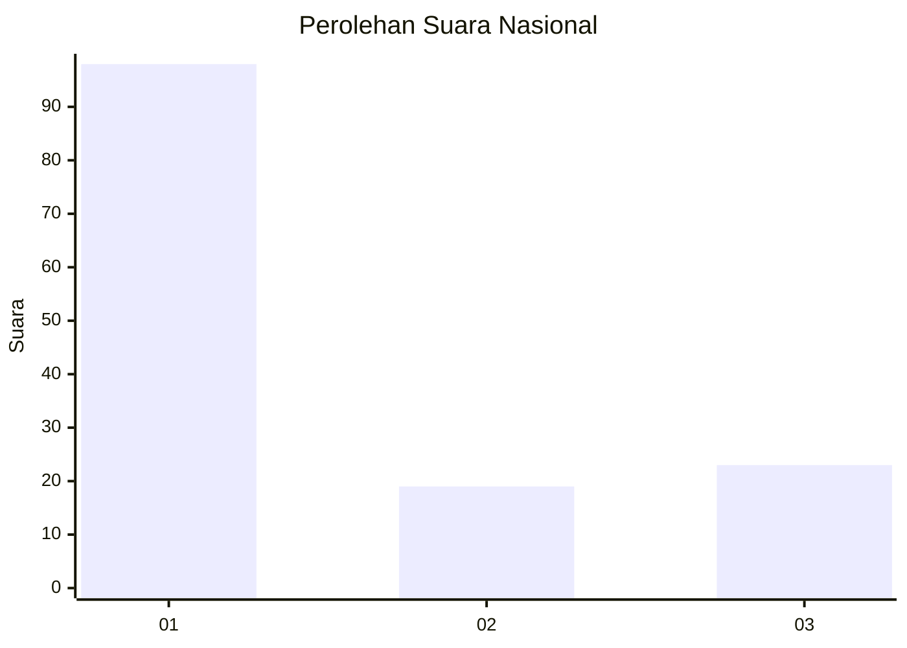
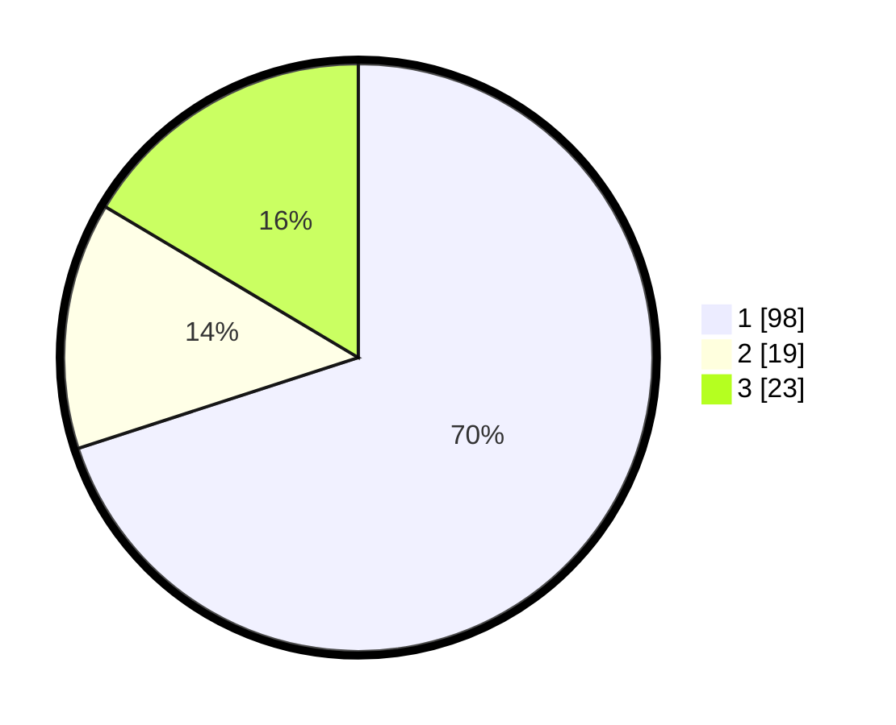

# Hasil

## Grafik

## Tabel

| No. | Nama Paslon    | Suara | Suara (raw) | Persentase |
|:--- |:-------------- | -----:| -----------:| ----------:|
| 1   | ANIES MUHAIMIN | 98    | [98][p-1]   | 70,00      |
| 2   | PRABOWO GIBRAN | 19    | [19][p-2]   | 13,57      |
| 3   | GANJAR MAHFUD  | 23    | [23][p-3]   | 16,43      |

[p-1]: https://github.com/gigit-pemilu/pemilu-2024/blob/main/pilpres/hitung-suara/sub/18-lampung/sub/71-kota-bandar-lampung/sub/02-sukarame/sub/1004-way-dadi/sub/013-tps/sub/paslon-1.txt
[p-2]: https://github.com/gigit-pemilu/pemilu-2024/blob/main/pilpres/hitung-suara/sub/18-lampung/sub/71-kota-bandar-lampung/sub/02-sukarame/sub/1004-way-dadi/sub/013-tps/sub/paslon-2.txt
[p-3]: https://github.com/gigit-pemilu/pemilu-2024/blob/main/pilpres/hitung-suara/sub/18-lampung/sub/71-kota-bandar-lampung/sub/02-sukarame/sub/1004-way-dadi/sub/013-tps/sub/paslon-3.txt

## Foto C Plano

https://sirekap-obj-formc.kpu.go.id/aa21/pemilu/ppwp/18/71/02/10/04/1871021004013-20240224-134756--8bc202a1-ef91-4840-b63b-b95267d72311.jpg

https://sirekap-obj-formc.kpu.go.id/aa21/pemilu/ppwp/18/71/02/10/04/1871021004013-20240224-135704--55aa8c4b-cb62-4bca-889b-0df3743c6da1.jpg

https://sirekap-obj-formc.kpu.go.id/aa21/pemilu/ppwp/18/71/02/10/04/1871021004013-20240224-140037--0fe8a6f6-e4a3-4549-8cbc-e81dc1b902d3.jpg

## Metadata

| Key        | Value               |
| ---------- | ------------------- |
| Time Stamp | 2024-02-24 22:31:28 |

