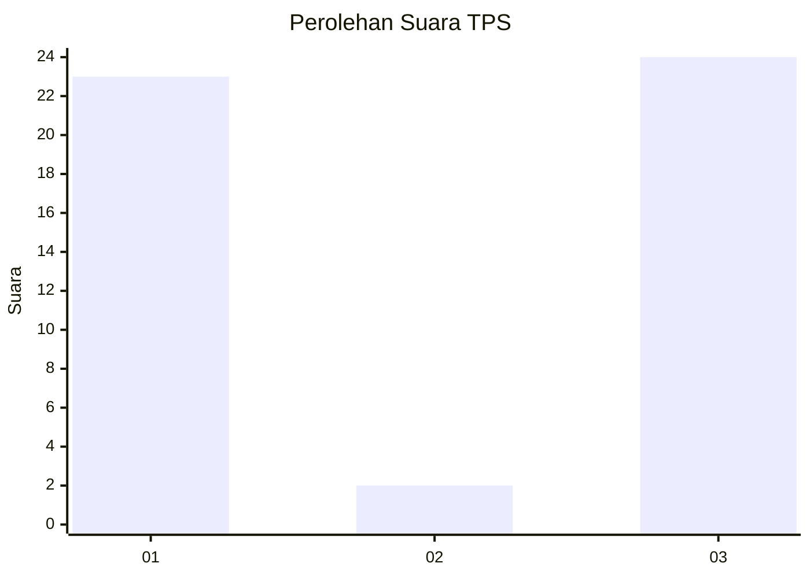
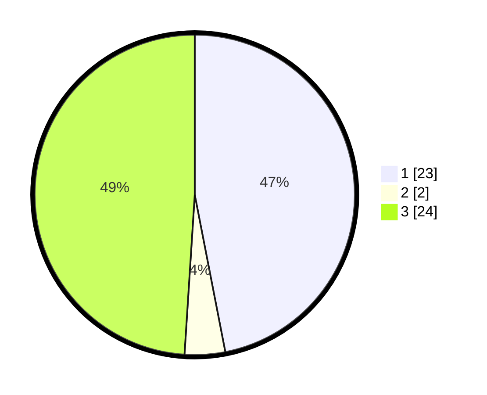

# Hasil

## Grafik

## Tabel

| No. | Nama Paslon    | Suara | Suara (raw) | Persentase |
|:--- |:-------------- | -----:| -----------:| ----------:|
| 1   | ANIES MUHAIMIN | 23    | [23][p-1]   | 46,94      |
| 2   | PRABOWO GIBRAN | 2     | [2][p-2]    | 4,08       |
| 3   | GANJAR MAHFUD  | 24    | [24][p-3]   | 48,98      |

[p-1]: https://github.com/gigit-pemilu/pemilu-2024-18-lampung/blob/main/pilpres/hitung-suara/sub/18-lampung/sub/71-kota-bandar-lampung/sub/03-tanjungkarang-barat/sub/1002-sukajawa/sub/004-tps/sub/paslon-1.txt
[p-2]: https://github.com/gigit-pemilu/pemilu-2024-18-lampung/blob/main/pilpres/hitung-suara/sub/18-lampung/sub/71-kota-bandar-lampung/sub/03-tanjungkarang-barat/sub/1002-sukajawa/sub/004-tps/sub/paslon-2.txt
[p-3]: https://github.com/gigit-pemilu/pemilu-2024-18-lampung/blob/main/pilpres/hitung-suara/sub/18-lampung/sub/71-kota-bandar-lampung/sub/03-tanjungkarang-barat/sub/1002-sukajawa/sub/004-tps/sub/paslon-3.txt

## Foto C Plano

https://sirekap-obj-formc.kpu.go.id/1b7d/pemilu/ppwp/18/71/03/10/02/1871031002004-20240219-231141--d63c84f9-71e1-4e06-9a3b-6b18f1755325.jpg

https://sirekap-obj-formc.kpu.go.id/1b7d/pemilu/ppwp/18/71/03/10/02/1871031002004-20240219-231228--e74d8e94-396d-408d-8418-b706ae9e65a2.jpg

https://sirekap-obj-formc.kpu.go.id/1b7d/pemilu/ppwp/18/71/03/10/02/1871031002004-20240219-231301--37cc15fc-0b9f-4375-b35d-776b4d19e7fb.jpg

## Metadata

| Key        | Value               |
| ---------- | ------------------- |
| Time Stamp | 2024-02-20 00:00:00 |

## DATA PEMILIH TETAP

Jumlah pemilih dalam DPT: **222**.
 * L: **108**.
 * P: **220**.

## DATA PENGGUNA HAK PILIH

Jumlah pengguna hak pilih dalam DPT: **652**.
 * L: **872**.
 * P: **846**.

Jumlah pengguna hak pilih dalam DPTb: **361**.
 * L: **5**.
 * P: **85**.

Jumlah pengguna hak pilih dalam DPK: **82**.
 * L: **802**.
 * P: **0**.

Jumlah pengguna hak pilih: **672**.
 * L: **50**.
 * P: **72**.

## JUMLAH SUARA SAH DAN TIDAK SAH

JUMLAH SELURUH SUARA SAH: **670**.

JUMLAH SUARA TIDAK SAH: **2**.

JUMLAH SELURUH SUARA SAH DAN SUARA TIDAK SAH: **372**.

