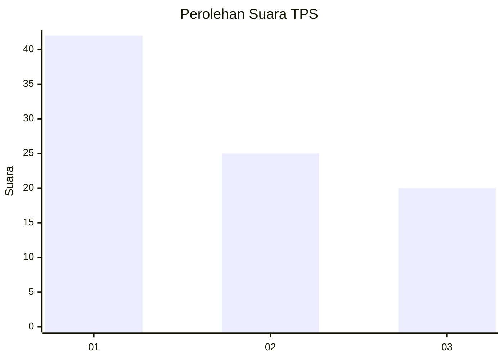
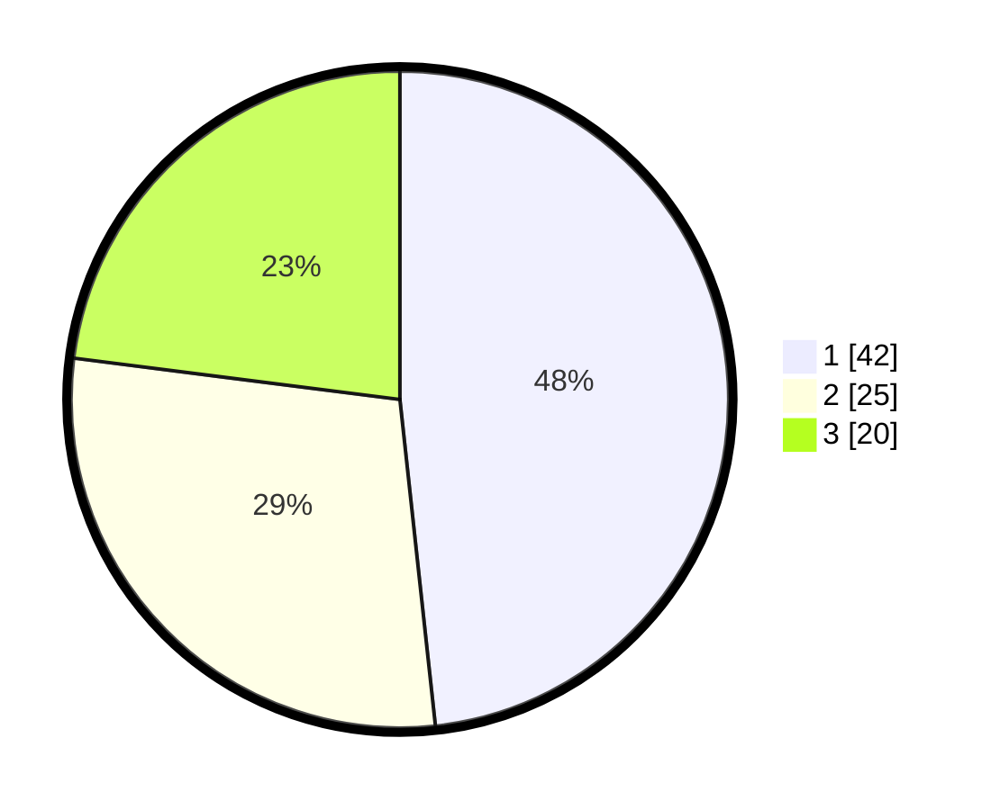

# Hasil

## Grafik

## Tabel

| No. | Nama Paslon    | Suara | Suara (raw) | Persentase |
|:--- |:-------------- | -----:| -----------:| ----------:|
| 1   | ANIES MUHAIMIN | 42    | [42][p-1]   | 48,28      |
| 2   | PRABOWO GIBRAN | 25    | [25][p-2]   | 28,74      |
| 3   | GANJAR MAHFUD  | 20    | [20][p-3]   | 22,99      |

[p-1]: https://github.com/gigit-pemilu/pemilu-2024-18-lampung/blob/main/pilpres/hitung-suara/sub/18-lampung/sub/71-kota-bandar-lampung/sub/03-tanjungkarang-barat/sub/1002-sukajawa/sub/017-tps/sub/paslon-1.txt
[p-2]: https://github.com/gigit-pemilu/pemilu-2024-18-lampung/blob/main/pilpres/hitung-suara/sub/18-lampung/sub/71-kota-bandar-lampung/sub/03-tanjungkarang-barat/sub/1002-sukajawa/sub/017-tps/sub/paslon-2.txt
[p-3]: https://github.com/gigit-pemilu/pemilu-2024-18-lampung/blob/main/pilpres/hitung-suara/sub/18-lampung/sub/71-kota-bandar-lampung/sub/03-tanjungkarang-barat/sub/1002-sukajawa/sub/017-tps/sub/paslon-3.txt

## Foto C Plano

https://sirekap-obj-formc.kpu.go.id/c3a4/pemilu/ppwp/18/71/03/10/02/1871031002017-20240219-224916--2ad566af-080d-4d7f-aa27-4bdf9a7d56d7.jpg

https://sirekap-obj-formc.kpu.go.id/c3a4/pemilu/ppwp/18/71/03/10/02/1871031002017-20240219-224756--17e8cbb6-9246-49b0-8670-b1d3507d8216.jpg

https://sirekap-obj-formc.kpu.go.id/c3a4/pemilu/ppwp/18/71/03/10/02/1871031002017-20240219-224555--a2746b3a-cb3b-4422-961a-bd08a4911a12.jpg

## Metadata

| Key        | Value               |
| ---------- | ------------------- |
| Time Stamp | 2024-02-19 23:00:00 |

## DATA PEMILIH TETAP

Jumlah pemilih dalam DPT: **77**.
 * L: **220**.
 * P: **747**.

## DATA PENGGUNA HAK PILIH

Jumlah pengguna hak pilih dalam DPT: **777**.
 * L: **22**.
 * P: **144**.

Jumlah pengguna hak pilih dalam DPTb: **808**.
 * L: **808**.
 * P: **8**.

Jumlah pengguna hak pilih dalam DPK: **0**.
 * L: **800**.
 * P: **82**.

Jumlah pengguna hak pilih: **442**.
 * L: **52**.
 * P: **287**.

## JUMLAH SUARA SAH DAN TIDAK SAH

JUMLAH SELURUH SUARA SAH: **522**.

JUMLAH SUARA TIDAK SAH: **805**.

JUMLAH SELURUH SUARA SAH DAN SUARA TIDAK SAH: **722**.

