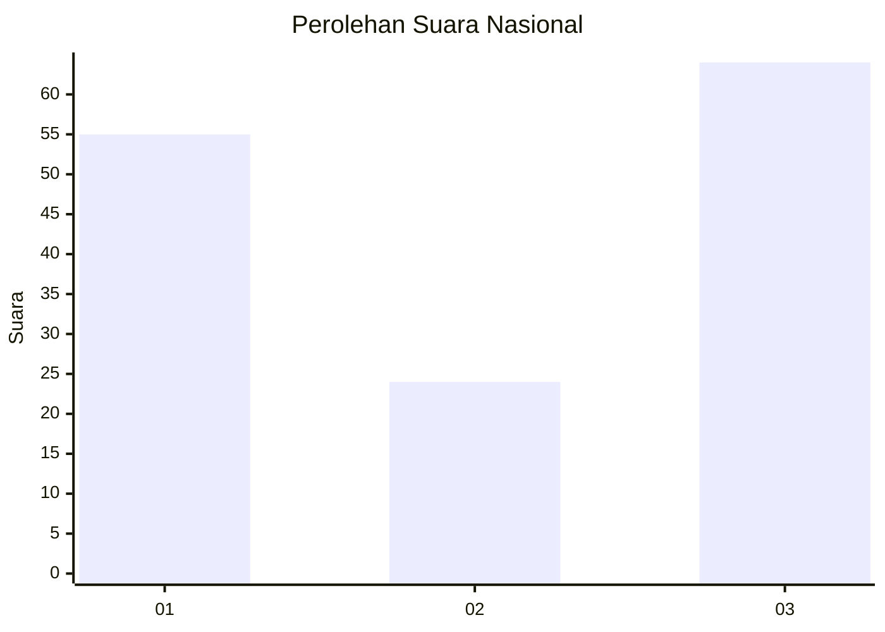
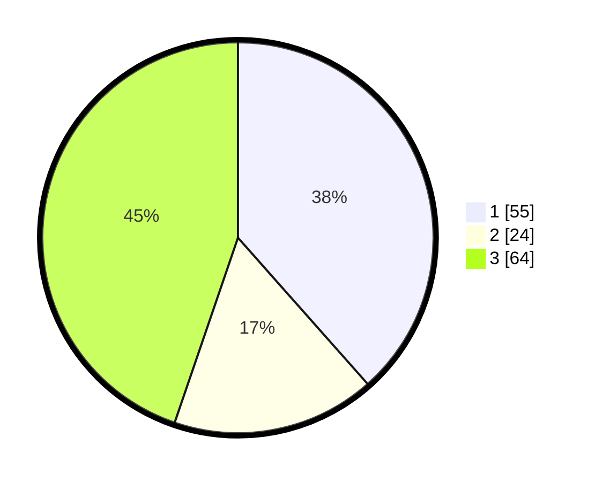

# Hasil

## Grafik

## Tabel

| No. | Nama Paslon    | Suara | Suara (raw) | Persentase |
|:--- |:-------------- | -----:| -----------:| ----------:|
| 1   | ANIES MUHAIMIN | 55    | [55][p-1]   | 38,46      |
| 2   | PRABOWO GIBRAN | 24    | [24][p-2]   | 16,78      |
| 3   | GANJAR MAHFUD  | 64    | [64][p-3]   | 44,76      |

[p-1]: https://github.com/gigit-pemilu/pemilu-2024/blob/main/pilpres/hitung-suara/sub/18-lampung/sub/71-kota-bandar-lampung/sub/03-tanjungkarang-barat/sub/1002-sukajawa/sub/025-tps/sub/paslon-1.txt
[p-2]: https://github.com/gigit-pemilu/pemilu-2024/blob/main/pilpres/hitung-suara/sub/18-lampung/sub/71-kota-bandar-lampung/sub/03-tanjungkarang-barat/sub/1002-sukajawa/sub/025-tps/sub/paslon-2.txt
[p-3]: https://github.com/gigit-pemilu/pemilu-2024/blob/main/pilpres/hitung-suara/sub/18-lampung/sub/71-kota-bandar-lampung/sub/03-tanjungkarang-barat/sub/1002-sukajawa/sub/025-tps/sub/paslon-3.txt

## Foto C Plano

https://sirekap-obj-formc.kpu.go.id/d049/pemilu/ppwp/18/71/03/10/02/1871031002025-20240219-232831--fa248468-9975-4a37-944d-76c94ff1856f.jpg

https://sirekap-obj-formc.kpu.go.id/d049/pemilu/ppwp/18/71/03/10/02/1871031002025-20240219-232920--226696b9-8280-4043-b0ef-80f0c96238fe.jpg

https://sirekap-obj-formc.kpu.go.id/d049/pemilu/ppwp/18/71/03/10/02/1871031002025-20240219-233001--ad04bf69-4b01-4ce4-b8e6-9afe1cd55e68.jpg

## Metadata

| Key        | Value               |
| ---------- | ------------------- |
| Time Stamp | 2024-02-20 00:00:00 |

## DATA PEMILIH TETAP

Jumlah pemilih dalam DPT: **237**.
 * L: **639**.
 * P: **544**.

## DATA PENGGUNA HAK PILIH

Jumlah pengguna hak pilih dalam DPT: **395**.
 * L: **895**.
 * P: **429**.

Jumlah pengguna hak pilih dalam DPTb: **888**.
 * L: **800**.
 * P: **888**.

Jumlah pengguna hak pilih dalam DPK: **403**.
 * L: **882**.
 * P: **808**.

Jumlah pengguna hak pilih: **208**.
 * L: **837**.
 * P: **114**.

## JUMLAH SUARA SAH DAN TIDAK SAH

JUMLAH SELURUH SUARA SAH: **203**.

JUMLAH SUARA TIDAK SAH: **5**.

JUMLAH SELURUH SUARA SAH DAN SUARA TIDAK SAH: **298**.

