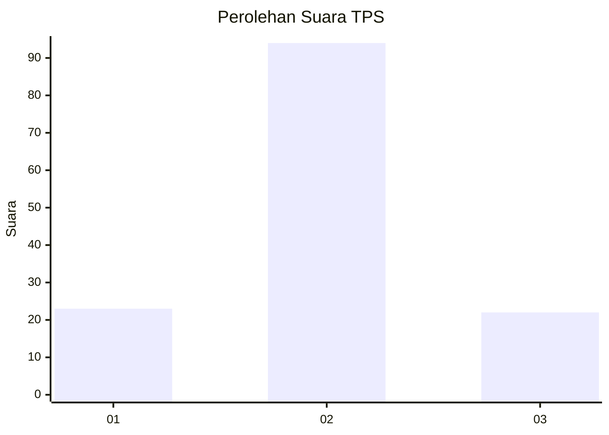
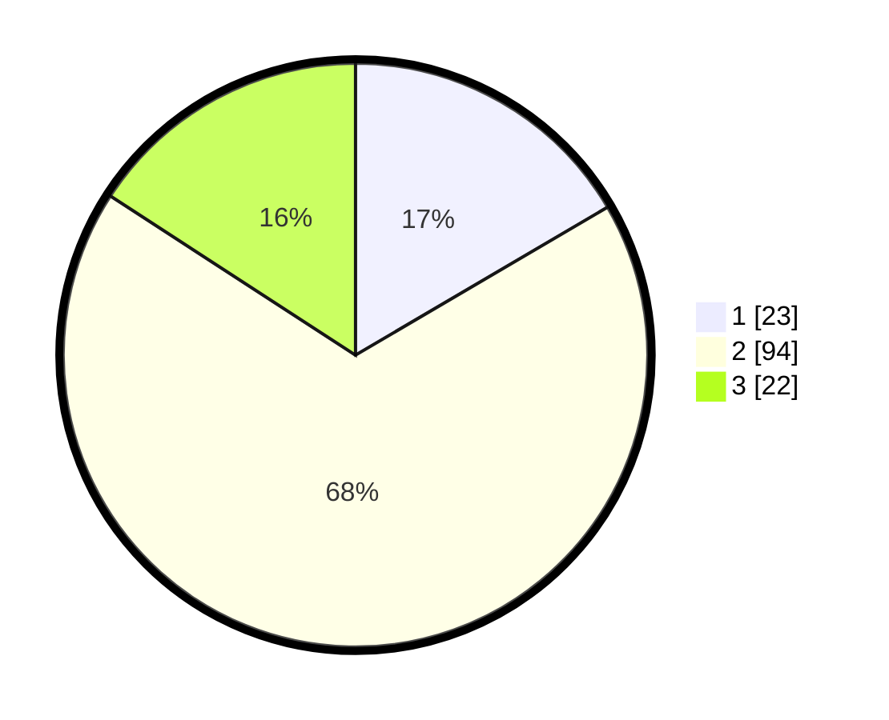

# Hasil

## Grafik

## Tabel

| No. | Nama Paslon    | Suara | Suara (raw) | Persentase |
|:--- |:-------------- | -----:| -----------:| ----------:|
| 1   | ANIES MUHAIMIN | 23    | [23][p-1]   | 16,55      |
| 2   | PRABOWO GIBRAN | 94    | [94][p-2]   | 67,63      |
| 3   | GANJAR MAHFUD  | 22    | [22][p-3]   | 15,83      |

[p-1]: https://github.com/gigit-pemilu/pemilu-2024-18-lampung/blob/main/pilpres/hitung-suara/sub/18-lampung/sub/71-kota-bandar-lampung/sub/04-panjang/sub/1001-panjang-selatan/sub/002-tps/sub/paslon-1.txt
[p-2]: https://github.com/gigit-pemilu/pemilu-2024-18-lampung/blob/main/pilpres/hitung-suara/sub/18-lampung/sub/71-kota-bandar-lampung/sub/04-panjang/sub/1001-panjang-selatan/sub/002-tps/sub/paslon-2.txt
[p-3]: https://github.com/gigit-pemilu/pemilu-2024-18-lampung/blob/main/pilpres/hitung-suara/sub/18-lampung/sub/71-kota-bandar-lampung/sub/04-panjang/sub/1001-panjang-selatan/sub/002-tps/sub/paslon-3.txt

## Foto C Plano

https://sirekap-obj-formc.kpu.go.id/3fe4/pemilu/ppwp/18/71/04/10/01/1871041001002-20240215-004421--ec1d445e-c456-4b05-a77d-b7038ba39d43.jpg

https://sirekap-obj-formc.kpu.go.id/3fe4/pemilu/ppwp/18/71/04/10/01/1871041001002-20240215-012358--1d9b7a06-2873-42b7-93df-8369494a35a4.jpg

https://sirekap-obj-formc.kpu.go.id/3fe4/pemilu/ppwp/18/71/04/10/01/1871041001002-20240215-012447--b9eaf82b-559b-41ff-ad11-0402ca3692a4.jpg

## Metadata

| Key        | Value               |
| ---------- | ------------------- |
| Time Stamp | 2024-02-15 15:00:29 |

