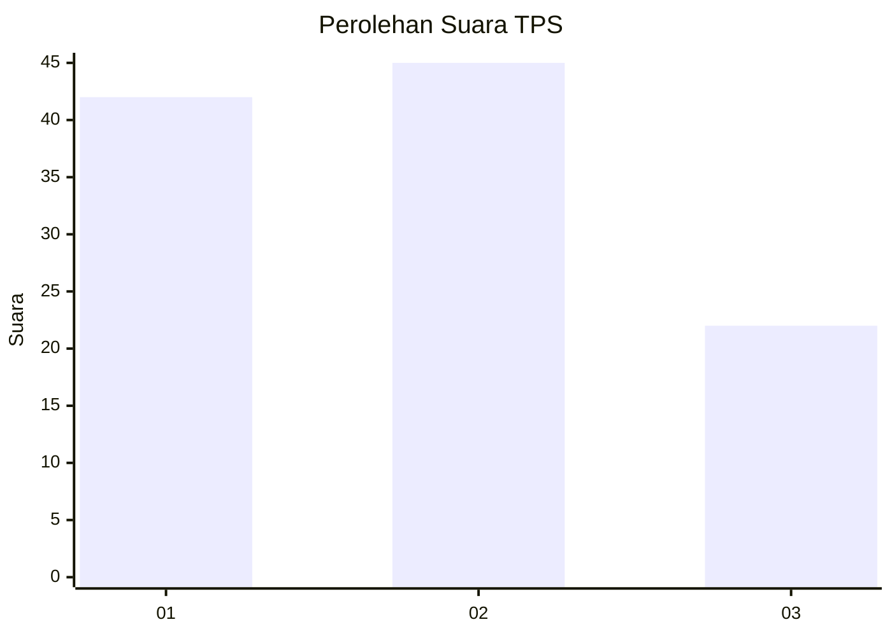
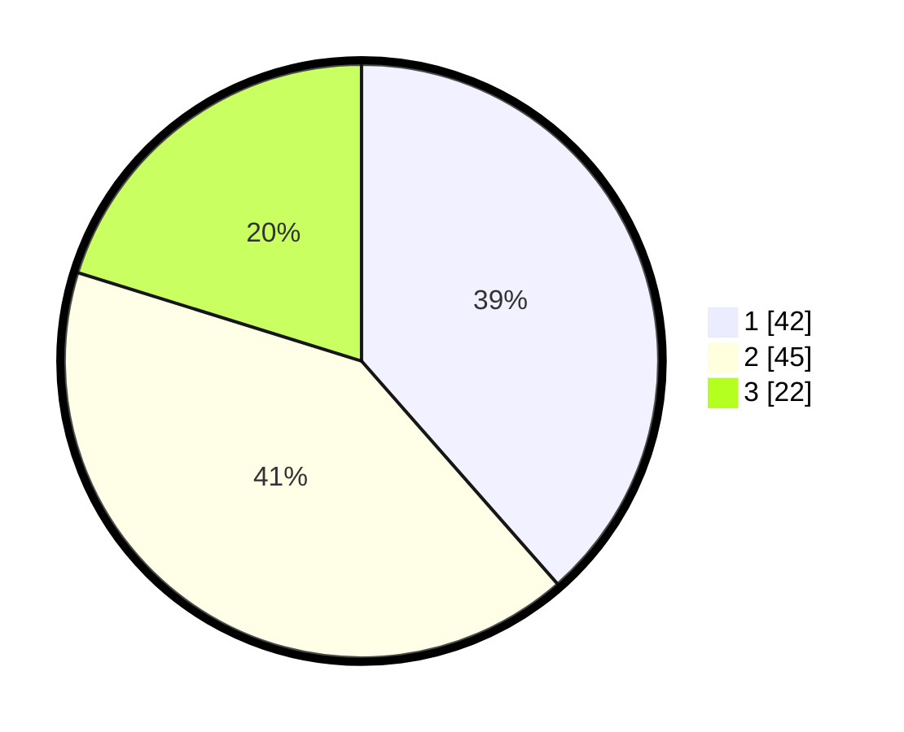

# Hasil

## Grafik

## Tabel

| No. | Nama Paslon    | Suara | Suara (raw) | Persentase |
|:--- |:-------------- | -----:| -----------:| ----------:|
| 1   | ANIES MUHAIMIN | 42    | [42][p-1]   | 38,53      |
| 2   | PRABOWO GIBRAN | 45    | [45][p-2]   | 41,28      |
| 3   | GANJAR MAHFUD  | 22    | [22][p-3]   | 20,18      |

[p-1]: https://github.com/gigit-pemilu/pemilu-2024-18-lampung/blob/main/pilpres/hitung-suara/sub/18-lampung/sub/71-kota-bandar-lampung/sub/09-telukbetung-utara/sub/1004-kupang-teba/sub/011-tps/sub/paslon-1.txt
[p-2]: https://github.com/gigit-pemilu/pemilu-2024-18-lampung/blob/main/pilpres/hitung-suara/sub/18-lampung/sub/71-kota-bandar-lampung/sub/09-telukbetung-utara/sub/1004-kupang-teba/sub/011-tps/sub/paslon-2.txt
[p-3]: https://github.com/gigit-pemilu/pemilu-2024-18-lampung/blob/main/pilpres/hitung-suara/sub/18-lampung/sub/71-kota-bandar-lampung/sub/09-telukbetung-utara/sub/1004-kupang-teba/sub/011-tps/sub/paslon-3.txt

## Foto C Plano

https://sirekap-obj-formc.kpu.go.id/0bc6/pemilu/ppwp/18/71/09/10/04/1871091004011-20240221-210224--6bea7755-12c3-439e-8267-e3ad7c54762c.jpg

https://sirekap-obj-formc.kpu.go.id/0bc6/pemilu/ppwp/18/71/09/10/04/1871091004011-20240221-211021--56376d16-3a8c-4a77-90c4-bf52fde25fb6.jpg

https://sirekap-obj-formc.kpu.go.id/0bc6/pemilu/ppwp/18/71/09/10/04/1871091004011-20240221-211218--2ec00b0f-7001-43df-af22-185a7b051a43.jpg

## Metadata

| Key        | Value               |
| ---------- | ------------------- |
| Time Stamp | 2024-02-21 22:00:00 |

## DATA PEMILIH TETAP

Jumlah pemilih dalam DPT: **236**.
 * L: **25**.
 * P: **34**.

## DATA PENGGUNA HAK PILIH

Jumlah pengguna hak pilih dalam DPT: **552**.
 * L: **880**.
 * P: **832**.

Jumlah pengguna hak pilih dalam DPTb: **88**.
 * L: **888**.
 * P: **880**.

Jumlah pengguna hak pilih dalam DPK: **822**.
 * L: **884**.
 * P: **888**.

Jumlah pengguna hak pilih: **457**.
 * L: **884**.
 * P: **835**.

## JUMLAH SUARA SAH DAN TIDAK SAH

JUMLAH SELURUH SUARA SAH: **454**.

JUMLAH SUARA TIDAK SAH: **3**.

JUMLAH SELURUH SUARA SAH DAN SUARA TIDAK SAH: **457**.

