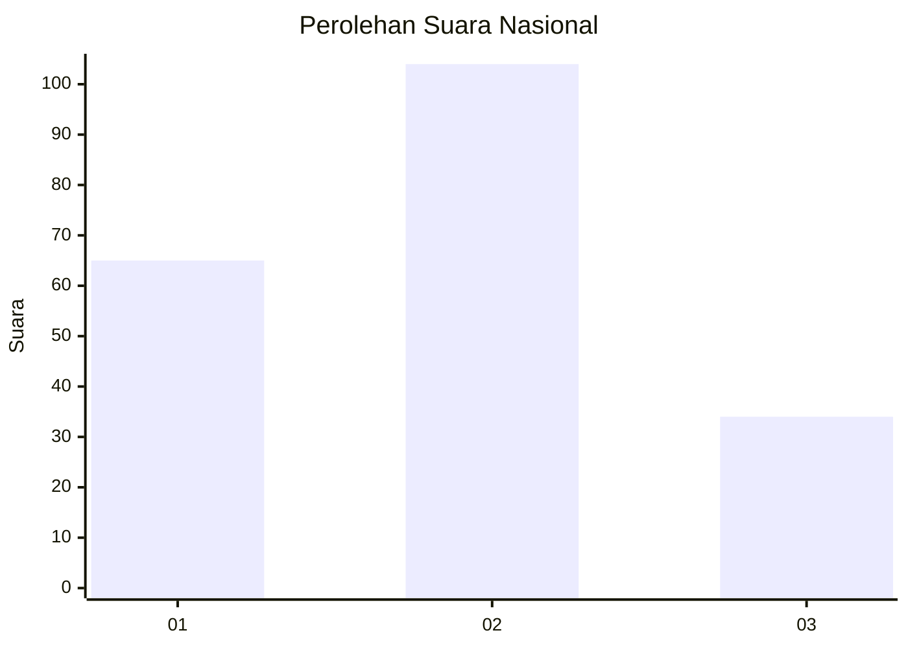
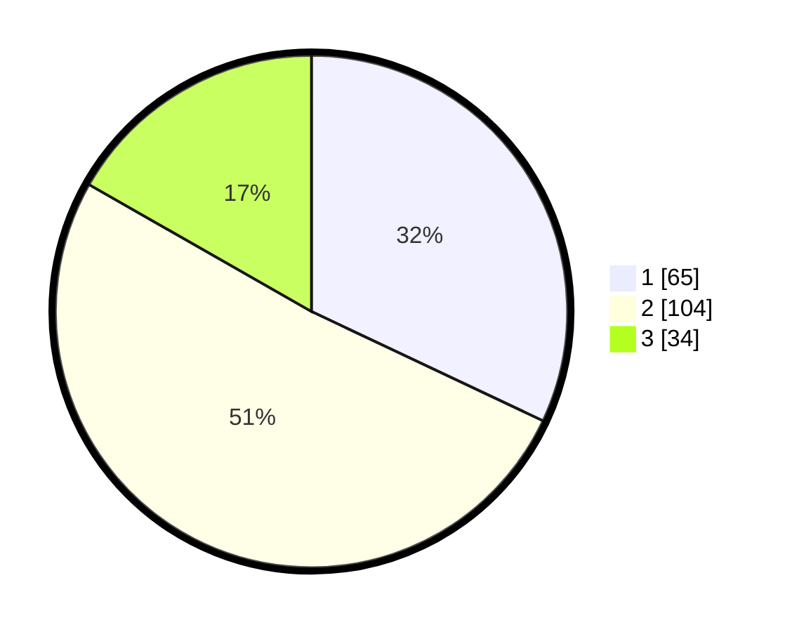

# Hasil

## Grafik

## Tabel

| No. | Nama Paslon    | Suara | Suara (raw) | Persentase |
|:--- |:-------------- | -----:| -----------:| ----------:|
| 1   | ANIES MUHAIMIN | 65    | [65][p-1]   | 32,02      |
| 2   | PRABOWO GIBRAN | 104   | [104][p-2]  | 51,23      |
| 3   | GANJAR MAHFUD  | 34    | [34][p-3]   | 16,75      |

[p-1]: https://github.com/gigit-pemilu/pemilu-2024/blob/main/pilpres/hitung-suara/sub/18-lampung/sub/71-kota-bandar-lampung/sub/13-kemiling/sub/1001-sumber-rejo/sub/001-tps/sub/paslon-1.txt
[p-2]: https://github.com/gigit-pemilu/pemilu-2024/blob/main/pilpres/hitung-suara/sub/18-lampung/sub/71-kota-bandar-lampung/sub/13-kemiling/sub/1001-sumber-rejo/sub/001-tps/sub/paslon-2.txt
[p-3]: https://github.com/gigit-pemilu/pemilu-2024/blob/main/pilpres/hitung-suara/sub/18-lampung/sub/71-kota-bandar-lampung/sub/13-kemiling/sub/1001-sumber-rejo/sub/001-tps/sub/paslon-3.txt

## Foto C Plano

https://sirekap-obj-formc.kpu.go.id/9abe/pemilu/ppwp/18/71/13/10/01/1871131001001-20240215-014951--423adafb-f423-47bf-bfab-73e5ebd33617.jpg

https://sirekap-obj-formc.kpu.go.id/9abe/pemilu/ppwp/18/71/13/10/01/1871131001001-20240215-020706--6f92b891-b35a-4b19-a97d-1adfa7d7bcf4.jpg

https://sirekap-obj-formc.kpu.go.id/9abe/pemilu/ppwp/18/71/13/10/01/1871131001001-20240214-155715--bfd55429-b36f-4e22-8b62-4ebf5764957f.jpg

## Metadata

| Key        | Value               |
| ---------- | ------------------- |
| Time Stamp | 2024-02-17 16:00:02 |

